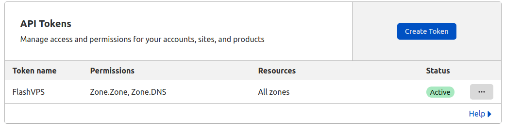
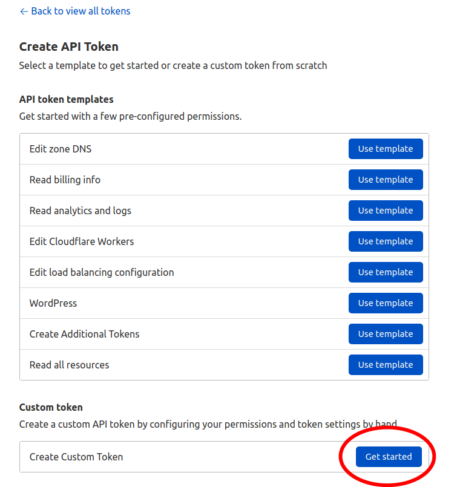
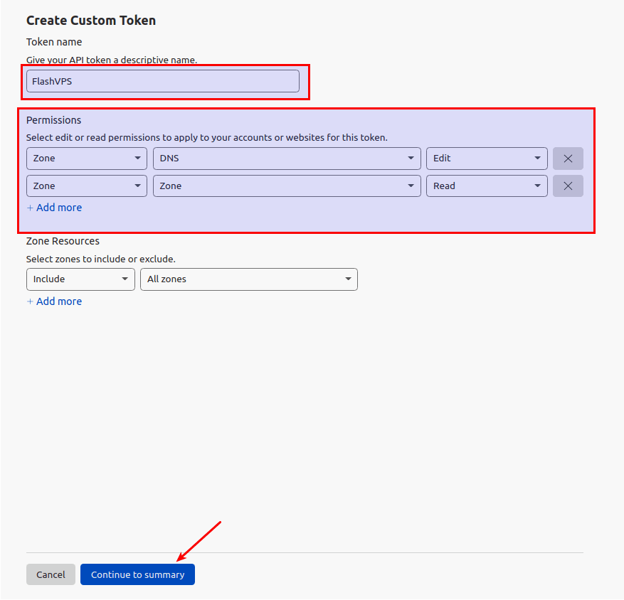
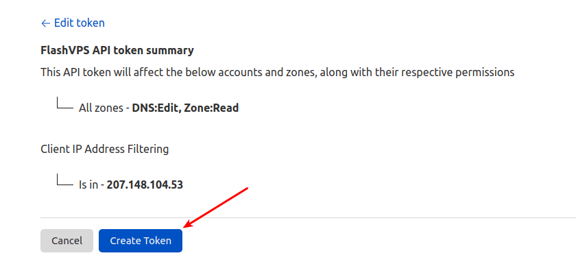
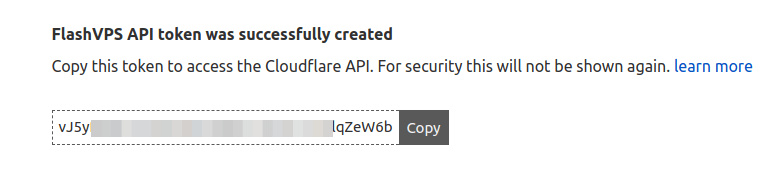
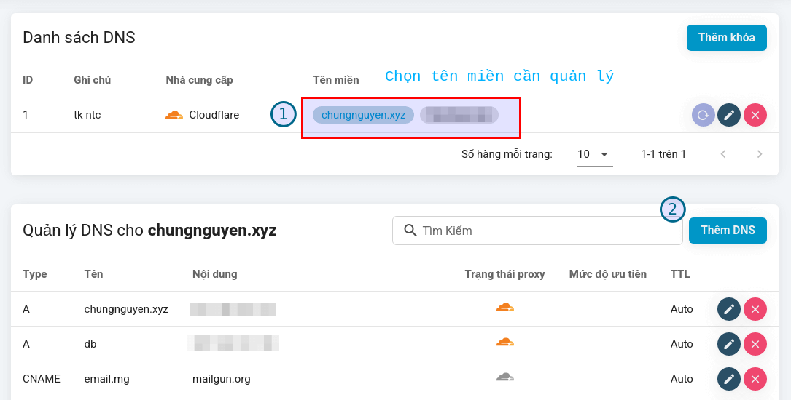

# DNS connection

DNS connection allows you to `{{ data.name }}` manage DNS, and automatically create records in some [cases](#co-the-ban-chua-biet)

## Cloudflare

1. Log in to your `Cloudflare` account.
2. Visit the API Token page at: https://dash.cloudflare.com/profile/api-tokens, then click the `Create Token` button
   
3. In the `Custom Token` section, click `Get Started`
   
4. In the `Create Custom Token` section, fill in and select as shown in the picture
   
5. Select `Create Token`
   
6. Done, copy the token below
   
7. Go to <a :href="data.url + '/user/dns'" target="_blank">DNS management</a> page `{{ data.name }}`
8. Press the `Add Key` button
9. Enter a description of this API Token
10. Enter the API Token received above
11. Click the `Add API Token` button

## Name.com

1. Log in to your `Name.com` account.
2. Access the Token API page at: https://www.name.com/account/settings/api
3. Enter `Token name` and Click `Generate new token` button
4. Go to <a :href="data.url + '/user/dns'" target="_blank">DNS management</a> page `{{ data.name }}`
5. Press the `Add Key` button
6. Enter a description of this API Token
7. Enter the API Token received above
8. Click the `Add API Token` button

## Manage DNS

After successfully adding the API key, the system will automatically retrieve all the domains you allow to manage.
You just need to choose which domain to manage.

## Maybe you don't know?

When you create a new website, the domain name is in the list of managed domains at `{{ data.name }}`.
The system will automatically create a type A DNS record pointing to the server being used to create the domain name.
