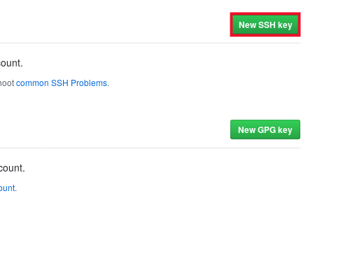
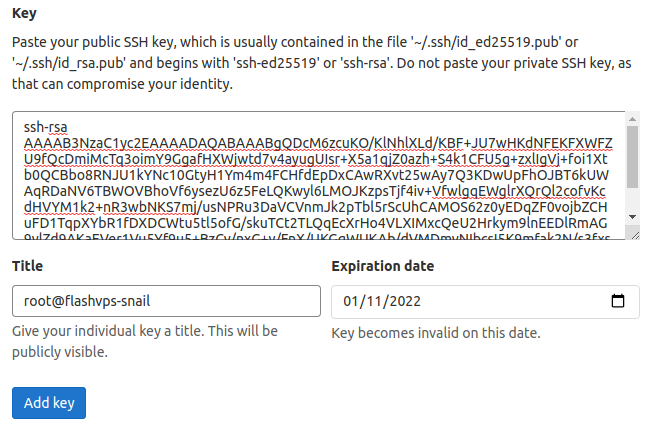

# Git Connect

## Supported Git providers `{{ data.name }}`

`{{ data.name }}` currently supports the following Git providers:

-   Github
-   Gitlab
-   Bitbucket
-   Custom Git

## Add SSH key to Git provider

To use Custom Git Provider you need to add the SSH Key that `{{ data.name }}` provides to your source code provider. Instructions for adding SSH Key code:

### Github

1. Create SSH Key [here](../knowledge/ssh-keys.md) if you don't have one
2. [Login to Github account](https://github.com/login)
3. Select your avatar and select **Settings**:
   
4. Select **SSH and DPG keys**
   
5. Select **New SSH key**
   
6. Enter a title for the _Title_ field and paste the SSH Key obtained in step 1 into the _Key_ field
   
7. Select **Add SSH key**

### Gitlab

1. Create SSH Key [here](../knowledge/ssh-keys.md) if you don't have one
2. [Sign in to your GitLab account](https://gitlab.com/users/sign_in)
3. Select your avatar and select **Preferences**:
   
4. Select **SSH Keys**
   
5. Paste the SSH Key code obtained in step 1 into the _Key_ field and Enter a title for the _Title_ and _Expiration Date_ fields
   
6. Select **Add key**

Once your SSH Key has been added to your source control provider, you can [follow these instructions](../site/basic.md) and install the source as usual.

## Connect Git provider

You can connect to any supported source control provider at any time through the Source Code Management console of `{{ data.name }}` at the `Source Code Management` tab in Your account profile:

1. [Log in to `{{ data.name }}`]
2. Go to <a :href="data.url + '/user/git'" target="_blank">Source Code Management</a>
3. Select **Connect to `Github`|`GitLab`|`Bitbucket`** to connect to the corresponding source code provider

## Unmount Git provider

You can remove a connected source control provider by clicking the **Unlink** button next to the provider.

1. [Log in to `{{ data.name }}`]
2. Go to <a :href="data.url + '/user/git'" target="_blank">Source Code Management</a>
3. Select **Unlink from `Github`|`GitLab`|`Bitbucket`** to connect to the corresponding source code provider

## Refresh tokens

If you want to refresh `{{ data.name }}`'s connection to your source control provider, you can do so by clicking the **Refresh Token** button next to the provider's name provide source control on the `Manage Source Code` page in your `{{ data.name }}` account profile.
