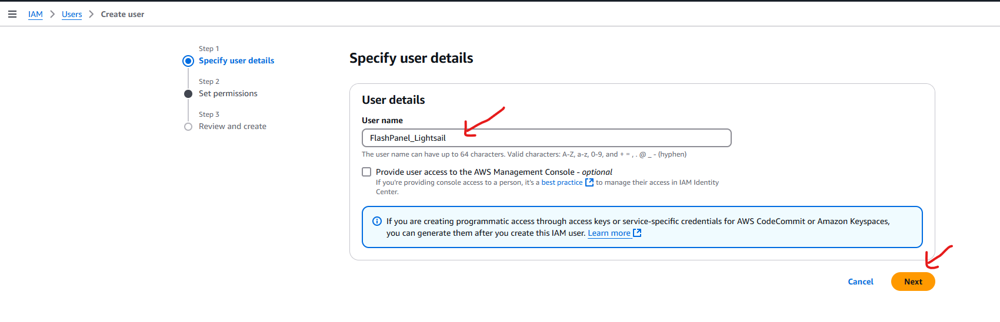
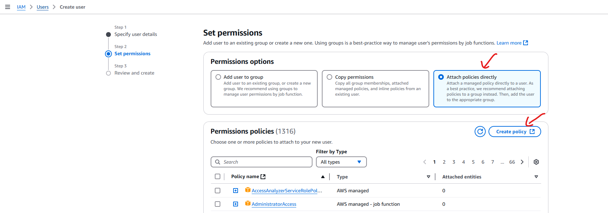
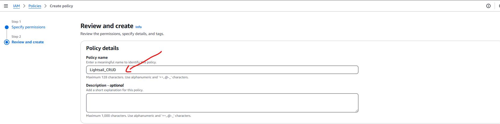
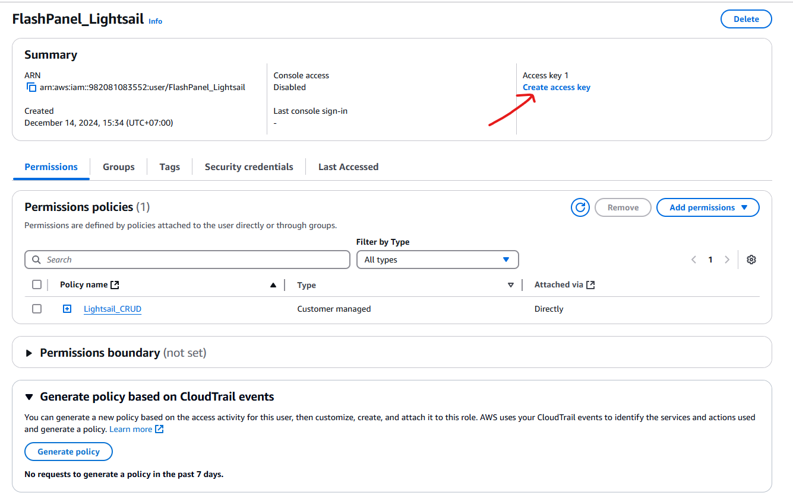
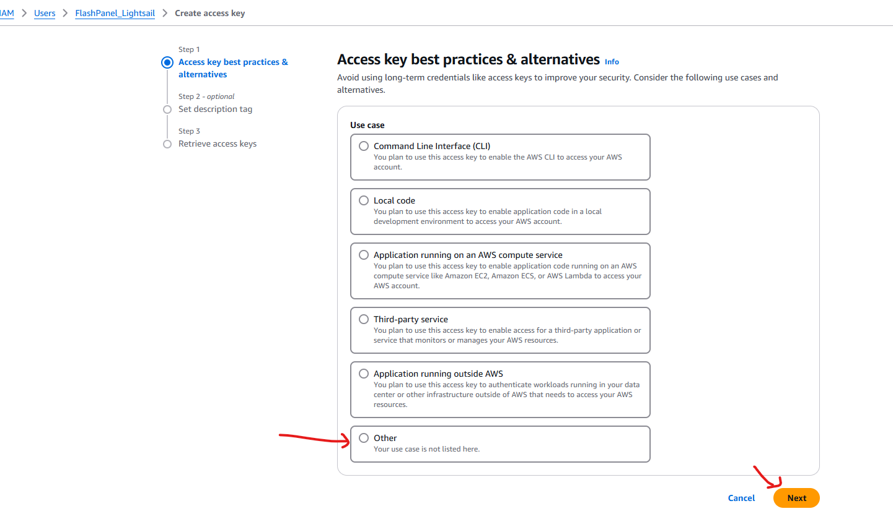
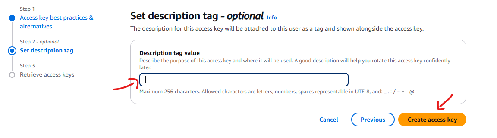
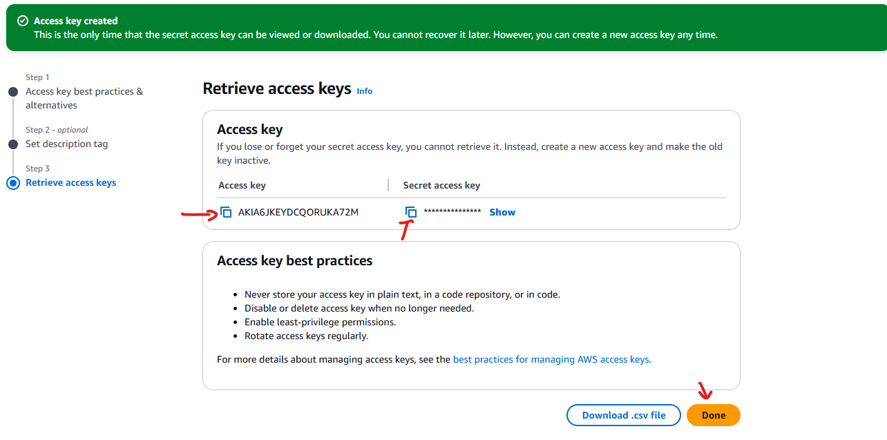
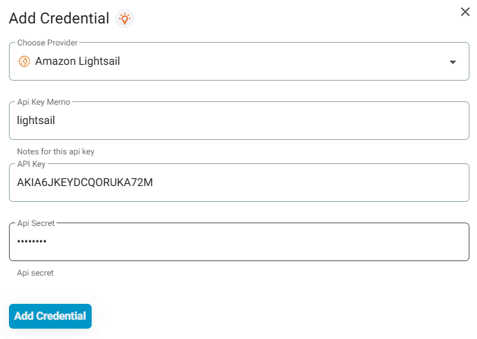

<script setup>
import { data } from '../../.vitepress/config.data.ts'
</script>

# Connect server provider

## Vultr

1. Visit the [Vultr API] page(https://my.vultr.com/settings/#settingsapi)
2. In the `Personal Access Token` section, press `enable` if this is your first use. Copy `API Key`
3. Return to <a :href="data.url + '/user/vps'" target="_blank">{{ data.name }}</a>
4. Click the `Add Credentials` button
5. Select the server provider `Vultr`
6. Enter a note about this `API Key`
7. Enter the `API Key` obtained in step 2

## Digital Ocean

1. Visit the [Digital Ocean API] page(https://cloud.digitalocean.com/account/api/tokens)
2. In the `Personal Access Token` section, press `Generate New Token`
3. Copy API Token
4. Return to <a :href="data.url + '/user/vps'" target="_blank">{{ data.name }}</a>
5. Click the `Add Credentials` button
6. Select `Digital Ocean` server provider
7. Enter a note about this API Token
8. Enter the API Token obtained in step 3

## Linode

1. Visit the [Linode API] page(https://cloud.linode.com/profile/tokens)
2. In the `Personal Access Token` section, press `Create A Personal Access Token`
3. Enter `label` for API Token, select `Read/Write` under `Linodes`
   
   Click the `Create Token` button
4. Copy API Token
5. Return to <a :href="data.url + '/user/vps'" target="_blank">{{ data.name }}</a>
6. Click the `Add Credentials` button
7. Select server provider `Linode`
8. Enter a note about this API Token
9. Enter the API Token obtained in step 4

## UpCloud

1. Visit the [UpCloud API] page(https://hub.upcloud.com/people/accounts)
2. In the `Account` section, press `Create subaccount`
3. Enter `subaccount` information and press `Create subaccount`
4. After creating the `subaccount`, press the `subaccount` edit button to go to the edit page, scroll down to the `Permissions` section and press the `Go to permissions` button.
   Select as shown below, all remaining items are disabled
   
5. Return to <a :href="data.url + '/user/vps'" target="_blank">{{ data.name }}</a>
6. Click the `Add Credentials` button
7. Select `UpCloud` server provider
8. Enter a note about this API Token
9. Enter `username` and `password` in step 4

## Hetzner

1. Go to [Hetzner](https://console.hetzner.cloud/projects) page > Select a `project` > In the left sidebar select `Security` > In the tab above select `API Tokens`
2. Click `Generate API Token` in the upper right corner
3. Enter a note and check `Read & Write` in the Permissions section
4. After creating, press Copy to get `Token`
5. Return to <a :href="data.url + '/user/vps'" target="_blank">{{ data.name }}</a>
6. Click the `Add Credentials` button
7. Select server provider `Hetzner`
8. Enter a note about this API Token
9. Enter the API Token obtained in step 4

## Bizfly Cloud

1. Go to the [Application Credential configuration page](https://manage.bizflycloud.vn/account/configuration/credential)
2. Click create new `Application Credential`, then enter name, description, ... and click `Confirm`
3. Application Credential information will appear, copy `Application Credential ID` and `Secret Key`
4. Return to <a :href="data.url + '/user/vps'" target="_blank">{{ data.name }}</a>
5. Click the `Add Credentials` button
6. Select `Bizfly Cloud` server provider
7. Enter a note about this API Credential
8. Enter `API Key` as `Application ID Credential` and `API Secret` as `Secret Key` obtained in step 3

## Amazon Lightsail

1. Goto [IAM Console Create User](https://us-east-1.console.aws.amazon.com/iam/home#/users/create)
   
2. Next to set permissions > `Click attach policy directly` > `Click Create Policy` a new tab open for you
   
3. At the Create Policy page > Select `JSON` editor and Pasted this json config > Click `Next` to Step 2
   

```
{
	"Version": "2012-10-17",
	"Statement": [
		{
			"Effect": "Allow",
			"Action": [
				"lightsail:GetBundles",
				"lightsail:GetRegions",
				"lightsail:GetBlueprints",
				"lightsail:CreateInstances",
				"lightsail:GetInstances",
				"lightsail:GetInstance",
				"lightsail:DeleteInstance",
				"lightsail:CreateKeyPair",
				"lightsail:DeleteKeyPair",
				"lightsail:RebootInstance",
				"lightsail:GetKeyPairs",
				"lightsail:ImportKeyPair",
				"lightsail:PutInstancePublicPorts"
			],
			"Resource": "*"
		}
	]
}
```

5. Enter Policy name, Policy description and Click `Create Policy` to create Policy
   
6. Closed the `Policy tab` and `Go back` to create user tab > Click `Icon Reload` next the Create Policy > Click `Next`
   
7. At review and create page click `Create User`
   
8. Goto edit your user and create new access key
   
9. At Create Access Key page
   
10. Enter description
    
11. Save the accessKey and back to FlashPanel and paste the relative access key
    
    
