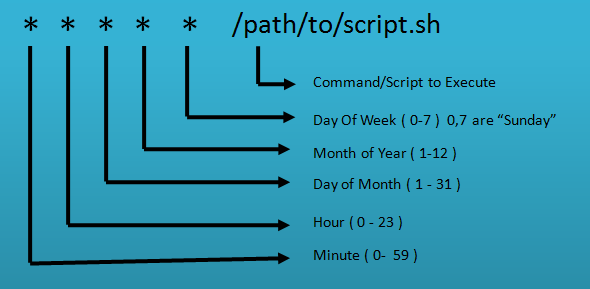

# Cron Job

## What is Cron Job?

The cron command line utility, also known as cron job is a job scheduler on Unix-like operating systems. Users set up and maintain software environments that use cron to schedule jobs to run periodically at fixed times, dates, or intervals.

## Advantages of using Cron Job

One of the hardships of sysadmins is probably having to do tasks day and night. Some tasks need to be done overnight, or must be done on weekends. So we have to spend our free time every night to run commands and scripts after hours? Or do you always have to stay up at night to run backups or updates?

Thanks to **Cron Job**, you will save a large amount of time when scheduling repeated tasks, without having to try to remember and create recurring jobs over and over again.

## Limitations when using Cron Job

Cron Jobs can only execute commands in cycles of 1 minute or more. In case you want to perform repetitive tasks in cycles less than 1 minute, it will not be possible.

## Cron Job syntax

1 job sẽ có 2 thành phần chủ yếu đó là

-   Cron Expression: Indicates the job repetition cycle
-   Command: The command will be executed

## What is Cron expression?

As you can see in the image above, `* * * * *` is the Cron expression

Cron expression is 5 characters separated by 1 space, each character represents a different meaning, let's find out:

1. 1st character: Indicates what minute to execute?
2. Second character: Indicates what time to execute?
3. 3rd character: Indicates which day of the month to execute?
4. 4th character: Indicates which month of the year to execute?
5. 5th character: Indicates which day of the week to execute?

Above we know that each position corresponds to a meaning. Next, let's find out the **RANGE OF ALLOWED VALUES** at each position.

1. 1st character: 0-59 (minute)
2. Second character: 0-23 (hour)
3. 3rd character: 1-31 (day)
4. 4th character: 1-12 (month)
5. 5th character: 0-6 (day, 0 is Sunday)

After understanding the value range, we continue to learn about **SPECIAL CHARACTERS**

"**\***": All values ​​within the allowed range. For example, if used in character 1, it is every minute, character 2 is every hour, ... every day, every month

"**,**": Use to list values. For example, if you want to execute at 7:00 am and 7:00 pm, then in the second character you will enter **7,19**

"**-**": Indicates the value range. For example, if you want to execute between 7am and 7pm, the second character you will enter is **7-19**

"**/**" : Indicates a value jump. For example, if you want to execute every 5 minutes, then in the first character you will enter **0/5** (starting at 0 minutes, then every 5 minutes)

So after combining the above 3 factors, you can build a cron expression as desired:

For example:

`* * * * *` every minute, every hour, every day, every month, every day of the week. In short, every minute until the server crashes

`0 * * * *` per hour

`0 0 * * *` every 12 midnight

`0 0 * * 0` every Sunday, at 12 midnight

`0 0 1 * *` on the 1st of each month, at 12 midnight

`0 22 * ​​* 1-5` from Monday to Friday, at 10pm.

`23 0-20/2 * * *` from 0 to 20 o'clock (at 23 minutes), 2 hours apart.

Do you want to try?

`0 0.12 1 */2 *` ???

`0 4 8-14 * *` ???

`0 0 1.15 * 3` ???

`5 0 * 8 *` ???

`15 14 1 * *` ???
