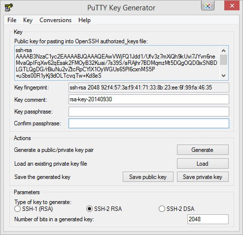

<script setup>
import { data } from '../../.vitepress/config.data.ts'
</script>

# SSH key

By default for each VPS, you will log in with the username **root** and **root password** that the provider sent you when renting the VPS, however using a password always has 2 big risks: :

-   You will lose it completely if your password is revealed.
-   Attackers can use Brute Force Attack to detect passwords.

Therefore, to make authenticating external connections to the VPS more secure, password authentication via SSH is disabled by default on all servers connecting to `{{ data.name }}`.

## What is SSH Key?

SSH Key is a method of authenticating login to the server via SSH access by comparing a pair of keys, including a personal key (private key) and public key (public key). Private key and Public key are closely related to each other for the purpose of mutual identification.

SSH Keys are often used to **REPLACE PASSWORD** by verifying access rights. You can simply understand, this login method is in a question and answer format, in which one party presents a question and the other party must provide a valid answer to be authenticated.

## Generate SSH Key

### Method 1: Generate SSH Key automatically

1. First, access the <a :href="data.url + '/user/ssh-keys'" target="_blank">SSH Keys management page</a>
2. Click the button to create a new SSH key
3. A popup appears, click on `Generate SSH Key`
   
4. You proceed to download 3 files `OpenSSH Key`, `PuTTY Key` and `Public Key` to your computer.
5. Click the `Add SSH Key` button to complete.

### Method 2: Generate SSH Key using ssh-keygen command (Windows/Linux/MacOS)

**For Windows**

Enable OpenSSH Client on Windows 10 by:

1. Open **Settings** panel, click **Apps**
2. Under the _Apps and Features_ heading, click **Optional Features.**
   
3. Scroll down the list to see if **OpenSSH Client** is listed
    - If not, click on the + sign next to **Add a feature.**
    - Slide down the list to find and select **OpenSSH Client.**
      
    - Finally, click **Install.**

After activating OpenSSH Client, open the `command line` with **admin** rights and run the following command:

```powershell
ssh-keygen -t rsa -m PKCS8 -b 2048 -f "C:\Users\your_username\.ssh"
```

Replace `C:\Users\your_username\.ssh` with the path where your ssh key is saved.

**For Linux/Mac**

```bash-vue
ssh-keygen -t rsa -m PKCS8 -b 2048 -f ~/.ssh/id_rsa_{{ data.user }}
```

After running the above command at the path `~/.ssh/`, there will be 2 files named `id_rsa_{{ data.user }}` (Private Key) and `id_rsa_{{ data.user }}.pub` (Public Key) you copy the Public Key content and add it to your server.

### Method 3: Create SSH Key using PuTTY-Gen software (Windows)

1. Install PuTTY software at https://www.putty.org/
2. Click the **Generate** button and **drag the mouse around the screen** until it's done creating.
   
3. After completing creating the SSH Key, save the Private Key by clicking the "Save Private Key" button and preserve it carefully. You can set a password for the Private Key to increase security by entering the "Key passphare" and "Confirm passphare" boxes before pressing the "Save Private Key" button.
   
   Public Key is **ssh-rsa AAAA...**, then use it to enter `{{ data.name }}`!

### Method 4: Generate SSH Key using PuTTY (Ubuntu/MacOS)

**Install puttygen**

_For Mac_ : `brew install putty`

_For Linux_: `sudo apt install putty-tools`

**Create SSH Key (version 2)**

```bash-vue
puttygen -t rsa -b 2048 -o /home/flashvps/.ssh/id_putty_{{ data.user }} --ppk-param version=2
```

**Create SSH Key (version 3)**

```bash-vue
puttygen -t rsa -b 2048 -o /home/flashvps/.ssh/id_putty_{{ data.user }}
```

After running the above command, the Private Key file will be saved at the path you entered. To use the key you need a Public Key. Create Public Key as follows:

```bash
puttygen -L /home/flashvps/.ssh/id_putty_{{ data.user }}
```

After running the above command, you will see the returned content in the form `ssh-rsa AAAA...`, copy this code and add it to your server.

In case you need to save the `Public Key` somewhere, run the following command:

```bash-vue
puttygen -L /home/flashvps/.ssh/id_putty_{{ data.user }} > /path/to/save/filename.pub
```

The file will be saved at `/path/to/save/filename.pub`

**Note:** change `/home/flashvps/.ssh/id_putty_{{ data.user }}` to the path to save your file.

## Global SSH Key

After registering the Global SSH Key, each time you connect to a new server, the system will automatically add those SSH Keys to the server.

Go to <a :href="data.url + '/user/ssh-keys'" target="_blank">Global SSH Key</a> page and do the same as [add SSH Key to server](# add-ssh-key-into-machine-chu)


## Add SSH Key to the server

1. Access the server's SSH Key management page > Click `Add SSH Key`
   

2.  - Name: enter note
    - User: Linux system user
    - Public Key: public key content created in step [create SSH Key](#create-ssh-key)

3. Click `Add SSH Key`
