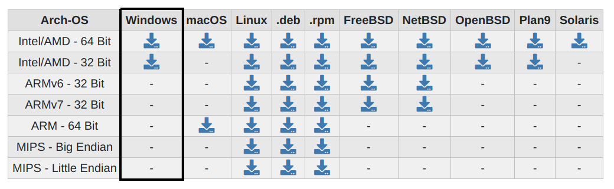
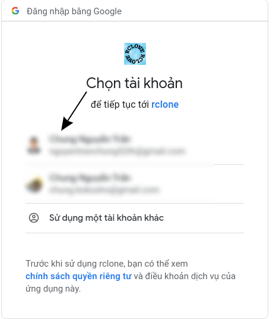
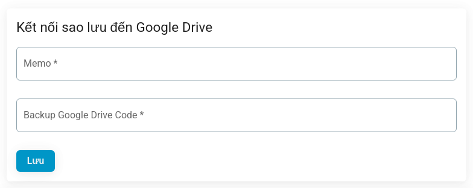
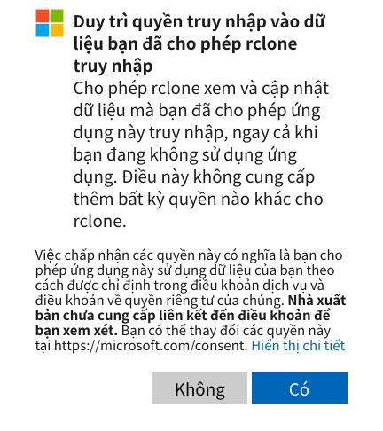
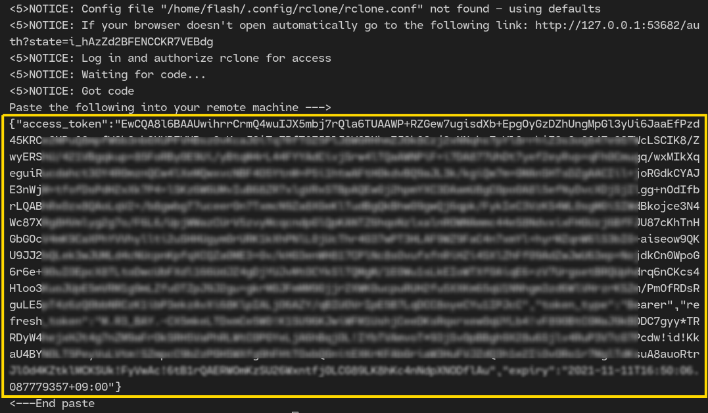
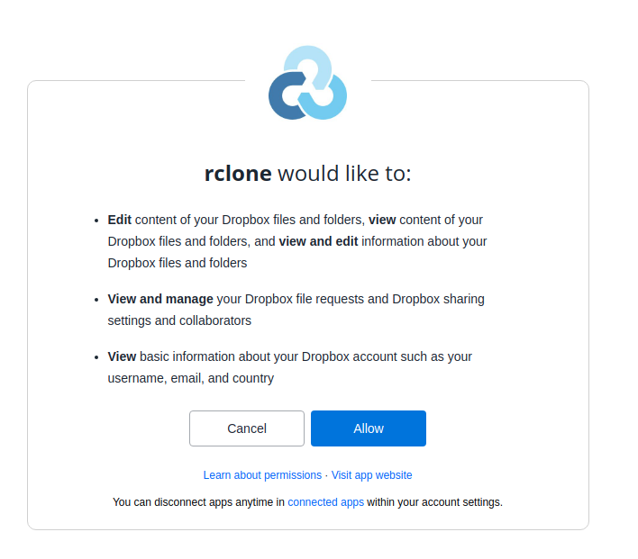
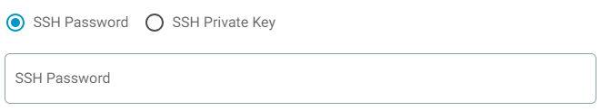
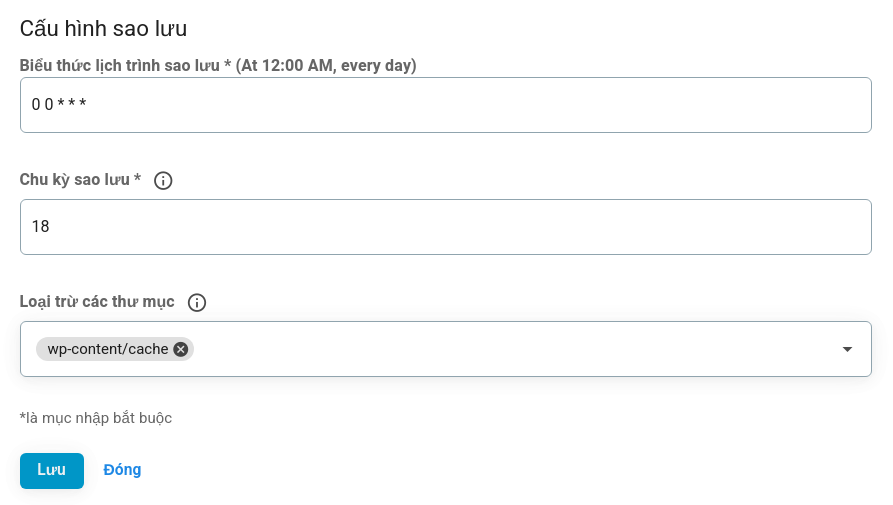

<script setup>
import { data } from '../../.vitepress/config.data.ts'
</script>

# Data backup

## Backup to Google Drive

For the configuration process to go smoothly, you need to prepare the following:

1. A Google Drive account dedicated to backing up data
2. Install Rclone and get Google Drive Token

    1. **On Windows**

        Download Rclone 64bit or 32bit software to your device at https://rclone.org/downloads/
        
        Then unzip the zip file downloaded above, we will have the file rclone.exe, assuming it is located in the folder `D:\Rclone\rclone.exe`
        Open the Windows CMD application (Run- CMD) and run the following command:

        ```powershell
        D:\Rclone\rclone.exe authorize "drive"
        ```

        Don't forget to change `D:\Rclone\rclone.exe` to the corresponding path on your computer!
        A browser will open, go to step 3

    2. **On Linux/macOS/BSD**

        Open the terminal application and run the command to install (be sure to enter sudo password):

        ```bash
        curl https://rclone.org/install.sh -o rclone.sh
        sudo bash rclone.sh
        rm rclone.sh

        rclone authorize "drive"
        ```

        A browser will open, go to step 3

3. Select the Google account to back up to:
   
4. Authorize connection to your account:
   
5. Go back to terminal/cmd in step 2, you will see a code as shown below, please copy this code:
   
6. Go to <a :href="data.url + '/servers/'" target="_blank">server management page</a> and select the server to backup, then click on the "Backup" tab save"
7. Select Google Drive
   
8. In the memo box, enter a description to take notes. In the second box is "Backup Google Drive Code", enter the code you copied in step 5.
   
9. Click save to complete.

## Backup to OneDrive

For the configuration process to go smoothly, you need to prepare the following:

1. A dedicated Microsoft OneDrive account for data backup
2. Install Rclone and get OneDrive Token

    1. **On Windows**

        Download Rclone 64bit or 32bit software to your device at https://rclone.org/downloads/
        
        Then unzip the zip file downloaded above, we will have the file rclone.exe, assuming it is located in the folder `D:\Rclone\rclone.exe`
        Open the Windows CMD application (Run- CMD) and run the following command:

        ```powershell
        D:\Rclone\rclone.exe authorize "onedrive"
        ```

        Don't forget to change `D:\Rclone\rclone.exe` to the corresponding path on your computer!
        A browser will open, go to step 3

    2. **On Linux/macOS/BSD**

        Open the terminal application and run the command to install (be sure to enter sudo password):

        ```bash
        curl https://rclone.org/install.sh -o rclone.sh
        sudo bash rclone.sh
        rm rclone.sh

        rclone authorize "onedrive"
        ```

        A browser will open, go to step 3

3. Sign in to your Microsoft account (skip if you're already signed in)
4. Allow connection to your account by pressing Yes or Yes:
   
5. Go back to terminal/cmd in step 2, you will see a code as shown below, please copy this code:

    The code between `Paste the following into your remote machine --->` and `<---End paste`!
    

6. Go to <a :href="data.url + '/servers/'" target="_blank">server management page</a> and select the server to backup, then click on the "Backup" tab save"
7. Select OneDrive
   
8. In the memo box, enter a description to take notes. In the second box is "Backup OneDrive Code", enter the code copied in step 5.
   
9. Click save to complete.

## Backup to DropBox

For the configuration process to go smoothly, you need to prepare the following:

1. A dedicated Dropbox account for data backup
2. Install Rclone and get Dropbox Token

    1. **On Windows**

        Download Rclone 64bit or 32bit software to your device at https://rclone.org/downloads/
        
        Then unzip the zip file downloaded above, we will have the file rclone.exe, assuming it is located in the folder `D:\Rclone\rclone.exe`
        Open the Windows CMD application (Run- CMD) and run the following command:

        ```powershell
        D:\Rclone\rclone.exe authorize "dropbox"
        ```

        Don't forget to change `D:\Rclone\rclone.exe` to the corresponding path on your computer!
        A browser will open, go to step 3

    2. **On Linux/macOS/BSD**

        Open the terminal application and run the command to install (be sure to enter sudo password):

        ```bash
        curl https://rclone.org/install.sh -o rclone.sh
        sudo bash rclone.sh
        rm rclone.sh
        rclone authorize "dropbox"
        ```

        A browser will open, go to step 3

3. Sign in to your Dropbox account (skip if you're already signed in)
4. Allow connection to your account by pressing "Agree" or "Allow":
   
5. Go back to terminal/cmd in step 2, you will see a code as shown below, please copy this code:

    The code between `Paste the following into your remote machine --->` and `<---End paste`!
    

6. Go to <a :href="data.url + '/servers/'" target="_blank">server management page</a> and select the server to backup, then click on the `Backup tab save`
7. Select Dropbox
   
8. In the memo box, enter a description to take notes. In the second box is "Backup Dropbox Code", enter the code copied in step 5.
   
9. Click save to complete.

## Backup to SFTP

1. Go to <a :href="data.url + '/servers/'" target="_blank">server management page</a> and select the server to backup, then click on the `Backup tab save`
2. Select SFTP
   
3. In the Config SFTP box, Enter your SFTP information.

    

-   Memo box, enter a description to take notes
-   Host: Enter SFTP IPv4 address or Domain name
-   User: SFTP User to connect. Default (root)
-   Port: SFTP port to connect. Default (22)

    

-   SSH Password: The password of User to connect

    

-   SSH Private Key & Passphrase: SFTP Authenticate using private key & passphrase (if it have)

## Backup configuration



-   Backup schedule expression: refer to [here](../knowledge/cron-job.md)
-   Backup cycle: the most recent number of days to retain backups, for example, if set to 18, the previous 19-day backups are no longer available, you should consider downloading them before being deleted.
-   Exclude folders: is a path pointing to a folder that is not in your data backup
