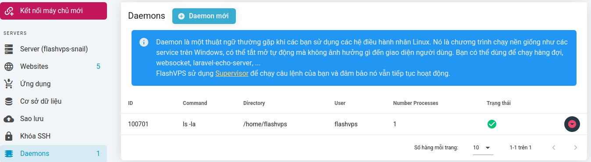

#Daemons

## Generality

Daemon is a common term when you use Linux kernel operating systems. It is a program that runs in the background like services on Windows, and can be turned on and off automatically without affecting the user interface. You can use it to run queues, websockets, laravel-echo-server, ...
`{{ data.name }}` uses Supervisor to run your command and ensure it continues to work

## Daemon configuration

You can set up a script daemon via the server's `Daemon` tab. Steps to configure a daemon script:

1. At the `Daemon` tab > Select `New Daemon`
   
2. Fill in the script information you want to set up:

    - **Command**: Command to run. For example: `php artisan queue:work`
    - **User**: System user used to invoke the command, default `flashvps` will be used
    - **Directory**: Directory to run your command from. This field can be left blank.
    - **Number Processes**: This option determines the number of instances of the process that will continue to run
      

3. Select `Save`

After the script daemon is successfully created, you will be able to easily perform some operations on the script as follows:

## Log files

`{{ data.name }}` automatically configures your daemon to write to the log file. The logs can be found in the `/home/flashvps/.flashvps/` directory. The log files are named `daemon-*.log`. If the daemon script is run with the system user `root`, the log file will be saved at `/root/.flashvps/`.

::: warning
If you are using the user isolation feature of `{{ data.name }}`, you should navigate to the `.flashvps` folder in the `/home/{username}` directory based on the user the daemon belongs to. belongs to locate the log file.
:::
