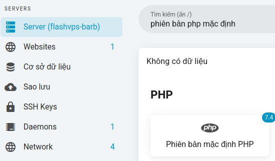
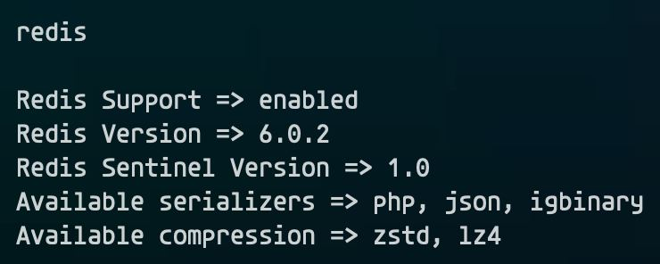
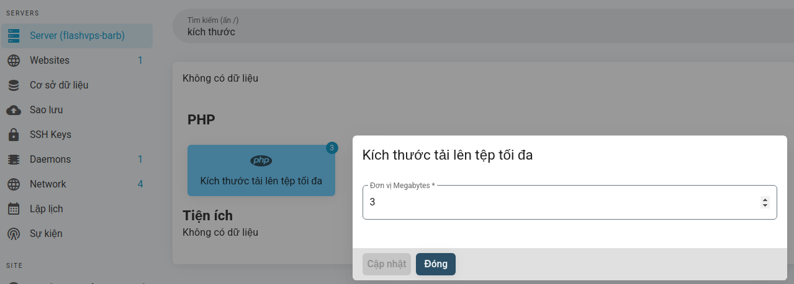
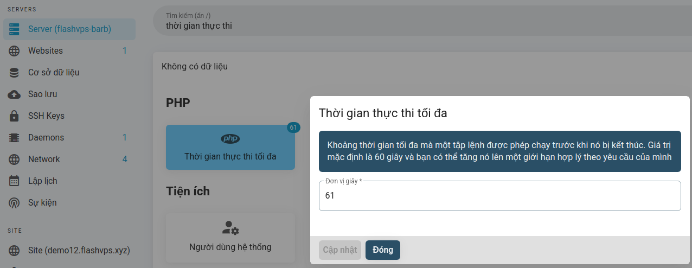
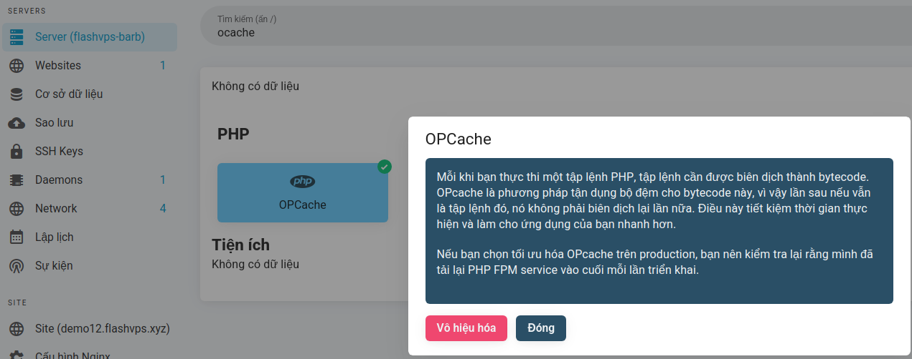

<script setup>
import { data } from '../../.vitepress/config.data.ts'
</script>

# PHP

{{ data.name }} makes it easy to toggle the default version for the server, set maximum file upload size, maximum execution time, and enable/disable OPCache.

::: warning ! Install PHP manually

If you choose to manually install PHP versions on your server, {{ data.name }} will not know about those PHP settings. {{ data.name }} only knows about PHP settings managed through the {{ data.name }} control panel.

:::

## Multiple PHP Versions

When creating a server, you must decide which version of PHP you want to install as the `default` version. The PHP CLI on your server will point to the installed version selected at creation time.

Once the server has been created, {{ data.name }} makes it easy to install additional instances alongside the default instance. In the following document, we will discuss how to manage these additional PHP versions.

## Setting

You can install additional PHP versions through the [**Applications**](./application.md) tab on the server's management console. Once an additional PHP version has been installed, you can select it when creating a website or when switching the PHP version of a website.

When you install a new PHP version to your server, {{ data.name }} creates and configures the PHP-FPM process for that version. This means your server will be running multiple versions of PHP at the same time.

## Uninstall

You can uninstall PHP versions through the [**Applications**](./application.md) tab on the server's management console. You can choose to uninstall the PHP version as long as:

-   There are other versions installed.
-   The version you want to uninstall is not the server's default version for new sites.
-   The version you want to uninstall is not the server's default version on CLI.
-   The version you want to uninstall is not used by any website.

## Convert PHP Default

The 'default' PHP version is the PHP version that will be used by default when creating a new website on the server.
Conversion steps:

1. At the server management console > Select `PHP Default Version`
   
2. Select the PHP version you want to transfer
   
3. Select `Update`

When selecting a new PHP version as the 'default' version for your server, PHP versions used by existing websites will not be updated.

## Install PHPRedis with igbinary and zstd + lz4

::: warning
OpenLiteSpeed ​​does not apply
:::

-   Go to Application > PHP and install extension `php8.2-redis`, `php8.2-igbinary`, `php8.2-lz4`.
-   Go to Server > Terminal (root user) and run the command

    ```bash
    apt update && apt install liblz4-dev libzstd-dev
    pecl uninstall redis
    pecl install --configureoptions 'enable-redis-igbinary="yes" enable-redis-zstd="yes" enable-redis-lz4="yes"' redis
    ```

    It will report an error related to php_ini but can be ignored.

    Check the results with the command `php -ri redis`

    The result as shown in the picture is ok.

    

Those who run multiple sites sharing the same Redis instance, especially 'Wordpress' and 'Woocommerce' sites, should consider turning on compression for more optimization.

    Blog comparing redis compression from DoorDash: https://doordash.engineering/2019/01/02/speeding-up-redis-with-compression/

## Some common PHP configuration settings

::: warning

Changing the following settings will apply the changes to all PHP versions installed on the server.

:::

### Maximum file upload size

You can configure the maximum file upload size in the server management console. Values ​​are provided in megabytes. For reference, `1024MB` is `1GB`.


### Maximum execution time

You can configure the maximum execution time at the server management console. The value provided is in `seconds`.


### OPcache

Optimizing OPcache PHP for production configures OPcache to store your compiled PHP code in memory to significantly improve performance. If you choose to optimize OPcache for production, you should verify that your deployment script [**restart PHP-FPM service**](cookbook.md#restart-restart- php-fpm) at the end of each deployment.

Enable PHPOccache at the server management console

