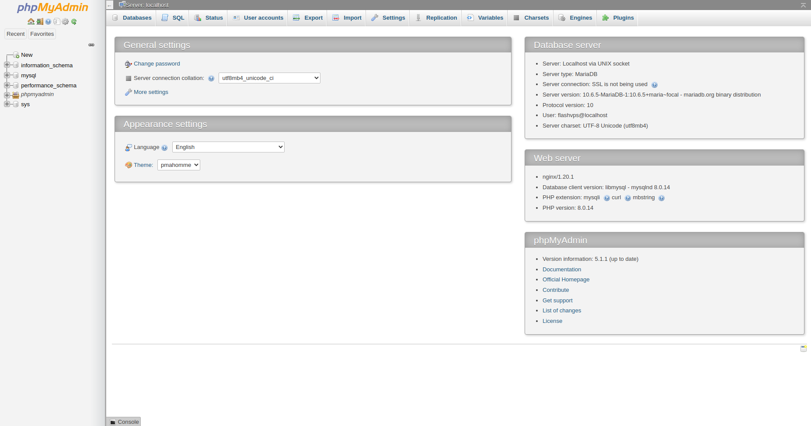

# phpMyAdmin

::: warning
Unlike the panels or scripts you used before, phpMyAdmin in {{ data.name }} is a standalone website.
:::

## What is phpMyAdmin?

`phpMyAdmin` is a free software tool written in PHP that handles MySQL administration over the Web. phpMyAdmin supports a wide range of operations on MySQL and MariaDB. Commonly used operations (management of databases, tables, columns, relations, indexes, users, permissions, etc.) can be performed through the user interface, while you still has the ability to execute any SQL statement directly.

{{ data.name }} also supports phpMyAdmin installation, so you can manage your database from anywhere.

If you haven't done so before, you should create a new database and database user. This is used by phpMyAdmin to store the configuration of your database and users.

Once {{ data.name }} has installed phpMyAdmin, you can then log in to your installation using any combination of your database username and password.

## Outstanding features of phpMyAdmin

-   Intuitive web interface
-   Supports most MySQL features:
    -   browse and delete databases, tables, views, fields and indexes
    -   create, copy, delete, rename and alter databases, tables, fields and indexes
    -   server, database and table maintenance, with server configuration recommendations
    -   execute, edit and bookmark any SQL statement, even batch queries
    -   Manage MySQL user accounts and privileges
    -   manage stored procedures and triggers
-   Import data from CSV and SQL
-   Export data to different formats: CSV, SQL, XML, PDF, ISO/IEC 26300 - OpenDocument Text and Spreadsheet, Word, LATEX and others
-   Administering multiple servers
-   Create graphics of your database layout in different formats
-   Create complex queries using Query-by-example (QBE)
-   Global search within a database or a subset of it
-   Convert stored data to any format using a set of predefined functions, like displaying BLOB data as an image or download-link
-   ...

## Instructions for installing phpMyAdmin

::: warning
phpMyAdmin version may work on PHP greater than 8.0 but may experience some compatibility issues due to some feature and syntax changes compared to previous PHP versions.
:::

1.  **Create website**: At the server information interface, select `Create new website`
    

2.  Fill in website information and select `Create website`
    

3.  **Install phpMyAdmin**: Go to the website management panel.
    Then select the option to install phpMyAdmin source code
    

4.  Select `Install phpMyAdmin`

        {{ data.name }} will install for you. The installation process will take 1-2 minutes. Then you just need to access the website and if you see the interface as shown below, you have succeeded.

    Enter the username and password that {{ data.name }} sent you via email when you created the server. Or you can also go to the `Database` > tab and create a new `username`, `password`.
    

        After successful login, the interface is as follows:
        

## Some issues to note

### When importing large files

-   When importing large files, it will take a long time to process
-   Go back to <a :href="data.url + '/servers'" target="_blank">{{ data.name }}</a> and set a few more parameters in the server management panel For the file import to be successful:
    -   Set [`Maximum file upload size`](php.md#maximum-file-upload-size) (MB)
    -   Set [`execution time`](php.md#max-execution-time)
