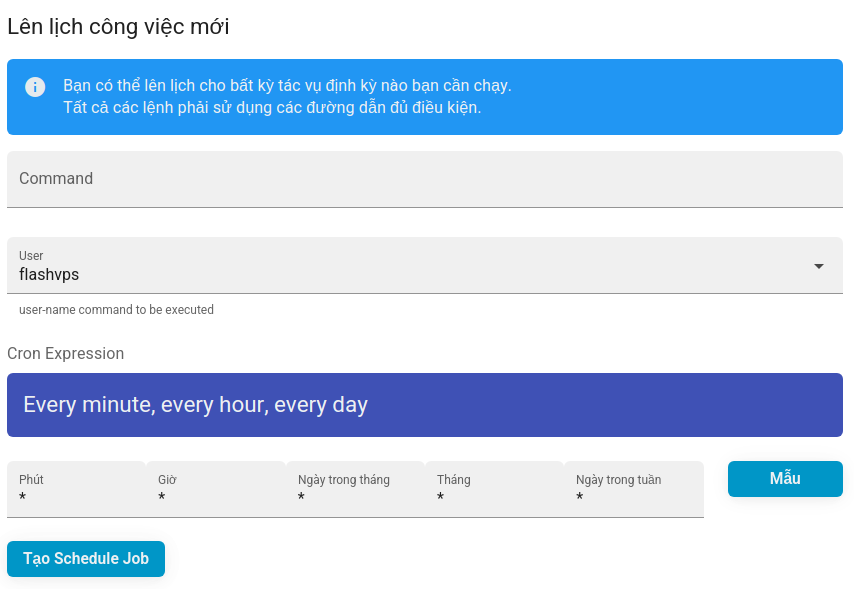

# Scheduling (Schedule)

## Scheduled Jobs

Scheduled jobs can be configured to run commands within a specified period of time. `{{ data.name }}` provides some common defaults, or you can enter a custom Cron schedule for a command.

You can create scheduled jobs through the `{{ data.name }}` console via the **Scheduling** tab for the server's management console. When you create a new scheduled job, you need to provide:

-   **Command**: Command to run, for example: `php /home/flashvps/default/ artian schedule:run`
-   **User**: System user running the command. e.g. `flashvps`
-   **Cron Expression**: Frequency of running command at.
    

::: warning **! Scheduled Job Not Running?.**  
If your scheduled job is not running, you should ensure that the path to the command is correct.
:::

### Laravel Scheduled Jobs

If you have deployed a Laravel application and are using the [Laravel scheduling](https://laravel.com/docs/master/scheduling) feature, you will need to create a scheduled job to run the command Laravel Artisan `schdule:run`. This job should be configured to execute every minute.
