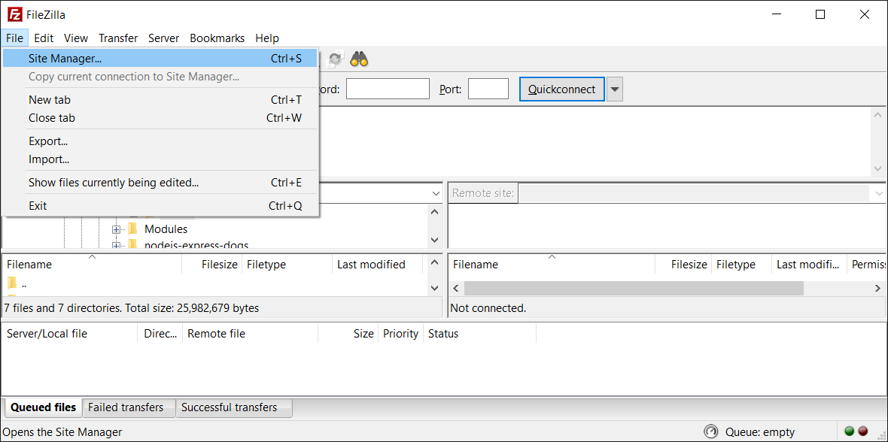

# SFTP

::: info

SFTP is also known by its original name: SSH File Transfer Protocol.
That is the SSH - Secure Shell protocol, a protocol used to move files.
SFTP was developed in the 1990s. And it allows to move files securely.
:::

## What is SFTP Client?

SFTP Client is a software that uses the SFTP protocol to securely transfer files to remote computers.

## Instructions for using WinSCP

1. Download and install at: https://winscp.net/eng/download.php
2. Click the "New Session" button to initiate a new connection
   
3. Configure as shown, then click the "Advanced..." button
   
4. On the left select SSH > Authentication, then click the ... button in the red frame and select private PuttyKey,
   If you don't have a Private PuTTY Key, please see [instructions here](../knowledge/ssh-keys.md)
   
   Then click OK.
5. Click "Login" to log in
   
6. Done, you can upload the file to your server.
   

## Instructions for using FileZilla

1. Download and install at: https://filezilla-project.org/download.php?type=client
2. From the menu select "File > Site Manager"
   
3. Click "New Site" to create a new site
   
4. Configuration as shown below, note:

    ② protocol: select SFTP

    ⑤ Logon Type: select key file

    ⑦ If you don't have a Private PuTTY Key, please see [instructions here](../knowledge/ssh-keys.md)
    
    Then click Connect.

5. Done, you can upload the file to your server.
