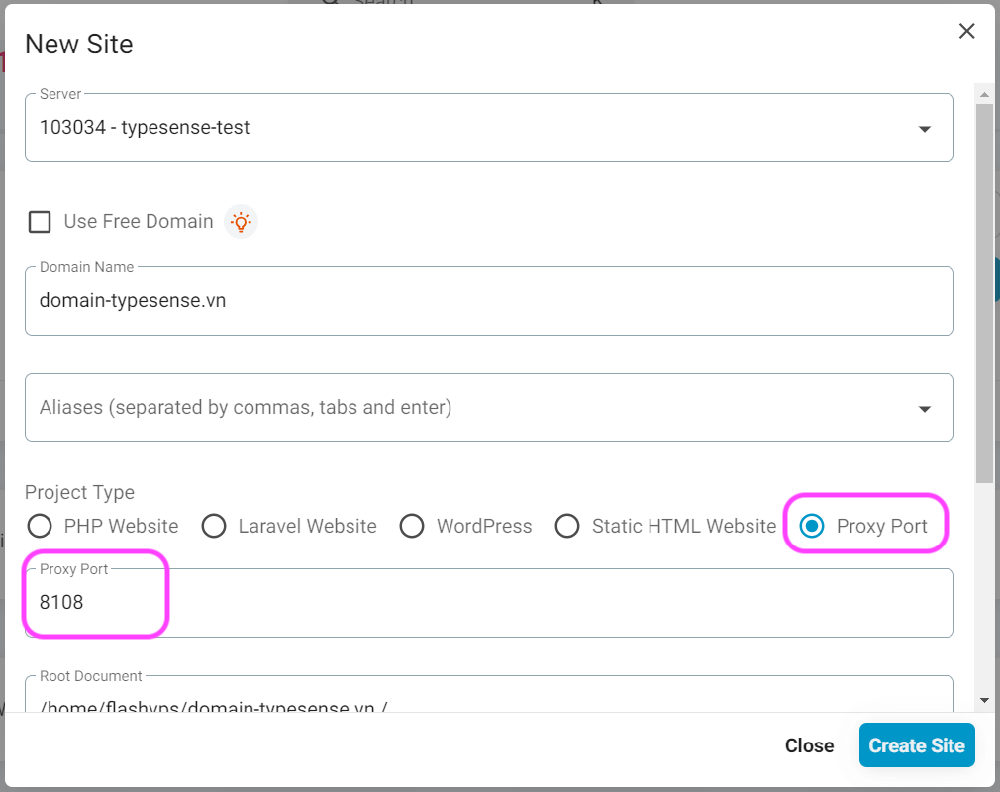
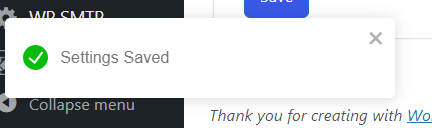
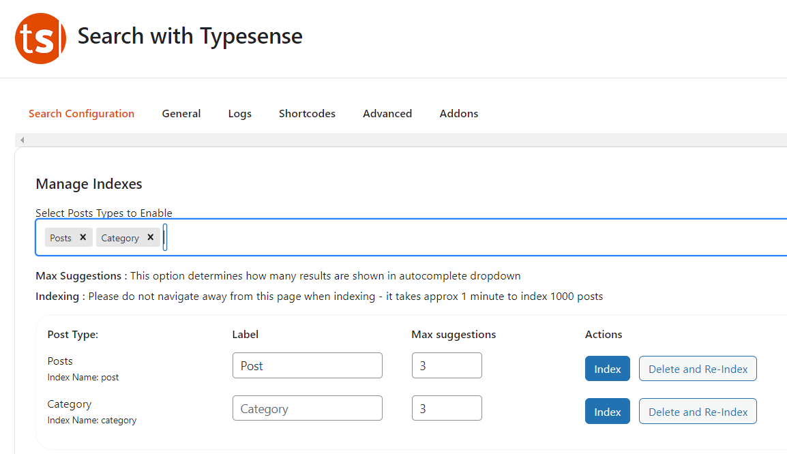
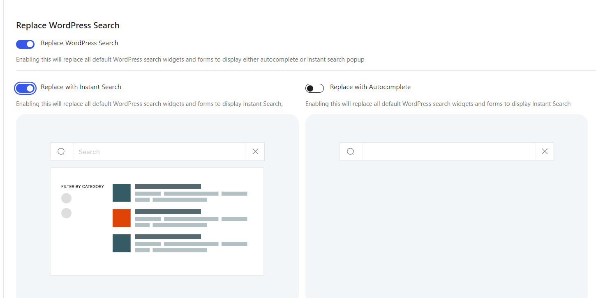

---
head:
    - - meta
      - name: description
        content: Typesense Server is an open source search engine, designed to provide fast and accurate full-text search features
---

<script setup>
import { data } from '../../.vitepress/config.data.ts'
</script>

# Typesense Server


How to install Typesense Server Search on {{ data.name }}

## What is Typesense Server?

Typesense Server is an open source search engine, designed to provide fast and accurate full-text search features. It is built to serve applications with complex search requirements, yet is easy to deploy and manage.

### Key features of Typesense Server:

1. **Fast full-text search**: Typesense uses advanced search algorithms to provide near-instant search results.

2. **Easy to install and manage**: It has a simple management interface, making it easy to install, configure and maintain.

3. **Auto-completion and keyword suggestions**: Typesense supports auto-completion and keyword suggestions while users type, helping to improve user experience.

4. **Improve the quality of search results**: Use features like weighting, natural language analysis, and relevance tuning to ensure results Search accurately and best match the user's query.

5. **RESTful API**: Provides a RESTful API for easy integration with web or mobile applications.

6. **Supports approximate search (fuzzy search)**: Helps search accurately even when the user enters misspelling or has a typing error.

7. **Easy Scalability**: Scalable to handle large data volumes and multiple concurrent users.

### Benefits of using Typesense:

-   **High speed and performance**: Helps improve user experience with fast and accurate search results.
-   **Simple and easy to use**: User-friendly API and management interface, making integration and management easier.
-   **Open source**: Users can customize and expand features according to their needs without being limited by a specific vendor.

### Some applications of Typesense:

-   **E-commerce**: Search for products in online stores.
-   **Web and mobile apps**: Provides search for apps that need to search for content or large data.
-   **Information portal and content website**: Helps users find information quickly and effectively.

Typesense Server is an ideal choice for developers and businesses who want to improve search features in their applications without spending too much effort and resources.

## Install Typesense Server on {{ data.name }}

::: info
First you need a brand new server connected to {{ data.name }} (just install `Nginx`, the others are not needed). Actually, you can share your current server with the website, but I think you should separate them, so that it's easy to manage and if there are any errors, both won't go wrong.
:::

Go to the server's `Applications` tab, find the `Typesense Server` application and click install


Please save information such as `Port` and `Master Key`.

## Connect to Typesense Server

There are 2 ways for you to connect to Typesense Server:

1. connect via ip, port
2. connect through domain

### Connect via ip, port

1. If your website and Typesense Server are on the same server, you don't have to do anything.
2. If the website and Typesense Server are different servers, you must open port `8108` in [Firewall management](firewall-rule.md) for outside connections to

### Connect through domain

Go to the connected server {{ data.name }}, go to the application section (app), find and install the Typesense application

Create a new website for Typesense Server

Remember to fill in the necessary information: Domain (or subdomain is fine, and remember to point DNS to the server IP), select type `Proxy Port`, and enter Proxy port `8108`, as shown below. And click create site.



Then you [install SSL certificate](../site/ssl.md) for the domain.

## Generate Api Key

When connecting to Typesense Server, you need to provide an `API Key`. You can use a `Master Api Key` when installing Typesense, but it is not recommended because it is not safe. `Master Api Key` is the master API key, it has full rights.

Therefore, for more security, you should create subkeys `Admin Api Key`, and `Search Only Api Key`

Go to Command and enter the commands below to create API keys

```bash
# This is the Master API Key
TYPESENSE_API_KEY=abcxyz

# Create Admin Api Key
curl 'http://localhost:8108/keys' \
    -X POST\
    -H "X-TYPESENSE-API-KEY: ${TYPESENSE_API_KEY}" \
    -H 'Content-Type: application/json' \
    -d '{"description":"Admin Key","actions": ["*"], "collections": ["*"]}'

# Create Search Only Api Key
curl 'http://localhost:8108/keys' \
    -X POST\
    -H "X-TYPESENSE-API-KEY: ${TYPESENSE_API_KEY}" \
    -H 'Content-Type: application/json' \
    -d '{"description":"Search-only key","actions": ["documents:search"], "collections": ["import_collection"]}'

```

## Use Typesense Server in WordPress

Go to Wordpress, install the plugin `Search with Typesense` (completely free), if you use `Woocommerce` then you need to buy the add-on

After installing and activating the plugin, go to the plugin and go to the General tab:


You fill in the following information:

1. In case Typesense Server and WordPress are on the same server
    - PROTOCOL: select `http`
    - ENTER NODE URI: enter `127.0.0.1`
    - ENTER PORT: enter `80`
    - ADMIN API KEY and SEARCH API KEY: enter `MASTER API Key` or [create `Admin Api Key` and `Search Only Api Key`](#tao-api-key)
2. In case Typesense Server and WordPress have different servers and use `ip:port`
    - PROTOCOL: select `http`
    - ENTER NODE URI: enter `server_ip`
    - ENTER PORT: enter `8108`
    - ADMIN API KEY and SEARCH API KEY: enter `MASTER API Key` or [create `Admin Api Key` and `Search Only Api Key`](#tao-api-key)
3. In case Typesense Server and WordPress have different servers and use `domain`
    - PROTOCOL: select `https`
    - ENTER NODE URI: enter `domain` when creating the website above
    - ENTER PORT: enter `443`
    - ADMIN API KEY and SEARCH API KEY: enter `MASTER API Key` or [create `Admin Api Key` and `Search Only Api Key`](#tao-api-key)
      Enter the MASTER API Key (I will talk more about this later)

When finished, click "Save"

It will notify you in the bottom left corner as if it was successful:



### Index data to Typesense server:

Go to Search Config:



Index posts and categories by clicking the index button and waiting (index speed is quite fast)

If you want to index data to a more stable Typesense server, refer to the plugin's WP-CLI at this link: https://docs.wptypesense.com/wp-cli/

### Customize display

You can customize some of the items below:



I prefer to use `Instant Search` rather than `Autocomplete`. But depending on each person's needs, you can customize it to your liking.

### Display Typesense Search page:

You can use shortcode to display the search page. Just create a blank page, then add the shortcode and you're done.

Plugin shortcode documentation here: https://docs.wptypesense.com/shortcode/

## Summary:

Above are the basic and quite easy steps to install an extremely powerful 'Typesense search' server for your Wordpress website.

Especially for websites with a large number of articles (calculated in tens of thousands to several hundred thousand).

Reduce server load.

Furthermore, the user experience will be greatly improved compared to using Wordpress's default search.
