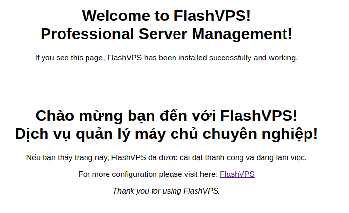

<script setup>
import { data } from '../../.vitepress/config.data.ts'
</script>

# Basic

## Create website

1. On the server management page, click the `New Site` button

    

    When creating a new site on your `{{ data.name }}` server, many configuration options are available to you:

    - **Server**: The server in which the website will be created.
    - **Domain Name**: Domain name for the website.
    - **Aliases**: Alias ​​for the website (optional)
    - **Project Type**: This option indicates whether the project installed for your website will be a PHP / Laravel project or a static HTML page. This setting is used to determine the structure of the Nginx configuration file generated for your website.
    - **Web Directory**: Directory publicly accessible via the Internet. For Laravel applications, this is usually the `/public` directory.
    - **PHP Version**: If you have multiple versions of PHP installed on your server, you can choose which version will be used to serve the website.
    - **Enable subdomain wildcard**: Subdomain wildcard allows you to set the destination for all non-existent subdomains to the current website.
    - **Site Isolation**: This configuration setting indicates whether the PHP-FPM process should run on the specified user account or use the default user.
          <!-- You can learn more about site quarantine by consulting [the feature's full documentation](#). -->
    - **Create Database**: This setting indicates whether you want to create a new database for your site.

2. Enter information > Select `Create website`

## Install source code

Once the website has been created in `{{ data.name }}`, you can install an application or project. Projects contain the actual source code of your application.

Install the source code at the site's management console


### Self Upload

The goal is to hide the `Source Code Settings` section on the interface and let `{{ data.name }}` know that the source code was uploaded manually by you

### Git Repository

::: warning **! Source Control Vendor**  
Before you can install a Git repository, you must first ensure that you have [git connect](../connect/connect-git.md) with the account `{{ data.name }}` mine.
:::

Once you have connected your source control provider accounts, you can select a provider from one of the available options. Steps to install source code for website:

1. Select `Git` | `Github` | `Gitlab` | `Bitbucket`

2. If you choose `Git` you will need to [add the SSH key `{{ data.name }}` to the provider](../connect/connect-git.md) manually.
3. Enter the repository name, you should provide the full SSH URL, e.g. `git@flashpanel.io:flashpanel/flashpanel.git`.
4. Enter Branch Name
5. Select `Automatically add deployment key (Recommended)` if you have not registered a server global key
6. Select `Automatically install Composer dependencies` if you want to run the `composer install` command after `Pull Code` returns
7. Click the `Install Git Repository` button

### WordPress

Steps to install [Wordpress](https://wordpress.org/):

1. Select `Wordpress` source settings
2. The database user and database fields can be left blank. `{{ data.name }}` will be created automatically for you. Or [Create database](../server/database.md) if you don't have one.
3. Select `Wordpress Settings`

After the installation process is complete. You can go to your website domain and continue installing WordPress from the browser.

::: warning **! WordPress Security**  
You should proceed with WordPress installation once `{{ data.name }}` has installed it for you, so that it is secure with your username and password. You can also choose to create a new [Security Rule](./nginx.md) before installing WordPress so that your installation is password protected.
:::

### phpMyAdmin

Steps to install source code [phpMyAdmin](https://phpmyadmin.net/):

1. Select the phpMyAdmin source installation option
2. Select `Install phpMyAdmin`

Once `{{ data.name }}` has installed phpMyAdmin, you can then log in to your installation using any combination of your database username and password.

## Default website



When you're ready to convert your app to an official domain, you can easily [Create a website](#create-page-web) with your domain name.

## Default Nginx Template

Below is an example of the default Nginx site configuration used by `{{ data.name }}`.

```nginx
server {
    listen 80;
    listen [::]:80;

    server_name www.your-domain.com;

    if ($http_x_forwarded_proto = 'https') {
        return 301 https://your-domain.com$request_uri;
    }

    return 301 $scheme://your-domain.com$request_uri;
}

server{
    listen 80;
    listen [::]:80;
    server_name your-domain.com;
    server_tokens off;
    root /home/flashvps/your-domain.com;

    # ssl_certificate ###
    # ssl_certificate_key ###

    # https://ssl-config.mozilla.org/
    # Ubuntu 20.04 UP
    ssl_protocols TLSv1.2 TLSv1.3;
    ssl_ciphers XXXXXX;
    ssl_prefer_server_ciphers off;
    ssl_dhparam /etc/nginx/dhparams.pem;

    add_header X-Frame-Options "SAMEORIGIN";
    add_header X-XSS-Protection "1; mode=block";
    add_header X-Content-Type-Options "nosniff";

    index index.html index.php;

    charset utf-8;

    # USER CUSTOM CONFIG (CAN MOVE, DO NOT REMOVE!)
    location ^~ /.well-known/acme-challenge {
        auth_basic off;
        allow all;
        alias /home/flashvps/.letsencrypt;
    }

    location / {
        try_files $uri $uri/ /index.php?$query_string;
    }

    location = /favicon.ico { access_log off; log_not_found off; }
    location = /robots.txt { access_log off; log_not_found off; }

    access_log off;
    error_log /var/log/nginx/your-domain.com-error.log error;

    error_page 404 /index.php;

    location ~ \.php$ {
        try_files $uri $uri/ =404;
        fastcgi_split_path_info ^(.+\.php)(/.+)$;
        fastcgi_pass unix:/var/run/php/php7.4-fpm.sock;
        fastcgi_index index.php;
        include fastcgi_params;
    }

    # Deny files starting with a . (dot) except .well-known
    location ~ /\.(?!well-known).* {
        deny all;
    }

    # WordPress: Add a slash at the end of request */wp-admin
    rewrite /wp-admin$ $scheme://$host$uri/ permanent;

    # WordPress: deny general stuff
    location ~* ^/(?:xmlrpc\.php|wp-links-opml\.php|wp-config\.php|wp-config-sample\.php|readme\.html|license\.txt)$ {
        deny all;
    }

    location ~* \.(3gp|gif|jpg|jpeg|png|ico|wmv|avi|asf|asx|mpg|mpeg|mp4|pls|mp3|mid|wav|swf|flv|exe|zip|tar| rar|gz|tgz|bz2|uha|7z|doc|docx|xls|xlsx|pdf|iso|eot|svg|ttf|woff|woff2)$ {
      gzip_static off;
      add_header Pragma public;
      add_header Cache-Control "public, must-revalidate, proxy-revalidate";
      access_log off;
      expires 30d;
      break; break;
    }

    location ~* \.(txt|js|css)$ {
      add_header Pragma public;
      add_header Cache-Control "public, must-revalidate, proxy-revalidate";
      access_log off;
      expires 30d;
      break; break;
    }

}
```

## PHP version

If your server has multiple versions of PHP installed, you can switch the version your website uses at any time.

1. At the website management dashboard > `Utilities` section > Select the `Update PHP Version` box
2. Select the PHP version and click the `Update` button

::: warning
When switching the version your website is using, you should ensure that:

-   My server has all additional PHP extensions/modules installed for that version. Failure to install additional modules can make your website unresponsive.

-   You will also need to update your site's [deployment](./deployment.md) script to reload the correct PHP-FPM version and call the correct PHP version when running any PHP commands.

:::
