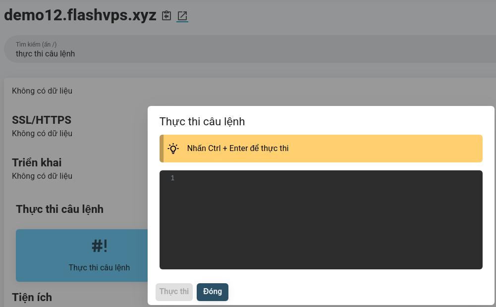
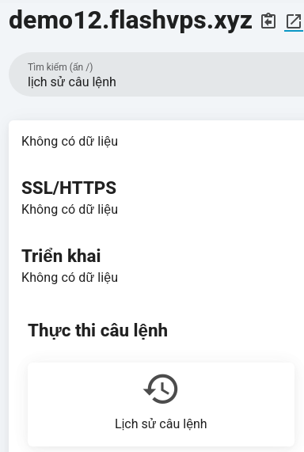
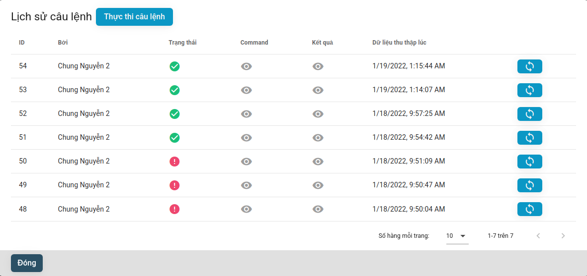

# Command

## Introduce

You can execute arbitrary Bash commands from the Commands panel. Commands are executed from within the site's root directory, for example `/home/flashvps/site.com`. If you need to run commands in another directory, you can precede the command with a `cd` operation:

`cd bin && ./run-command.sh`

## Run the command

Steps to execute a command:

1. At the website management panel
   
2. Search with the keyword `command execution` >> Select the `Command execution` tab
   
3. Enter the command you want to execute > Select `Execute`

> **! Command Input**
> Commands are not executed in tty, which means that input / passwords cannot be provided.

## Command history

`{{ data.name }}` displays the command history in table form, by default it will display the last 10 commands that have been executed.

From the Command History panel, you can also view command output and rerun the command.
