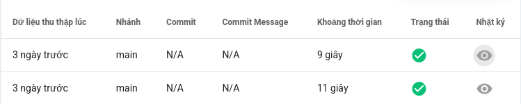
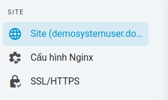
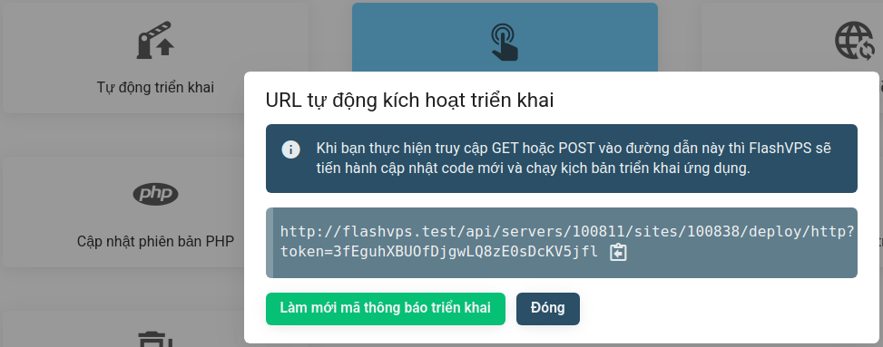
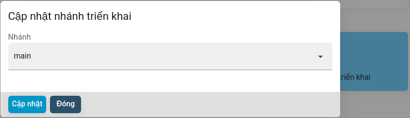
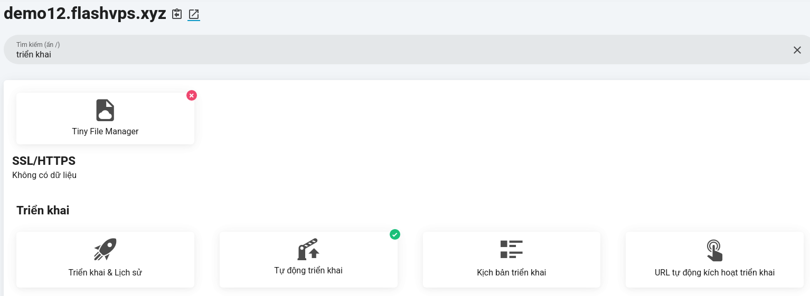
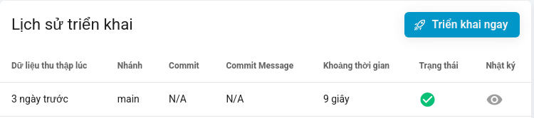
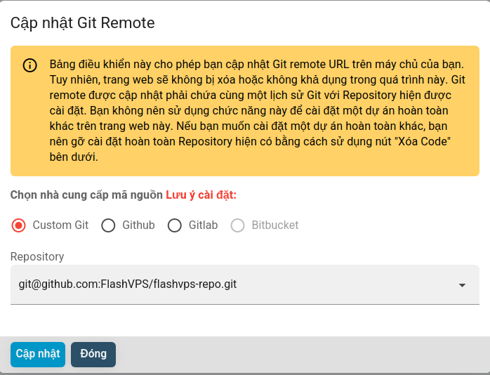
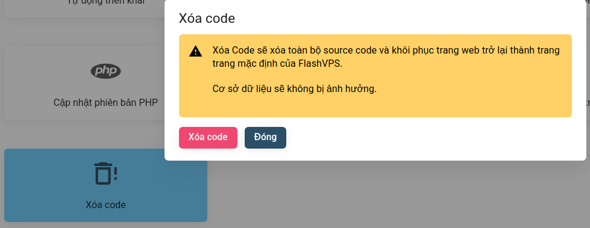

<script setup>
import { data } from '../../.vitepress/config.data.ts'
</script>

# Deployment

Deployment is the process in which your code is downloaded from the source control provider onto your server. `{{ data.name }}` shows deployments as a table, the table shows what (logs) were deployed, when they were deployed, and how long they lasted.


## .env file

Some applications, such as those built with the Laravel Framework, may require an `.env` file to configure settings such as the database and caching. You can create and edit your Environment files in the management console of the `{{ data.name }}` site.

At the site management console > Select `.env`


::: warning **! Automatic Environment Files**  
If your project contains a `.env.example` file, `{{ data.name }}` will automatically copy this file and replace some settings to match the server's database settings your. An empty `.env.example` file may result in an empty environment file on first deployment.

:::

## Automatic deployment

The `Auto-deploy` feature of `{{ data.name }}` allows you to easily deploy your projects when you push code to your source control provider. When you push to your configured deployment branch, `{{ data.name }}` will pull your latest code from source control and run your application's configured deployment script.
You can enable auto-deployment of `{{ data.name }}` following:

1. At the website management dashboard
2. Select the `Deployments` tab and click the `Enable auto deploy` button
   

## Deployment script

The commands that are executed on your server when your project is deployed are determined by your site's deployment script. Of course, this deployment script can be edited directly in the `{{ data.name }}` user interface.

`{{ data.name }}` provides a number of variables for you to easily use

```
FLASHVPS_SITE_ROOT='/path/to/yoursite.com'
FLASHVPS_CODE_BRANCH='siteBranch'
FLASHVPS_PHP='your-phpVersion'
FLASHVPS_PHP_FPM='your-phpVersion-fpm'
```

By default, your site's deployment script will:

```bash
cd $FLASHVPS_SITE_ROOT
git pull origin $FLASHVPS_CODE_BRANCH
echo 'Restarting FPM...';
sudo -S service $FLASHVPS_PHP_FPM reload
```

> **! Zero Downtime Deployments**  
> Deployment may cause your site to be unavailable momentarily. If you want to avoid delays in your website's rollout, check out [Envoyer](https://envoyer.io/)

## PHP Versions

If you have [multiple PHP versions](../server/php.md) installed on your server, your deployment script may need to be updated to use the correct PHP version.

By default, `php` will always point to the active PHP version used on the CLI. If you need to use a different version of PHP, you must use `phpx.x` where `x.x` corresponds to the version used (e.g. `php8.1`) when calling PHP commands.

The deployment script for newly created sites uses the $FLASHVPS_PHP environment variable. This [environment variable](#environment-variable) will always contain the name of the current PHP version configured for the site, so no additional changes are needed to your deployment script when using this variable and when switching the PHP version of your website.

## Environment variables

`{{ data.name }}` will automatically include the following environment variables in your deployment script at runtime:

| Variable               | Description                                                            |
| ---------------------- | :--------------------------------------------------------------------- |
| `FLASHVPS_PHP_FPM`     | The PHP-FPM process name is being used by `{{ data.name }}`.           |
| `FLASHVPS_PHP`         | The PHP version being used by the website or server `{{ data.name }}`. |
| `FLASHVPS_CODE_BRANCH` | The name of the branch to be deployed.                                 |
| `FLASHVPS_SITE_ROOT`   | The root of the deployment path, e.g. `/home/flashvps/mysite.com`      |

<!-- > **! Environment Variables**
> FLASHVPS will prefix any variables introduced with FLASHVPS_. Please do not use this 'namespace' when defining your own environment variables. -->

## Deploy from CI

So far, we have discussed deploying `{{ data.name }}` pages from the `{{ data.name }}` frontend or by using the 'Auto-deploy' feature ' of `{{ data.name }}`. However, you can also deploy them from the CI platform of your choice.

To perform a deployment of `{{ data.name }}` from a CI platform, you can use `Deploy from CI`.

1. At the site management console > Select `Auto-trigger deployment URL`
   
   
2. Select `Refresh deployment token`

### Use the Deployment Trigger

You can perform a deployment at any time by instructing your CI platform to make a `GET` or `POST` request to the URL shown in your site details.

While you can refresh your website token at any time, you'll need to update any services using this URL after you refresh the token.

<!-- Additional data can be passed to your deployment script via query parameters passed to the deployment trigger URL. For example, when passing the following query parameters `?token=abc1234&env=staging`, FLASHVPS will automatically include a custom FLASHVPS_VAR_ENV variable that will evaluate to 'staging'. -->

## Deployment branch

You can change the deployed branch for your site by updating the deployment branch settings. Once you have updated the deployment branch, you will then need to select **Deploy Now** to manually enable the new deployment to the new deployment branch.

Steps to update `deployment branch`:

1. At the site management console > Select `Update deployment branch`
   
2. Enter the name of the branch to change
   
3. Select `Update`

Steps to manually enable `deploy now`:

1. At the site management console > Select `Deployment and History`
   
2. Select `Deploy now`
   

## Git Remote

Updating the Git Remote control from the site management console will update the Git Remote URL on your server; however, the website will not be removed or unavailable during this process. The updated Git Remote must contain the same Git repository/history as the currently installed repository.

You should not use this function to install a completely different project on a website. If you want to install a completely different project, you should completely uninstall the existing repository using the 'Remove code' button in the Site Management Console.

Steps to update `Git Remote`:

1. At the site management console > Select `Git Remote Update`
   
2. Change the provider or full path of the repository.
   
3. Select `Update`

Steps to `Remove code`:

1. At the website management dashboard > Select `Remove code`
   
2. Select `Delete code`
   
