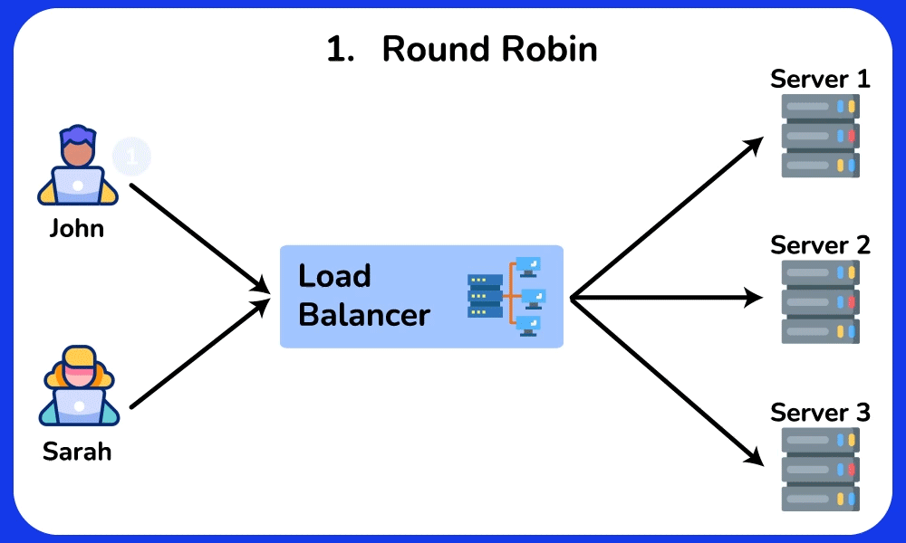
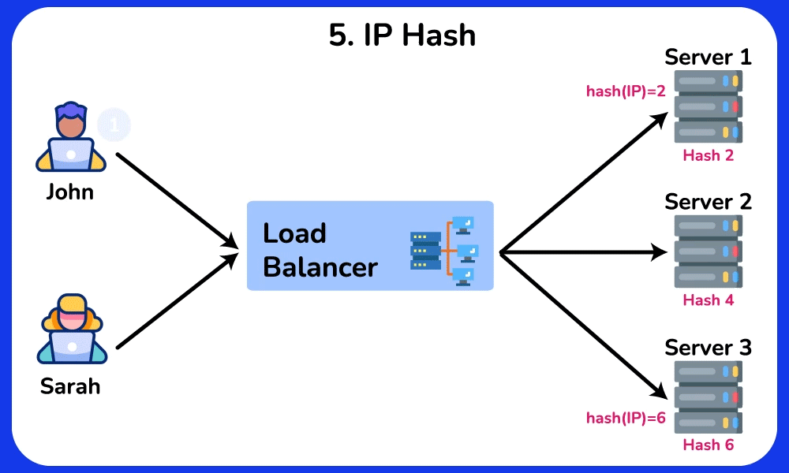

---
head:
    - - meta
      - name: description
        content: Load balancing in Nginx is one of the most powerful and popular features of Nginx, which helps distribute network traffic efficiently among backend servers to improve performance, availability and reliability application
---

<script setup>
import { data } from '../../.vitepress/config.data.ts'
import OgImage from '../../.vitepress/components/OgImage.vue'
</script>

# Load Balancing

<OgImage name="Load Balancing" />

::: warning
This document is only for servers that install [application](../server/application.md) `Nginx`
:::

Load balancing in Nginx is one of the most powerful and popular features of Nginx, which helps distribute network traffic efficiently among backend servers to improve application performance, availability and reliability. use


## Load Balancing Methods - Load balancing methods

Nginx supports many different load balancing algorithms:


### Round Robin (default)

This algorithm distributes requests to the server in cyclic order. It assigns a request to the first server, then passes to the second, third, and so on. and after reaching the last server, it will start again at the first server.



Advantage:

-   Ensures equal distribution of requests between servers because each server will take turns in a fixed order.
-   Easy to implement and understand.
-   Works well when the server has similar capabilities.

Defect:

-   May not perform optimally when servers have different capacities or different workloads.
-   Does not consider server status or response time.
-   Round Robin is predictable in its request delivery pattern, which can potentially be exploited by attackers who can observe traffic patterns and can find vulnerabilities in servers specifically by predicting which server will handle their request.

### Least Connections

The Least Connections algorithm directs requests to the server with the lowest number of active connections. This approach takes into account different server workloads.


**Advantage:**

-   Adapt to different server capacities and workloads.
-   More effective load balancing when handling requests that take a long time to process.

**Defect:**

-   Requires tracking of number of active connections per server, which may increase complexity.
-   May not take into account response time or server health.

### IP Hash

The IP Hash algorithm determines which server the request will be sent to based on the source and/or destination IP address. This method maintains session persistence, ensuring that requests from a particular user are routed to the same server.



**Advantage:**

-   Maintains session persistence, which can be useful for applications that require a persistent connection to a specific server.
-   Uniform load distribution is possible when using a well-designed hash function.

**Defect:**

-   May not balance load effectively when handling a small number of clients with many requests.
-   Does not consider server health, response times, or varying capacities.

## Add load balancing server


After clicking the `Add Server` button, fields will appear for you to fill in. I will explain these fields

1. **123,123,123 and 80**

    - The address and port of the backend server that Nginx will send requests to. In this case, it's a server running on `123.123.123` and port `80`.

2. **weight=1**:

    - Set the weight for this server in the load balancing algorithm. The weight determines the server's priority when distributing traffic.
    - A higher weight will cause the server to receive more requests than servers with a lower weight. The default weight is 1 if not specified.

3. **backup**:

    - Designate this server as a backup server.
    - The backup server only receives traffic when all primary servers are unavailable or inactive.
    - This means that this server will not receive any traffic under normal conditions and is only used in case the main servers are down.

    Benefits of using the backup attribute:

    1. **Enhanced reliability:** Ensures that your system can still serve requests even if all the main servers go down.
    2. **Resource Optimization:** Backup servers are unused under normal conditions, minimizing load and optimizing resources for primary servers.

4. **down**:

    - Mark this server as unavailable (down).
    - Servers marked as `down` will not receive any traffic from the load balancer.
    - This can be useful when you want to temporarily remove a server from the backend pool for maintenance, testing, or because the server is having problems.

    Benefits of using the down attribute:

    1. **Maintenance management:** You can temporarily remove a server from the traffic stream to perform maintenance without removing it from the Nginx configuration.
    2. **Troubleshooting:** If a server goes down, you can mark it as `down` so that Nginx does not send traffic to that server, ensuring that traffic is only sent to The server works fine.
    3. **Test and development:** During development and testing, you can use the `down` attribute to test the system behavior when some servers are unavailable.

## Note 1: Synchronize session

To ensure session synchronization when using Nginx as a load balancer, there are two main methods:

1. **Sticky Sessions:** Ensures that all requests from a user (session) are routed to the same backend server.
2. **Shared Session Storage:** Store sessions in a shared database or repository that can be accessed by all backend servers.

### 1. Sticky Sessions

Sticky sessions use cookies to ensure that a user is always routed to the same backend server. Here's how to configure sticky sessions in Nginx:

```nginx
upstream backend {
    server backend1.example.com;
    server backend2.example.com;
    server backend3.example.com;

    sticky cookie srv_id expires=1h domain=.example.com path=/; # [!code focus]
}
```

In this snippet of configuration:

-   `sticky cookie srv_id`: Creates a cookie with the name `srv_id`.
-   `expires=1h`: Cookie will expire after 1 hour.
-   `domain=.example.com`: Cookie applies to the entire domain.
-   `path=/`: Cookie applies to the entire path.

### 2. Shared Session Storage

This method stores sessions in a database or shared store such as Redis, Memcached, or an SQL database. Key steps include:

-   **Configure the application to use a session store:** Instead of storing sessions locally on each server, you configure the web application to store sessions in a shared repository.
-   **Ensure all backend servers can access the session store:** All backend servers must have access and be able to read/write to this session store.

### Example: Using Redis for Shared Session Storage

2. **Web application configuration:**
   With PHP-FPM, you can configure the following in the `php.ini` file:

    ```ini
    session.save_handler = redis
    session.save_path = "tcp://127.0.0.1:6379"
    ```

By using either of these methods, you can ensure that user sessions will be synchronized and consistent between backend servers in your system.

## Note 2: Synchronize File Upload

When using Nginx for load balancing, you should store user uploaded files in a separate location, such as Amazon S3 or another shared storage system. This helps ensure that all backend servers can access those files without having to synchronize files between servers, which avoids many complications. Here are some common reasons and methods:

### Reasons for storing files in separate locations

1. **Easy Synchronization:** When files are stored on a shared storage system, all backend servers can access them instantly without the need to synchronize files between machines owner.
2. **Data Consistency:** Helps ensure consistency of uploaded data as there is no duplication or inconsistency between servers.
3. **Easy Management:** System management and maintenance is easier when files are centralized in one place.
4. **Scalability:** Easily scale the system with centralized storage, as new servers can access files immediately without additional configuration.

### Popular solution

1. **Amazon S3:**

    - Amazon S3 is a popular object storage service widely used for storing user files.
    - You can use Amazon's SDK to upload and retrieve files from S3 in your application.

2. **NFS (Network File System):**

    - Use NFS to create a shared folder between servers.
    - This allows all backend servers to access the same file system.

3. **Use CDN (Content Delivery Network):**

-   Combine object storage with CDN to improve file access performance and deliver content to users quickly.

Storing file uploads in a separate location such as Amazon S3 or another shared storage system is a good practice when using Nginx for load balancing. This helps ensure that all backend servers can access files consistently and efficiently, while minimizing complications related to file synchronization.

## Note 3: Synchronize the database

Database synchronization in a load balanced environment is a complex issue and requires careful design of the system architecture. Here are some common methods and strategies to ensure databases are in sync when using Nginx for load balancing:

### 1. **Using a shared database (Single Database Instance)**

-   **Description:** All backend servers connect to the same database.
-   **Advantages:** Simple, easy to manage and ensures data consistency.
-   **Disadvantages:** Limits scalability, as a single database can become a bottleneck.

### 2. **Replica Set (Master-Slave Replication)**

-   **Description:** Uses master-slave (or primary-secondary) model. A main database server (master) is responsible for writing data, and secondary servers (slaves) receive data copied from the main server for reading.
-   **Advantages:** Improves data readability, increases load capacity.
-   **Disadvantages:** Delay in copying data from master to slave can cause temporary inconsistencies.

### 3. **Distributed Databases**

-   **Description:** Use database systems designed for distributed operation, such as Cassandra, Google Spanner, or CockroachDB.
-   **Advantages:** High scalability, availability and fault tolerance.
-   **Disadvantages:** Complex in deployment and management.

### 4. **Sharding database**

-   **Description:** Divides the database into smaller parts, called shards. Each shard contains a piece of data and is stored on different servers.
-   **Advantages:** Good scalability, reduces load on each database server.
-   **Disadvantages:** Complicated in deployment and management, need to be careful in dividing data.

### 5. **Synchronization and clustering tools**

-   **Description:** Use clustering and data synchronization tools such as Galera Cluster for MySQL, Patroni for PostgreSQL or use provider services such as Amazon Aurora, Google Cloud SQL.
-   **Advantages:** Ensures high availability and real-time data synchronization.
-   **Disadvantages:** Needs complex configuration and management, costs may be higher.

### Example configuration with Galera Cluster for MySQL

Galera Cluster is a powerful solution for real-time MySQL/MariaDB database synchronization. Below is an example configuration:
