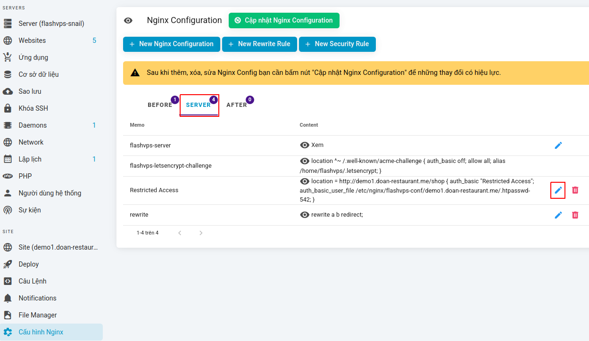
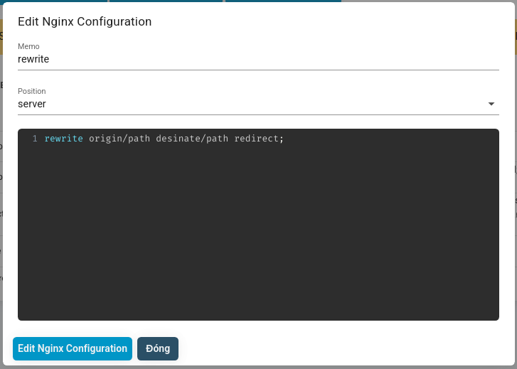
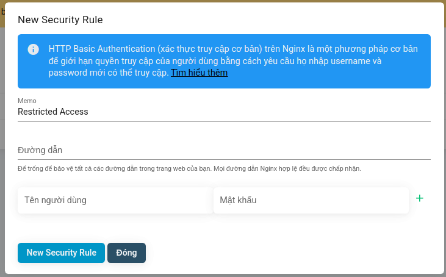
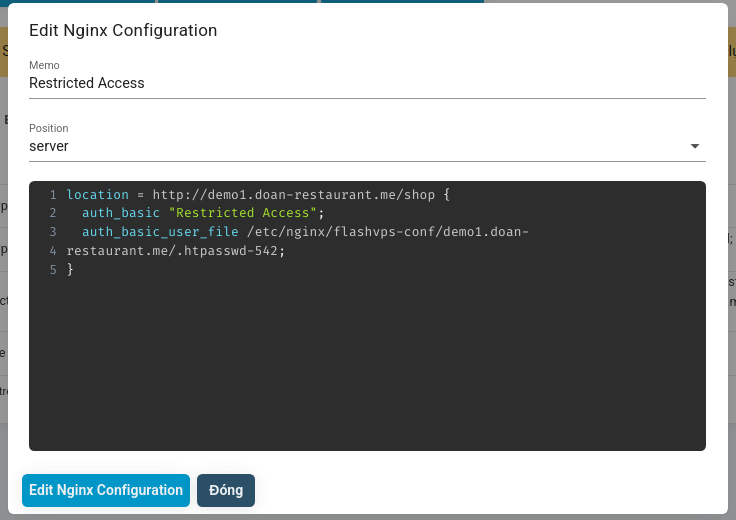
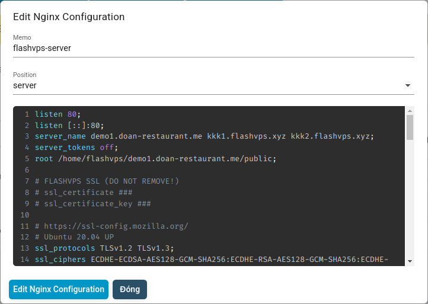
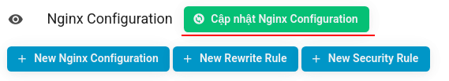

# Configure Nginx

## Redirect Rules

`{{ data.name }}` allows you to configure redirects that can be configured to automatically redirect visitors from one page to another. These redirection rules can be created via the 'New Rewrite Rule' tab in the website's nginx configuration management interface.

### Create a redirect rule

Redirects are wrappers around Nginx's [rewrite rules](https://nginx.org/en/docs/http/ngx_http_rewrite_module.html#rewrite) and can use the full redirect syntax supported by Nginx, including regular expressions. For example, you can use `= /` to match only the root of the domain.

Steps to create Redirect Rule:

1. At the `Nginx Configuration` tab > Select `New Rewrite Rule`
   
2. Enter information about the redirect rule

    - **Memo**: A reminder name for the rule
    - **Type**: Temporary redirect | Permanent redirect | last. last
      

3. Select `New Rewrite Rule`

> **⚠ INFO: Update Nginx Config.**  
> After adding, deleting, or editing Nginx Config, you need to click the "Update Nginx Configuration" button for the changes to take effect.

### Fix redirection rules

You can edit Redirect Rules through the `Nginx Configuration` tab on your website management dashboard under `{{ data.name }}`. Steps to edit redirect rules:

1. At the `Nginx Configuration` tab > Select the `Server` tab
   
2. Navigate to the navigation rule you want to edit > select **pen icon**

**\*Note**: Only edit **redirection rules** and **Memo** (Memory name)
 3. Select `Edit Nginx Configuration`

> **⚠ INFO: Update Nginx Config.**  
> After adding, deleting, or editing Nginx Config, you need to click the "Update Nginx Configuration" button for the changes to take effect.

## Temporary redirect and Permanent redirect

`{{ data.name }}` supports 2 types of redirects:

-   Permanent Redirect (HTTP Status Code 301)
-   Temporary Redirect (HTTP Status Code 302)

While both types of redirects are typically invisible to users, browsers handle them differently, and it's important to know the difference.

### Temporary redirect

When the browser encounters a temporary redirect, it takes you to the destination and forgets that it was redirected from the original page. If you change the destination page and then visit the original page again, the browser will see the new redirect location and take you there.

### Permanent redirect

With a permanent redirect, the browser will remember that it has been redirected away from the original page. To save making another network request, the next time the browser visits the original page, it will see that it has been redirected and immediately visit that page instead.

While you can change the redirect destination permanently, you'll need to clear your browser's cache before accessing the original page again. Changing the redirect permanently is considered bad practice, so be careful when doing so.

### Last redirect

The last redirect will either stop looking for rewrites at the current location or intercept and use the changed URI (e.g. rewritten URI) and search the new location for any matching rewrites.

## Security Rules

::: info
`{{ data.name }}` can configure password protection on your sites using [basic access authentication](https://en.wikipedia.org/wiki /Basic_access_authentication). You can choose to protect your entire website or a specific link.
:::

### Create security rules

You can create new Security Rules through the `Nginx Configuration` tab on your website management console under `{{ data.name }}`. You must provide the security rule name that some browsers display in their authentication prompts, as well as at least one set of authentication information. If you need to add more logins, you can click the + button to add a new username and password combination.

Steps to create security rules:

1. At the `Nginx Configuration` tab > Select `New Security Rule`
   
2. Enter information about the redirect rule

-   **Memo**: A reminder name for the rule
-   **Pair Username and Password**: User authentication information and password will be required to enter when accessing the secure path
    

3. Select `New Security Rule`

> **⚠ INFO: Update Nginx Config.**  
> After adding, deleting, or editing Nginx Config, you need to click the "Update Nginx Configuration" button for the changes to take effect.

### Edit security rules

You can edit Security Rules through the `Nginx Configuration` tab on your website management console under `{{ data.name }}`. Steps to edit security rules:

1. At the `Nginx Configuration` tab > Select the `Server` tab
   
2. Navigate to the security rule you want to edit > select **pen icon**

**\*Note**: Only edit **path** that requires security and **Memo** (Memory name)
 3. Select `Edit Nginx Configuration`

> **⚠ INFO: Update Nginx Config.**  
> After adding, deleting, or editing Nginx Config, you need to click the "Update Nginx Configuration" button for the changes to take effect.

### Credentials

`{{ data.name }}` creates a unique .htpasswd file for each security rule, meaning each secured path can have its own set of credentials. This also means that you will need to re-enter the same login information when securing multiple paths. If you need to modify authentication information, you can follow the [Edit security rules](#edit-security-rules) instructions.

## Manage Nginx Configuration

The nginx configuration management interface `{{ data.name }}` supports functions that allow you to easily manage nginx configuration files.

> **⚠ INFO: Update Nginx Config.**  
> After adding, deleting, or editing Nginx Config, you need to click the "Update Nginx Configuration" button for the changes to take effect.

## Preview Nginx configuration

`{{ data.name }}` allows viewing the content of the Nginx configuration file in the `Nginx Configuration` tab of your website management dashboard, selecting the `eye` icon.

## Create nginx configuration block

`{{ data.name }}` helps you create nginx configuration blocks. Steps to create nginx configuration block:

1. At the `Nginx Configuration` tab > Select `New Nginx Configuration`
   
2. Fill in the configuration block information

-   **Memo**: A memorable name for the block, this name will only be displayed on the system of `{{ data.name }}` and not saved to your VPS server
-   **Position**: Location to save the configuration block in the configuration file for your website.
    -   **Server**: The save location will be in the main server block (Block containing all configuration of your website) in the website configuration file
    -   **Before**: The save location will be before the main server block
    -   **After**: The save location will be after the main server block
-   Configuration block content

3. Select `New Nginx Configuration`

> **⚠ INFO: Update Nginx Config.**  
> After adding, deleting, or editing Nginx Config, you need to click the "Update Nginx Configuration" button for the changes to take effect.

## Fix nginx configuration block

Steps to fix nginx configuration block:

1. At the `Nginx Configuration` tab > Select the tab location (**Before | Server | After**) where the configuration block was previously saved
   
2. Navigate to the nginx configuration block you want to edit > select **pen icon**

::: warning
If the block to be edited is **Security Block** then refer to [Edit security rules](#sua-quy-tac-bao-mat) or **Redirect Block** refer to [Edit redirection rules] ](#sua-gui-tac-chuyen-huong)
:::

3. Fill in the information you want to edit

-   **Memo**: A memorable name for the block, this name will only be displayed on the system of `{{ data.name }}` and not saved to your VPS server
-   **Position**: Location to save the configuration block in the configuration file for your website.
    -   **Server**: The save location will be in the main server block (Block containing all configuration of your website) in the website configuration file
    -   **Before**: The save location will be before the main server block
    -   **After**: The save location will be after the main server block
-   Configuration block content
    

4. Once edited, Select `Edit Nginx Configuration`

> **⚠ INFO: Update Nginx Config.**  
> After adding, deleting, or editing Nginx Config, you need to click the "Update Nginx Configuration" button for the changes to take effect.

## Update Nginx Configuration

After adding, deleting, or editing Nginx Config, you need to click the "Update Nginx Configuration" button for the changes to take effect.
At the Nginx configuration management interface > Select `Update Nginx Configuration`

