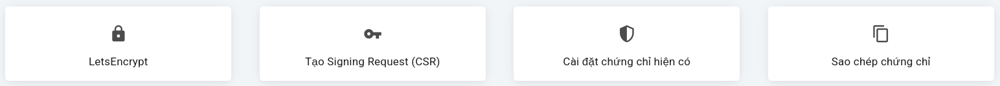
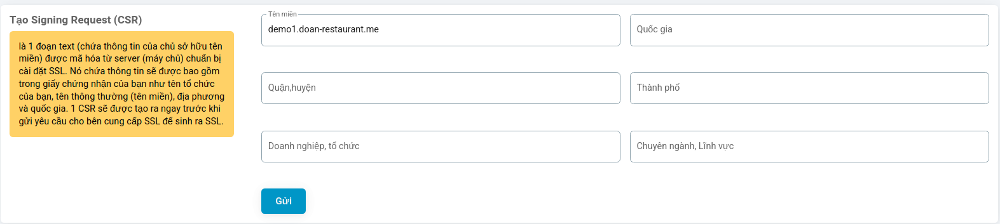
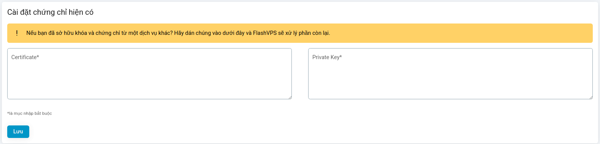
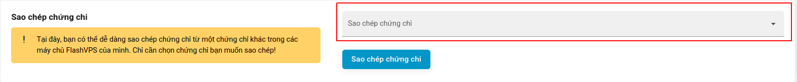

# SSL

{{ data.name }} supports installing custom SSL certificates and using `LetsEncrypt`, `ZeroSSL` to generate free certificates for your websites.

##LetsEncrypt

[LetsEncrypt](https://letsencrypt.org/) provides free SSL certificates recognized on all major browsers.

{{ data.name }} will automatically renew your LetsEncrypt certificate 21 days or less before expiration. Or you can also manually renew at the [certificate management panel](#quan-ly-chung-chi-ssl) of the website. Renewal will occur at a random date and time to avoid flooding the LetsEncrypt servers.

You can create a Singing Request at the `SSL` tab on {{ data.name }}'s website dashboard:

1. Select `LetsEnctypet`
2. Select `LetsEnctypet Settings`

    

::: warning
Due to the LetsEncrypt renewal process, LetsEncrypt certificates cannot be copied to other sites. You just need to issue a new LetsEncrypt certificate to that website.
:::

## Create Signing Request (CSR)

Create Signing Request is a piece of text (containing information of the domain owner) encrypted from the server preparing to install SSL. It contains information that will be included in your certificate such as your organization name, common name (domain name), locality and country. 1 CSR will be created immediately before sending the request to the SSL provider to generate SSL.

1. At the `SSL` tab > Select `Create Signing Request`
   
2. Enter CSR information
   
3. Select `Send`

## Install existing certificate

If you already own a key and certificate from another service. {{ data.name }} helps you install that certificate for your website.

1. At the `SSL` tab > Select `Install existing certificate`
   
2. Paste the certificate code and **Certificate** field and the private key code into the **Private Key** field
   
3. Select `Save`

## Copy certificate

You can easily copy 1 certificate from another in your {{ data.name }} servers.

1. At the `SSL` tab > Select `Copy certificate`
2. Select a certificate to copy
   
3. Select `Copy certificate`

## Manage SSL Certificates

{{ data.name }} displays the list of installed certificates as a table. Here you can `Renew`, `Activate` or `delete` the certificate for the website.

## Use 15 year Cloudflare certificate

::: info
This is a guide to using a `free` 15-year Cloudflare certificate if your domain is using Cloudflare service, the advantage is that it does not need to be renewed every 3 months like `LetsEncrypt` or `ZeroSSL` certificates
:::

1. First go to the `Cloudflare` panel, then select `SSL/TLS`. Here select `SSL/TLS encryption mode` to `Full`
   
2. Next select `Origin Server`, click `Create Certificate`
   
3. Click `Create` to create
   
   At this point we will have information about the newly created certificate
   
4. Go back to `{{ data.name }}` > `SSL` tab > select `Install Existing Certificate`
   
5. Copy items ① and ② in `step 3` into items ① and ② respectively
   
6. Click `Install Existing Certificate` and you're done
