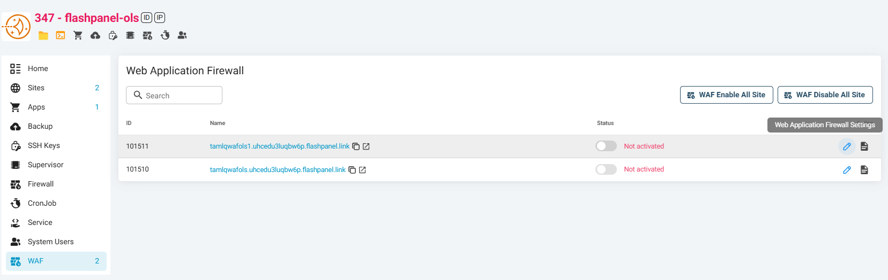
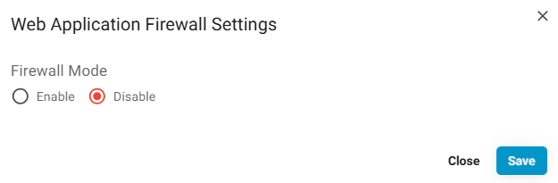
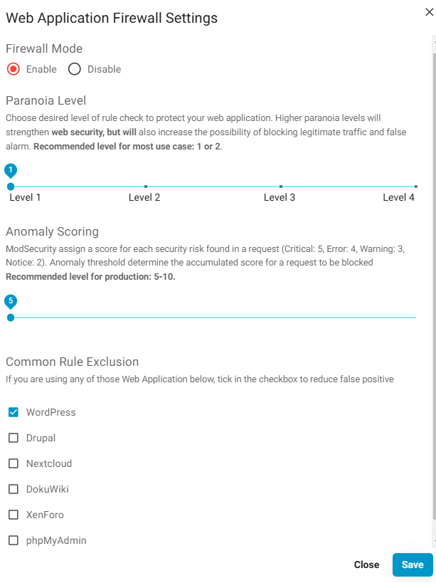

---
head:
    - - meta
      - name: description
        content: How To Use ModSecurity and OWASP CRS For Web App Firewall (WAF) To Secure Your Website
---

# How To Use ModSecurity and OWASP CRS For Web App Firewall (WAF) To Secure Your Website

With security as a primary focus this year, we are happy to bring ModSecurity and OWASP CRS for your Web Application Firewall (WAF) in {{ data.name }}.

## What is Modsecurity

<a href="https://modsecurity.org/" target="_blank">Modsecurity</a> is an open source, cross platform web application firewall (WAF) engine for Apache, IIS and Nginx that is developed by Trustwave’s SpiderLabs.

WAF can be enabled in your website to provide an external security layer that increases security, detects, and prevents attacks before they reach web applications, because over 70% of all attacks are now carried out over the web application level.

It can help detect and prevent many attacks against your web application by checking all HTTP(s) requests you are willing to allow or block (e.g., request methods, request headers, content types, etc.) against its set of rules.

If the check fails, the visitor will not see the content of your website, predefined actions are performed, usually the visitor will get 403 Forbidden screen.

## What is OWASP CRS

ModSecurity only is not enough to protect your website. You need to configure an additional rule set to make web protection work.

<a href="https://coreruleset.org/" target="_blank">The OWASP ModSecurity Core Rule Set (CRS)</a> is a set of generic attack detection rules for use with ModSecurity or compatible web application firewalls.

The CRS aims to protect web applications from a wide range of attacks, with a minimum of false alerts, including:

-   SQL Injection (SQLi)
-   Cross Site Scripting (XSS)
-   Local File Inclusion (LFI)
-   Remote File Inclusion (RFI)
-   PHP Code Injection
-   Java Code Injection
-   HTTPoxy
-   Shellshock
-   Unix/Windows Shell Injection
-   Session Fixation
-   Scripting/Scanner/Bot Detection
-   Metadata/Error Leakages

## How To Install ModSecurity and OWASP CRS

In {{ $data.name }}, we want to make it very easy for everyone, from beginner to expert, to enable or disable ModSecurity and OWASP CRS in each of your web site on your servers easily, instead of having to log into the linux terminal to do it.

Please login to your {{ $data.name }} Dashboard, choose your server, in the **Utilities** group
click **Install Web Application Firewall (WAF)** and hit the submit button.
Depending on your webserver it may take a different time to setup WAF

After Install WAF success, **go to WAF menu** and **click pencil icon** on your desire website, and you will see the Config Firewall dialog appear to setup.

Click “Enable” to to enable Web Application Firewall (WAF) to your current web application, and click “Save.

**That’s all. It is very easy!**

You can customize WAF Settings by configuring paranoia level, anomaly threshold, and common rule exclusion.

## Paranoia Level

Using paranoia level, you can choose the desired level of rule check to protect your web application.

Higher paranoia levels will strengthen web security, but will also increase the possibility of blocking some legitimate traffic due to false alarms (also named false positives or FPs).

From <a href="https://coreruleset.org/faq/" target="_blank">OWASP CRS website</a>, there is a detailed explanation about the difference of paranoia levels.

A **paranoia level of 1 (PL1)** is default. At this level, most core rules are enabled. PL1 is advised for beginners, installations covering many different sites and applications, and for setups with standard security requirements.

**Paranoia level 2 (PL2)** includes many extra rules, for instance, enabling many regexp-based SQL and XSS injection protections, and adding extra keywords checked for code injections.

PL2 is advised for **moderate to experienced users** who desire more complete coverage, and for all installations with elevated security requirements.

**Paranoia level 3 (PL3)** enables more rules and keyword lists that cover less common attacks. PL3 also tweaks limits on all special characters used, which provides high coverage against unknown attack types, obfuscated attacks, and attempted WAF bypasses.

PL3 is aimed at **users who are experienced at the handling of FPs** and at installations with high security requirements.

**Paranoia level 4 (PL4)** further restricts special characters.

PL4 is advised for **experienced users** protecting installations with very high security requirements.

Recommended level for most use cases is **1 (default) or 2**.

## Anomaly Threshold

ModSecurity assigns a score for each security risk found in a request (Critical: 5, Error: 4, Warning: 3, Notice: 2).

Anomaly threshold determines the accumulated score for a request to be blocked.

**Recommended level for production website is 5-10.**

## Common Rule Exclusion

OWASP CRS provides common rule exclusions for some popular Content Management System (CMS), including WordPress, Drupal, NextCloud, DocuWiki, phpMyAdmin and Xenforo.

If your current web application uses any of those CMS, please tick in the checkbox to reduce false positives and it will be automatically applied to your firewall.
