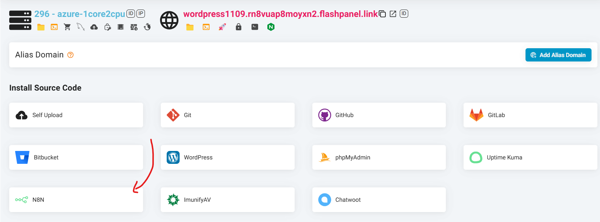
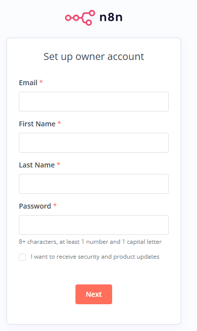

---
head:
    - - meta
      - name: description
        content: Instructions for installing n8n website
---

<script setup>
import { data } from '../../.vitepress/config.data.ts'
import OgImage from '../../.vitepress/components/OgImage.vue'
</script>

# n8n

## 1-Click Install N8N

Step 1: Create a New Website

Step 2: After the website is successfully created, click Manage to open the management interface.

Step 3: Install N8N

-   In the website management interface, find Install Source Code.
-   Here, you will see the N8N option in the list.
-   Click the N8N icon, then click the Install button.



Step 4: Complete

-   {{ data.name }} will automatically download and install the N8N source code.
-   Once completed, you can access the website you just installed to start using N8N immediately.



With the One-Click Install feature, {{ data.name }} helps you deploy N8N quickly without spending a lot of time and effort. Try it now to take full advantage of the potential of this powerful monitoring tool!

## Manual Setting

1. Install [application](../server/application.md) `nodejs`
2. Install [application](../server/application.md) `pm2`
3. Open terminal and type install command `n8n`

    

    ```bash
    npm -g install n8n
    ```

    

4. Still in terminal step 3, start `n8n` with the command

    ::: code-group

    ```bash [http://ip:port]
    N8N_SECURE_COOKIE=false pm2 start n8n
    pm2 save
    ```

    ```bash [http://domain.com]
    # change domain.com to your website address
    N8N_SECURE_COOKIE=false WEBHOOK_URL=http://domain.com pm2 start n8n
    pm2 save
    ```

    ```bash [https://domain.com]
    # change domain.com to your website address
    WEBHOOK_URL=https://domain.com pm2 start n8n
    pm2 save
    ```

    :::

    

## Access

To access UI `n8n` you have 2 options, use the form `http://ip:port` or `domain`

### Used with the form `ip:port`

1. Use the [Firewall Rule](../server/firewall-rule.md) feature
2. Add firewall rule as follows:
   

    Name: enter `n8n`
    Port: enter `5678`
    
    Press the `Add Firewall` button

3. Open browser enter with `http://ip:5678` replace `ip` with your server ip
   

### Used with the form `domain`

Let's say you have a domain name of `domain.com` and you want to use `n8n.domain.com` to access the `n8n` UI:

1. [Create a website](../site/basic.md#create-page-web) named `n8n.domain.com`
   
2. Go to the `nginx` section of the website to edit
   
3. Scroll down, add lines with + (plus) signs and delete lines with - (minus) signs.

    ```nginx
    listen 80;
    listen [::]:80;
    server_name n8n.lprht7cqot3f7k.flashvps.xyz;
    server_tokens off;
    root /home/flashvps/n8n.lprht7cqot3f7k.flashvps.xyz;

    # ssl_certificate ###
    # ssl_certificate_key ###
    ssl_session_timeout 1d;
    ssl_session_cache shared:FlashSSL:10m;
    ssl_session_tickets off;
    ssl_dhparam /etc/nginx/dhparams.pem;
    ssl_protocols TLSv1.2 TLSv1.3;
    ssl_ciphers ECDHE-ECDSA-AES128-GCM-SHA256:ECDHE-RSA-AES128-GCM-SHA256:ECDHE-ECDSA-AES256-GCM-SHA384:ECDHE-RSA-AES256-GCM-SHA384:ECDHE-ECDSA-CHACHA20-POLY1305:ECDHE -RSA-CHACHA20-POLY1305:DHE-RSA-AES128-GCM-SHA256:DHE-RSA-AES256-GCM-SHA384;
    ssl_prefer_server_ciphers off;

    add_header Strict-Transport-Security "max-age=63072000" always;
    add_header X-Frame-Options "SAMEORIGIN";
    add_header X-XSS-Protection "1; mode=block";
    add_header X-Content-Type-Options "nosniff";

    index index.html index.php;

    charset utf-8;

    # USER CUSTOM CONFIG (CAN MOVE, DO NOT REMOVE!)

    location / {
        proxy_pass http://localhost:5678;
        proxy_http_version 1.1;
        proxy_set_header Upgrade $http_upgrade;
        proxy_set_header Connection 'upgrade';
        proxy_set_header Host $host;
        proxy_cache_bypass $http_upgrade;
        #proxy_read_timeout 86400s;
        #proxy_send_timeout 86400s;
        # [!code ++:4]
        chunked_transfer_encoding off;
        proxy_buffering off;
        proxy_cache off;
    }

    # Deny files starting with a . (dot) except .well-known
    location ~ /\.(?!well-known).* {
        deny all;
    }
    # [!code --:17]
    location ~* \.(3gp|gif|jpg|jpeg|png|ico|wmv|avi|asf|asx|mpg|mpeg|mp4|pls|mp3|mid|wav|swf|flv|exe|zip|tar| rar|gz|tgz|bz2|uha|7z|doc|docx|xls|xlsx|pdf|iso|eot|svg|ttf|woff|woff2)$ {
        gzip_static off;
        add_header Pragma public;
        add_header Cache-Control "public, must-revalidate, proxy-revalidate";
        access_log off;
        expires 30d;
        break; break;
    }

    location ~* \.(txt|js|css)$ {
        add_header Pragma public;
        add_header Cache-Control "public, must-revalidate, proxy-revalidate";
        access_log off;
        expires 30d;
        break; break;
    }
    ```

4. Click the `Edit Nginx Configuration` button to make changes
5. Click the `Sync` button to apply the changes.
   
6. Open a browser and go to `n8n.domain.com` (replace domain.com with your domain name)
   

Showing up like this is successful

