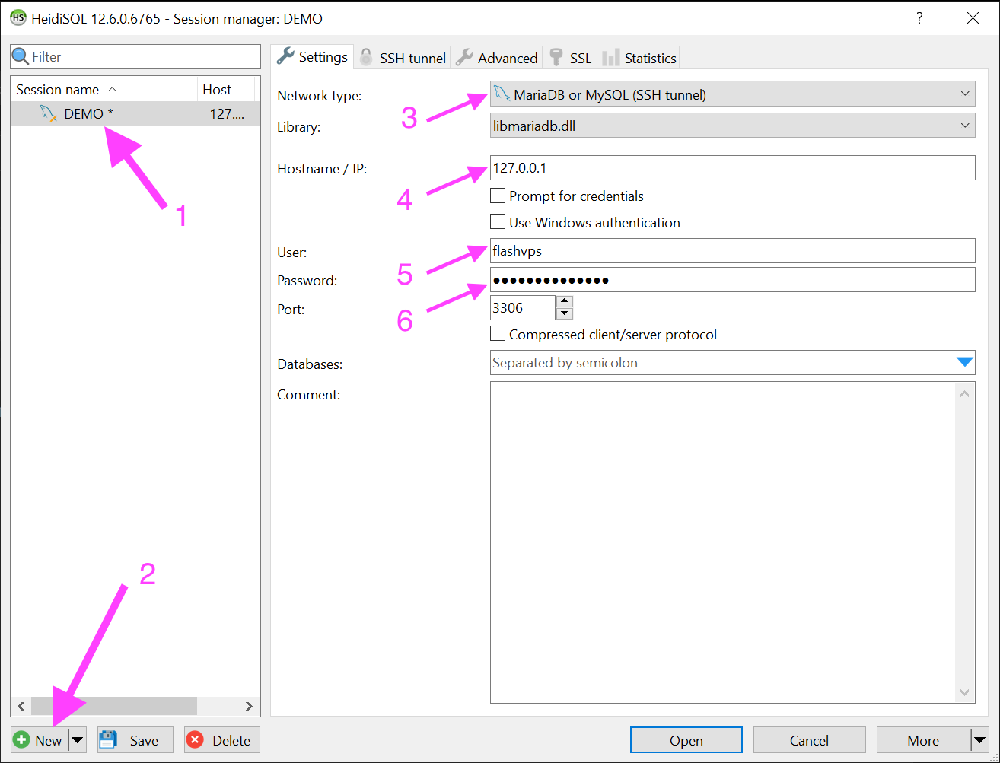
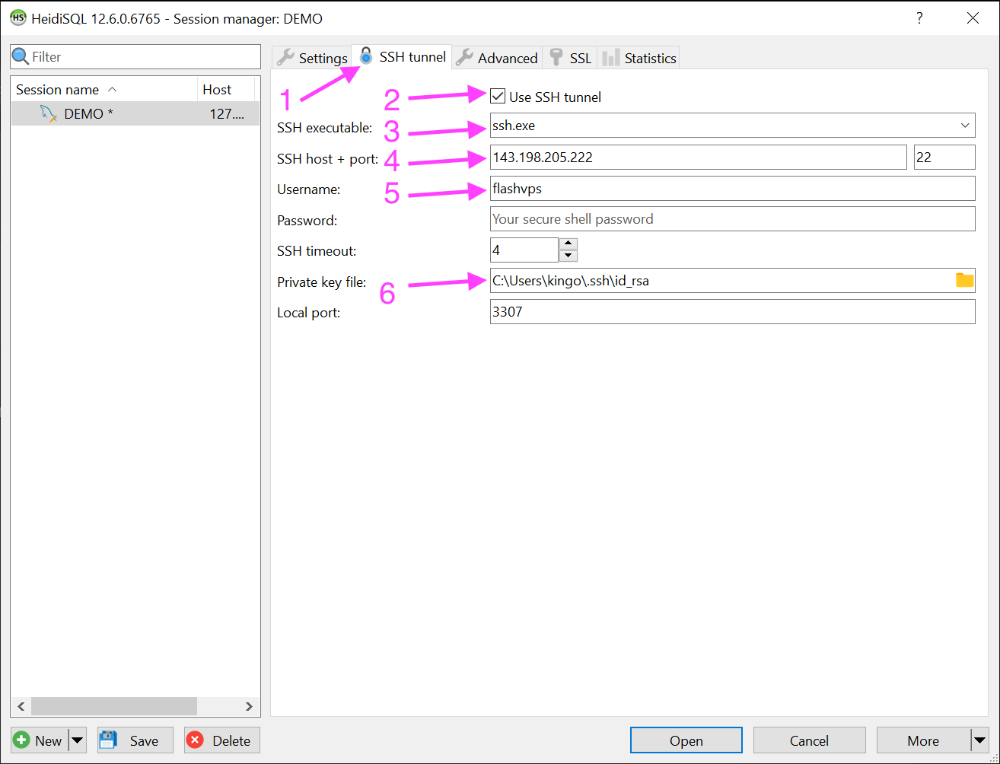

# Access MySQL remotely

In reality, you want to access `MySQL` | `MariaDB` from your computer to the server, or that server is `Remote Database` for everyone to use,...

## Method 1: Open port 3306 (not safe 👀)

Opening database port 3306 is the fastest way to make a connection to the remote database, however this is the least secure way, because now port 3306 is public, anyone can access this port to test. Password detector, if you set a weak password, it will be easily attacked.

To open port 3306, see [instructions for using Firewall Rule](../server/firewall-rule.md)

## Method 2: Through SSH Tunnel (safe 👉 recommended)

First you need to do [create SSH Key](../knowledge/ssh-keys.md#create-ssh-key) and [add SSH Key to the server](../knowledge/ssh-keys.md# add-ssh-key-into-machine-chu)

### Instructions for using HeidiSQL

1. Database configuration

    

    1. Click `New` to create a new Session
    2. Enter notes for this Session
    3. Select Network type: `MariaDB or MySQL (SSH Tunnel)`
    4. IP: absolutely must be `127.0.0.1`
    5. User: is the [database] user name (../server/database.md)
    6. Password: is the database user password

2. Configure SSH Tunnel

    

    1. Select the `SSH Tunnel` tab
    2. Check the `Use SSH Tunnel` box
    3. Select `ssh.exe`
    4. SSH Host + Port: enter server IP and SSH port
    5. Username: is the Linux system username that we choose when adding the SSH Key
       
    6. Private key file: is the key added in step [add SSH Key to server](../knowledge/ssh-keys.md#them-ssh-key-on-may-chu) **note: select private key is PuTTY (.ppk)**

### Instructions for using TablePlus

After `New Connection` we configure as follows

1. host: must absolutely be `127.0.0.1`
2. tag: set production (optional)
3. user: this is the database user name
4. password: this is the database user's password
5. Choose to connect via SSH
6. Server: your server ip
7. Port: is the SSH port
8. Username: is the Linux system username that we choose when adding the SSH Key
9. Check `Use SSH Key`
10. Select Private Key
