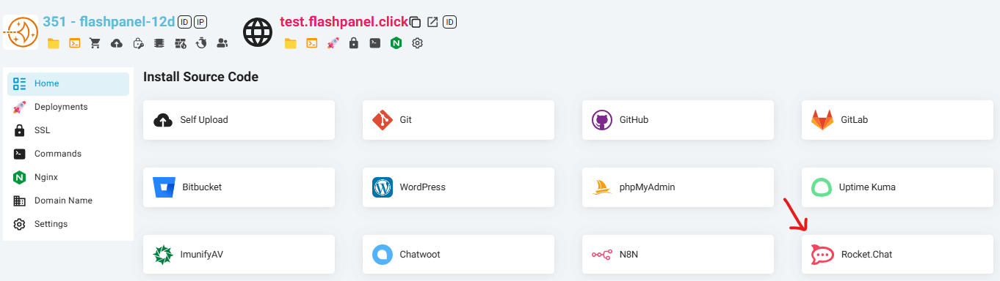
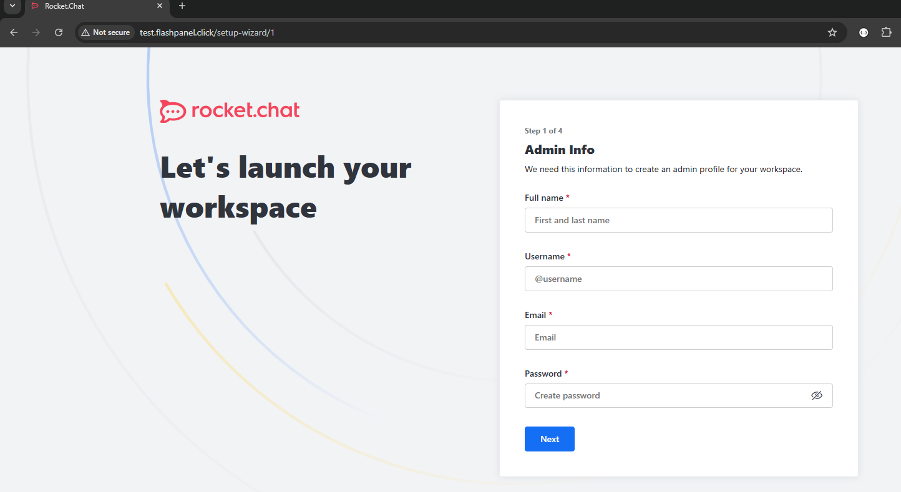
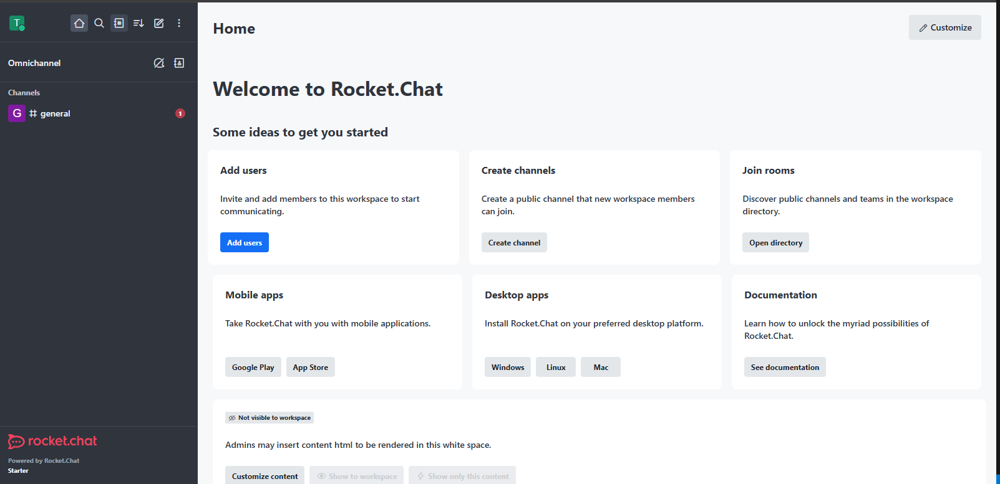

---
head:
    - - meta
      - name: description
        content: Instructions for installing Rocket.Chat website
---

# Rocket.Chat

## 1-Click Install Rocket.Chat

Step 1: Create a New Website

Step 2: After the website is successfully created, click Manage to open the management interface.

Step 3: Install Rocket.Chat

-   In the website management interface, find Install Source Code.
-   Here, you will see the Rocket.Chat option in the list.
-   Click the Rocket.Chat icon, then click the Install button.

Step 4: Complete

-   {{ data.name }} will automatically download and install the Rocket.Chat source code.
-   Once completed, you can access the website you just installed to start using Rocket.Chat immediately.

With the One-Click Install feature, {{ data.name }} helps you deploy Rocket.Chat quickly without spending a lot of time and effort. Try it now to take full advantage of the potential of this powerful monitoring tool!

After Setup Wizard showing up like this is successful

