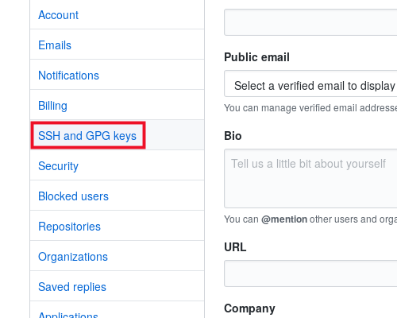

# Kết nối Git

## Các nhà cung cấp Git `{{ data.name }}` hỗ trợ

`{{ data.name }}` hiện hỗ trợ các nhà cung cấp Git sau:

-   Github
-   Gitlab
-   Bitbucket
-   Custom Git

## Thêm khóa SSH vào nhà cung cấp Git

Để sử dụng được Custom Git Provider bạn cần thêm mã SSH Key mà `{{ data.name }}` cung cấp vào nhà cung cấp mã nguồn của bạn. Hướng dẫn thêm mã SSH Key:

### Github

1. Tạo SSH Key [tại đây](../knowledge/ssh-keys.md) nếu chưa có
2. [Đăng nhập vào tài khoản Github](https://github.com/login)
3. Chọn vào avatar của bạn và chọn **Settings**:
   
4. Chọn **SSH and DPG keys**
   
5. Chọn **New SSH key**
   
6. Nhập tiêu đề cho trường _Title_ và dán mã SSH Key lấy được ở bước 1 vào trường _Key_
   
7. Chọn **Add SSH key**

### Gitlab

1. Tạo SSH Key [tại đây](../knowledge/ssh-keys.md) nếu chưa có
2. [Đăng nhập vào tài khoản GitLab](https://gitlab.com/users/sign_in)
3. Chọn vào avatar của bạn và chọn **Preferences**:
   
4. Chọn **SSH Keys**
   
5. Dán mã SSH Key lấy được ở bước 1 vào trường _Key_ và Nhập tiêu đề cho trường _Title_ và _Ngày hết hạn_
   
6. Chọn **Add key**

Sau khi bạn mã SSH Key đã được thêm vào nhà cung cấp kiểm soát nguồn của bạn, bạn [làm theo hướng dẫn sau](../site/basic.md) và cài đặt mã nguồn như bình thường.

## Kết nối nhà cung cấp Git

Bạn có thể kết nối với bất kỳ nhà cung cấp kiểm soát nguồn nào được hỗ trợ bất kỳ lúc nào thông qua bảng điều khiển Quản lý mã nguồn của `{{ data.name }}` tại tab `Quản lý mã nguồn` trong hồ sơ tài khoản của bạn:

1. [Đăng nhập vào `{{ data.name }}`]
2. Truy cập trang <a :href="data.url + '/user/git'" target="_blank">Quản lý mã nguồn</a>
3. Chọn **Kết nối với `Github`|`GitLab`|`Bitbucket`** để kết nối với nhà cung cấp mã nguồn tương ứng

## Hủy kết nối nhà cung cấp Git

Bạn có thể xóa nhà cung cấp điều khiển nguồn được kết nối bằng cách nhấp vào nút **Hủy liên kết** bên cạnh nhà cung cấp.

1. [Đăng nhập vào `{{ data.name }}`]
2. Truy cập trang <a :href="data.url + '/user/git'" target="_blank">Quản lý mã nguồn</a>
3. Chọn **Hủy liên kết với `Github`|`GitLab`|`Bitbucket`** để kết nối với nhà cung cấp mã nguồn tương ứng

## Làm mới token

Nếu bạn muốn làm mới kết nối của `{{ data.name }}` với nhà cung cấp kiểm soát nguồn của mình, bạn có thể làm như vậy bằng cách nhấp vào nút **Làm mới Token** bên cạnh tên của nhà cung cấp kiểm soát nguồn trên trang `Quản lý mã nguồn` trong hồ sơ tài khoản `{{ data.name }}` của bạn.
