<script setup>
import { data } from '../../.vitepress/config.data.ts'
</script>

# Kết nối nhà cung cấp máy chủ

## Vultr

1. Truy cập trang [Vultr API](https://my.vultr.com/settings/#settingsapi)
2. Ở mục `Personal Access Token` hãy ấn `enable` nếu đây là lần đầu sử dụng. Copy `API Key`
3. Quay lại <a :href="data.url + '/user/vps'" target="_blank">{{ data.name }}</a>
4. Ấn nút `Thêm Thông Tin Chứng Thực`
5. Chọn nhà cung cấp máy chủ `Vultr`
6. Nhập ghi chú về `API Key` này
7. Nhập `API Key` lấy ở bước 2

## Digital Ocean

1. Truy cập trang [Digital Ocean API](https://cloud.digitalocean.com/account/api/tokens)
2. Ở mục `Personal Access Token` hãy ấn `Generate New Token`
3. Copy API Token
4. Quay lại <a :href="data.url + '/user/vps'" target="_blank">{{ data.name }}</a>
5. Ấn nút `Thêm Thông Tin Chứng Thực`
6. Chọn nhà cung cấp máy chủ `Digital Ocean`
7. Nhập ghi chú về API Credential này
8. Nhập API Token lấy ở bước 3

## Linode

1. Truy cập trang [Linode API](https://cloud.linode.com/profile/tokens)
2. Ở mục `Personal Access Token` hãy ấn `Create A Personal Access Token`
3. Nhập `label` cho API Token, chọn `Read/Write` mục `Linodes`
   
   Bấm nút `Create Token`
4. Copy API Token
5. Quay lại <a :href="data.url + '/user/vps'" target="_blank">{{ data.name }}</a>
6. Ấn nút `Thêm Thông Tin Chứng Thực`
7. Chọn nhà cung cấp máy chủ `Linode`
8. Nhập ghi chú về API Credential này
9. Nhập API Token lấy ở bước 4

## UpCloud

1. Truy cập trang [UpCloud API](https://hub.upcloud.com/people/accounts)
2. Ở mục `Account` hãy ấn `Create subaccount`
3. Nhập thông tin `subaccount` và ấn `Create subaccount`
4. Sau khi tạo xong `subaccount` thì ấn nút chỉnh sửa `subaccount` đó để vào trang chỉnh sửa, kéo xuống dưới mục `Permissions` ấn nút `Go to permissions`.
   Chọn như hình dưới đây, các mục khác còn lại vô hiệu hóa hết
   
5. Quay lại <a :href="data.url + '/user/vps'" target="_blank">{{ data.name }}</a>
6. Ấn nút `Thêm Thông Tin Chứng Thực`
7. Chọn nhà cung cấp máy chủ `UpCloud`
8. Nhập ghi chú về API Credential này
9. Nhập `tên người dùng` và `mật khẩu` ở bước 4

## Hetzner

1. Truy cập trang [Hetzner](https://console.hetzner.cloud/projects) > Chọn 1 `project` > Ở sidebar bên trái chọn `Security` > Ở tab bên trên chọn `API Tokens`
2. Ấn `Generate API Token` ở góc trên bên phải
3. Nhập ghi chú và check vào `Read & Write` ở mục Permissions
4. Sau khi tạo xong ấn Copy để lấy `Token`
5. Quay lại <a :href="data.url + '/user/vps'" target="_blank">{{ data.name }}</a>
6. Ấn nút `Thêm Thông Tin Chứng Thực`
7. Chọn nhà cung cấp máy chủ `Hetzner`
8. Nhập ghi chú về API Credential này
9. Nhập API Token lấy ở bước 4

## Bizfly Cloud

1. Vào trang [cấu hình Application Credential](https://manage.bizflycloud.vn/account/configuration/credential)
2. Bấm tạo mới `Application Credential`, sau đó nhập tên, mô tả, ... và bấm `Xác nhận`
3. Thông tin Application Credential sẽ hiện ra, bạn copy `ID Application Credential` và `Secret Key`
4. Quay lại <a :href="data.url + '/user/vps'" target="_blank">{{ data.name }}</a>
5. Ấn nút `Thêm Thông Tin Chứng Thực`
6. Chọn nhà cung cấp máy chủ `Bizfly Cloud`
7. Nhập ghi chú về API Credential này
8. Nhập API Key là `ID Application Credential` và API Secret là `Secret Key` lấy ở bước 3

## Amazon Lightsail

1. Vào trang [IAM Console Create User](https://us-east-1.console.aws.amazon.com/iam/home#/users/create)
   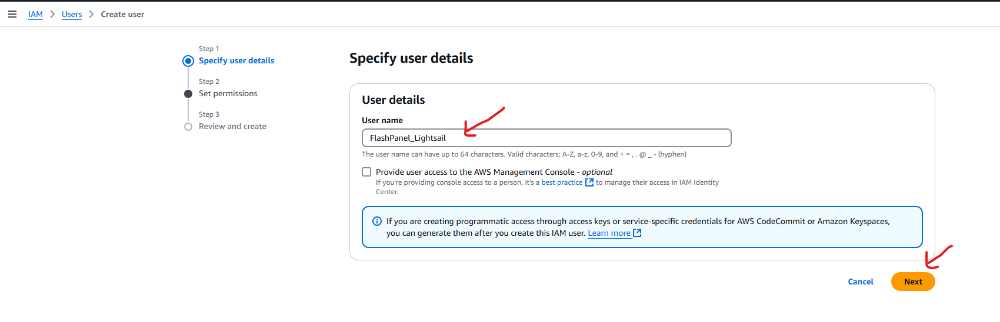
2. Tại panel tạo Permission > `Chọn attach policy directly` > `Chọn Create Policy`
   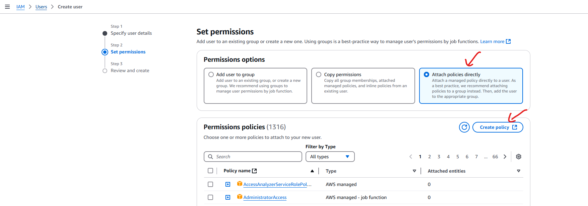
3. Tại trang tạo policy > Chọn trình chỉnh sửa `JSON` và dán đoạn json phía dưới > Chọn `Next` Để qua bước 2
   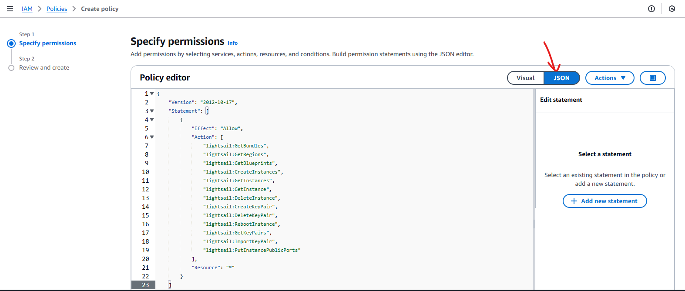

```
{
	"Version": "2012-10-17",
	"Statement": [
		{
			"Effect": "Allow",
			"Action": [
				"lightsail:GetBundles",
				"lightsail:GetRegions",
				"lightsail:GetBlueprints",
				"lightsail:CreateInstances",
				"lightsail:GetInstances",
				"lightsail:GetInstance",
				"lightsail:DeleteInstance",
				"lightsail:CreateKeyPair",
				"lightsail:DeleteKeyPair",
				"lightsail:RebootInstance",
				"lightsail:GetKeyPairs",
				"lightsail:ImportKeyPair",
				"lightsail:PutInstancePublicPorts"
			],
			"Resource": "*"
		}
	]
}
```

5. Nhập tên và mô tả Permissions và chọn `Create Policy`
   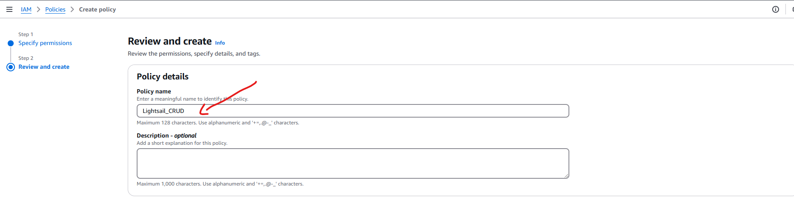
6. Đóng cửa sổ policy và Trở lại cửa sổ thêm mới user > Chọn biểu tượng `Reload` bên cạnh nút Create Policy > Chọn `Next`
   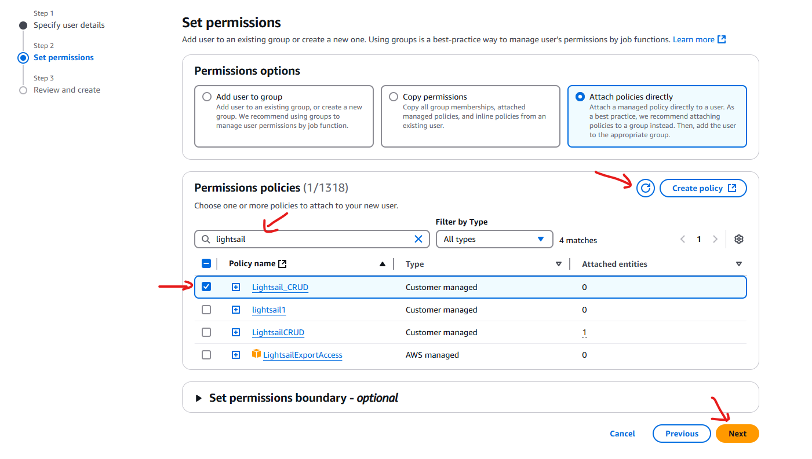
7. Tại step review và create chọn `Create User`
   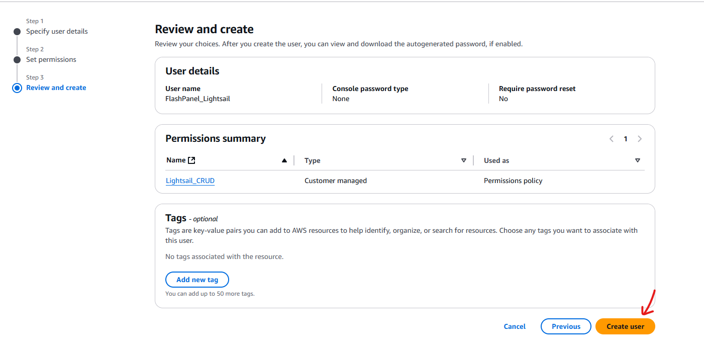
8. Đi đến trang chỉnh sửa user bạn vừa tạo và nhấn tạo access token
   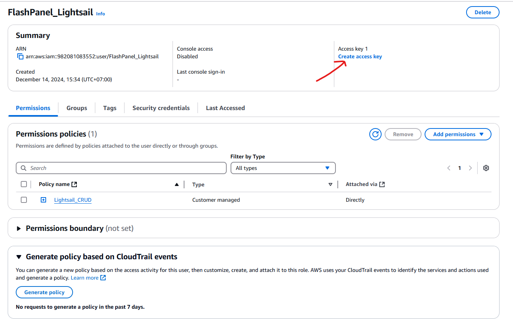
9. Tại trang tạo access token
   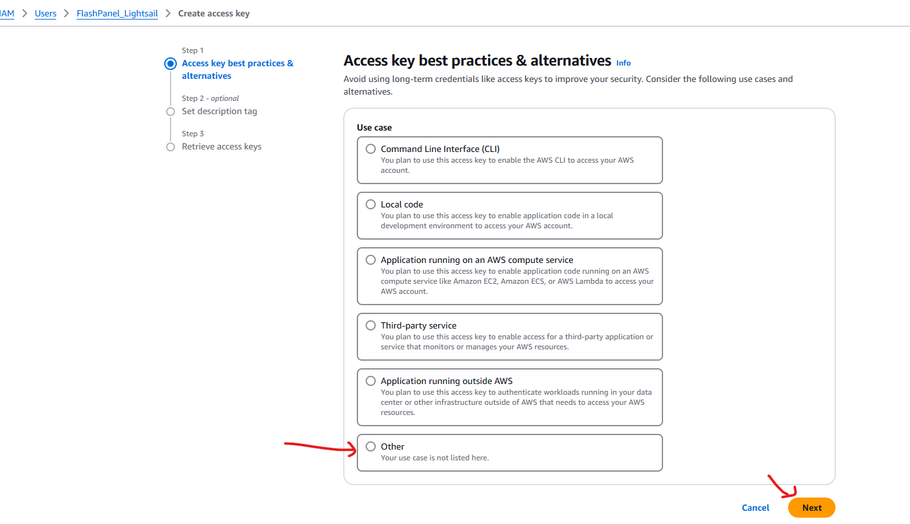
10. Nhập mô tả
    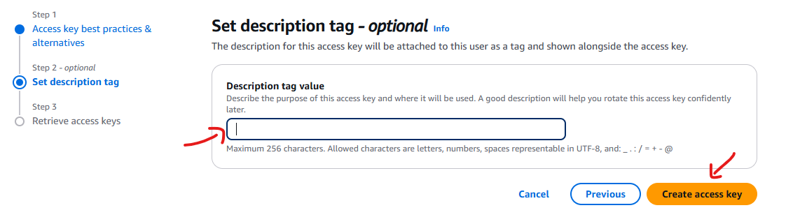
11. Thông tin Application Credential sẽ hiện ra, bạn copy `ID Application Credential` và `Secret Key`
    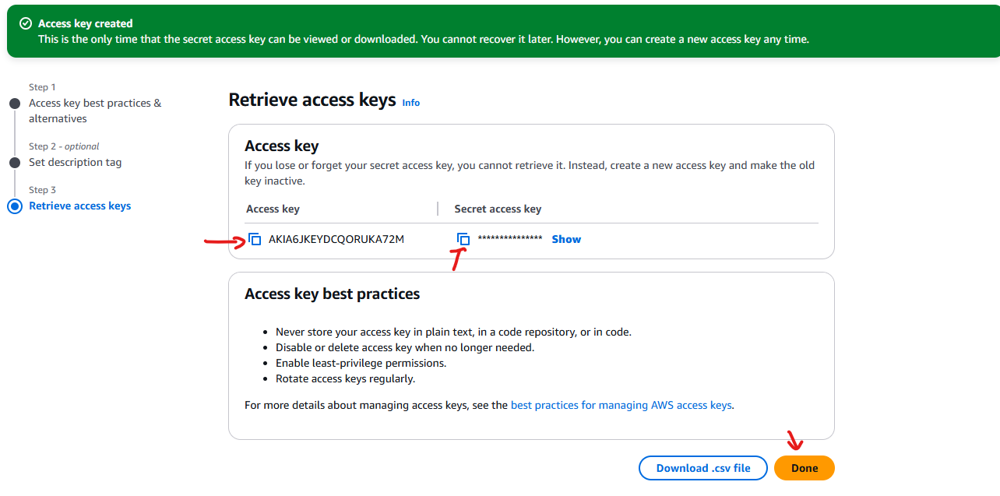
12. Quay lại <a :href="data.url + '/user/vps'" target="_blank">{{ data.name }}</a>
13. Ấn nút `Thêm Thông Tin Chứng Thực`
14. Chọn nhà cung cấp máy chủ `Amazon Lightsail`
15. Nhập ghi chú về API Credential này
16. Nhập API Key là `ID Application Credential` và API Secret là `Secret Key` lấy ở bước 11
    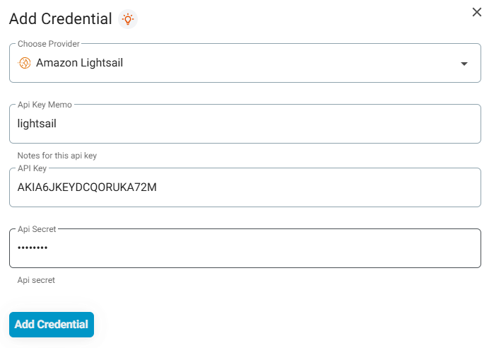
