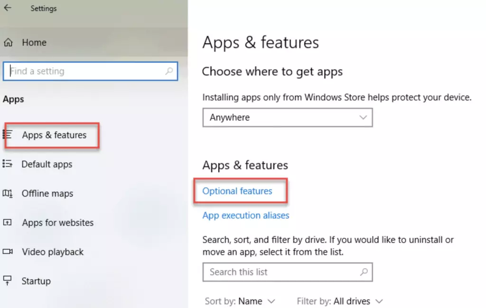
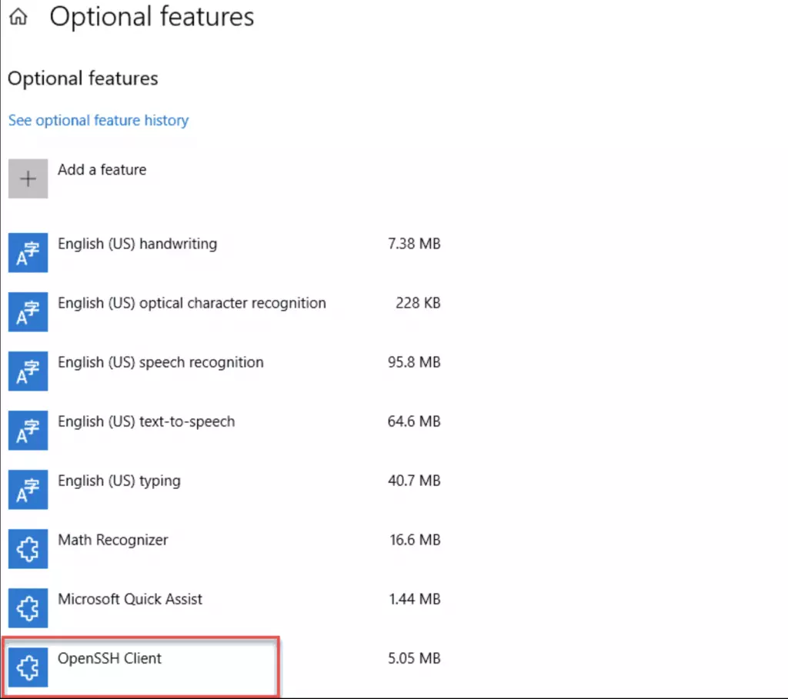
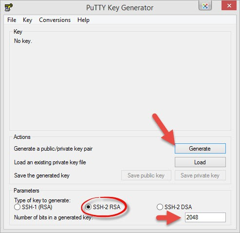
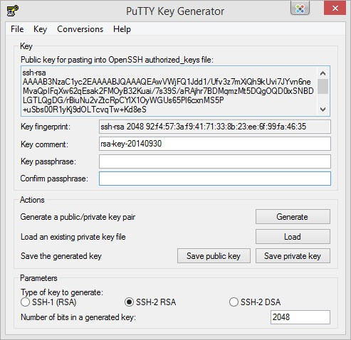

<script setup>
import { data } from '../../.vitepress/config.data.ts'
</script>

# Khóa SSH

Mặc định mỗi VPS bạn sẽ đăng nhập vào bằng username **root** và **mật khẩu root** mà nhà cung cấp đã gửi cho bạn lúc thuê VPS, tuy nhiên việc sử dụng mật khẩu luôn có 2 nguy cơ lớn là:

-   Bạn sẽ mất hoàn toàn nếu lộ mật khẩu.
-   Các attacker có thể sử dụng Brute Force Attack để dò tìm mật khẩu.

Do đó, để xác thực các kết nối từ bên ngoài vào VPS an toàn hơn, xác thực mật khẩu qua SSH bị tắt theo mặc định trên tất cả các máy chủ kết nối với `{{ data.name }}`.

## SSH Key là gì?

SSH Key là một phương thức xác thực đăng nhập với máy chủ thông qua truy cập SSH bằng việc đối chiếu giữa một cặp keys, bao gồm một key cá nhân (private key) và key công khai (public key). Private key và Public key có mối liên hệ chặt chẽ với nhau nhằm mục đích nhận diện lẫn nhau.

SSH Key thường được dùng để **THAY THẾ CHO MẬT KHẨU** bằng cách xác minh quyền truy cập. Bạn có thể hiểu đơn giản, cách thức đăng nhập này theo dạng hỏi và trả lời, trong đó một bên trình bày câu hỏi và bên khác phải cung cấp một câu trả lời hợp lệ để được chứng thực.

## Tạo SSH Key

### Cách 1: Tạo SSH Key tự động

1. Đầu tiên bạn truy cập vào <a :href="data.url + '/user/ssh-keys'" target="_blank">trang quản lý SSH Keys</a>
2. Nhấn nút tạo khóa SSH mới
3. Một popup hiện ra, bạn nhấn vào `Generate SSH Key`
   
4. Bạn tiến hành tải 3 file `OpenSSH Key`, `PuTTY Key` và `Public Key` về máy tính của mình.
5. Nhấn nút `Add SSH Key` để hoàn tất.

### Cách 2: Tạo SSH Key bằng lệnh ssh-keygen (Windows/Linux/MacOS)

**Đối với Windows**

Kích hoạt OpenSSH Client trên Windows 10 bằng cách:

1. Mở panel **Settings**, nhấp vào **Apps**
2. Dưới heading _Apps and Features_ , click vào **Optional Features.**
   
3. Lướt xuống list để tìm xem **OpenSSH Client** được liệt kê chưa
    - Nếu chưa, click vào dấu + bên cạnh **Add a feature.**
    - Trượt xuống dưới danh sách để tìm và chọn **OpenSSH Client.**
      
    - Cuối cùng, nhấp vào **Install.**

Sau khi kích hoạt xong OpenSSH Client mở `command line` với quyền **admin** và chạy lệnh sau:

```powershell
ssh-keygen -t rsa -m PKCS8 -b 2048 -f "C:\Users\your_username\.ssh"
```

Thay `C:\Users\your_username\.ssh` với đường dẫn nơi lưu khóa ssh của bạn.

**Đối với Linux/Mac**

```bash-vue
ssh-keygen -t rsa -m PKCS8 -b 2048 -f ~/.ssh/id_rsa_{{ data.user }}
```

Sau khi chạy lệnh trên tại đường dẫn `~/.ssh/` sẽ có 2 file tên là `id_rsa_{{ data.user }}` (Private Key) và `id_rsa_{{ data.user }}.pub` (Public Key) bạn sao chép nội dung Public Key và thêm vào máy chủ của bạn nhé.

### Cách 3: Tạo SSH Key bằng phần mềm PuTTY-Gen (Windows)

1. Cài đặt phần mềm PuTTY tại https://www.putty.org/
2. Nhấn nút **Generate** và **rê chuột vòng vòng màn hình** cho đến khi nó tạo xong.
   
3. Sau khi hoàn tất tạo SSH Key, bạn hãy lưu Private Key lại bằng cách ấn vào nút "Save Private Key" và hãy bảo quản cẩn thận nhé. Có thể đặt mật khẩu cho Private Key để tăng thêm bảo mật bằng cách nhập vào ô "Key passphare" và "Confirm passphare" trước khi ấn nút "Save Private Key"
   
   Public Key là đoạn **ssh-rsa AAAA...** thì bạn hãy dùng nó để nhập vào `{{ data.name }}` nhé!

### Cách 4: Tạo SSH Key bằng PuTTY (Ubuntu/MacOS)

**Cài puttygen**

_Đối với Mac_ : `brew install putty`

_Đối với Linux_: `sudo apt install putty-tools`

**Tạo khóa SSH Key (version 2)**

```bash-vue
puttygen -t rsa -b 2048 -o /home/flashvps/.ssh/id_putty_{{ data.user }} --ppk-param version=2
```

**Tạo khóa SSH Key (version 3)**

```bash-vue
puttygen -t rsa -b 2048 -o /home/flashvps/.ssh/id_putty_{{ data.user }}
```

Sau khi chạy lệnh trên sẽ được file Private Key được lưu tại đường dẫn bạn đã nhập, Để sử dụng được khóa bạn cần có Public Key. Tạo Public Key như sau:

```bash
puttygen -L /home/flashvps/.ssh/id_putty_{{ data.user }}
```

Sau khi chạy lệnh trên sẽ thấy nội dung được trả về có dạng `ssh-rsa AAAA...` bạn sao chép đoạn mã này và thêm vào máy chủ của bạn nhé.

Trong trường hợp bạn cần lưu `Public Key` vào 1 nơi nào đó bạn chạy lệnh sau:

```bash-vue
puttygen -L /home/flashvps/.ssh/id_putty_{{ data.user }} > /path/to/save/filename.pub
```

File sẽ được lưu tại `/path/to/save/filename.pub`

**Ghi chú:** thay `/home/flashvps/.ssh/id_putty_{{ data.user }}` thành đường dẫn lưu file của bạn.

## Global SSH Key

Sau khi đăng ký Global SSH Key thì mỗi lần kết nối 1 máy chủ mới, hệ thống sẽ tự động thêm các SSH Key đó vào máy chủ một cách tự động.

Truy cập trang <a :href="data.url + '/user/ssh-keys'" target="_blank">Global SSH Key</a> và thao tác giống như [thêm SSH Key vào máy chủ](#them-ssh-key-vao-may-chu)


## Thêm SSH Key vào máy chủ

1. Truy cập vào trang quản lý SSH Key của máy chủ > Bấm `Add SSH Key`
   

2.  - Name: nhập ghi chú
    - User: người dùng hệ thống Linux
    - Public Key: nội dung public key đã tạo ở bước [tạo SSH Key](#tao-ssh-key)

3. Bấm `Add SSH Key`
