<script setup>
import { data } from '../../.vitepress/config.data.ts'
</script>

# Sao lưu dữ liệu

## Sao lưu đến Google Drive

Để quá trình cấu hình diễn ra suôn sẻ bạn cần chuẩn bị những thứ sau đây:

1. Một tài khoản Google Drive chuyên dùng để sao lưu dữ liệu
2. Cài Rclone và lấy Google Drive Token

    1. **Trên Windows**

        Tải phần mềm Rclone 64bit hoặc 32bit về máy tại địa chỉ https://rclone.org/downloads/
        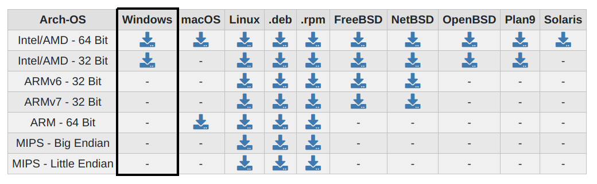
        Sau đó giải nén file zip tải được ở trên ta có file rclone.exe, giả sử nằm ở thư mục `D:\Rclone\rclone.exe`
        Mở ứng dụng CMD của Windows (Run- CMD) rồi chạy lệnh sau:

        ```powershell
        D:\Rclone\rclone.exe authorize "drive"
        ```

        Đừng quên thay `D:\Rclone\rclone.exe` thành đường dẫn tương ứng trên máy bạn nhé!
        Một trình duyệt sẽ mở ra, tới bước 3

    2. **Trên Linux/macOS/BSD**

        Mở ứng terminal rồi chạy lệnh để cài đặt (lưu ý nhập sudo password):

        ```bash
        curl https://rclone.org/install.sh -o rclone.sh
        sudo bash rclone.sh
        rm rclone.sh

        rclone authorize "drive"
        ```

        Một trình duyệt sẽ mở ra, tới bước 3

3. Chọn tài khoản Google sẽ sao lưu vào:
   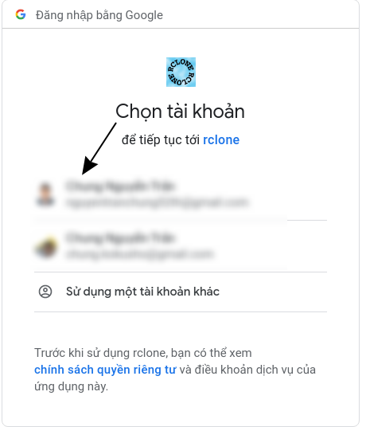
4. Cho phép kết nối vào tài khoản của bạn:
   
5. Quay lại terminal/cmd ở bước 2, bạn sẽ thấy một đoạn mã như hình bên dưới, vui lòng sao chép mã này lại:
   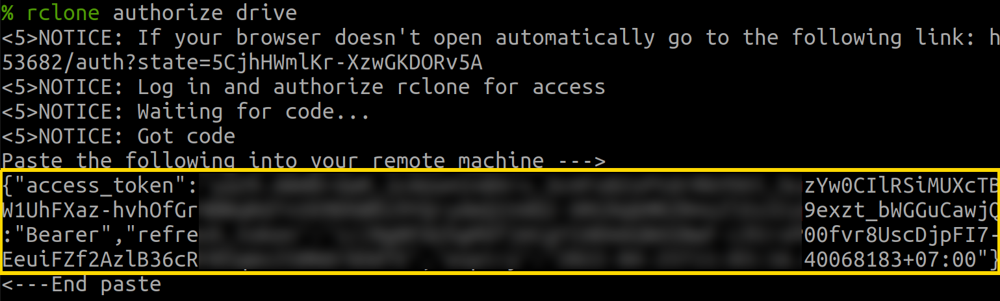
6. Truy vào <a :href="data.url + '/servers/'" target="_blank">trang quản lý máy chủ</a> và chọn máy chủ cần sao lưu, sau đó ấn vào tab "Sao lưu"
7. Chọn Google Drive
   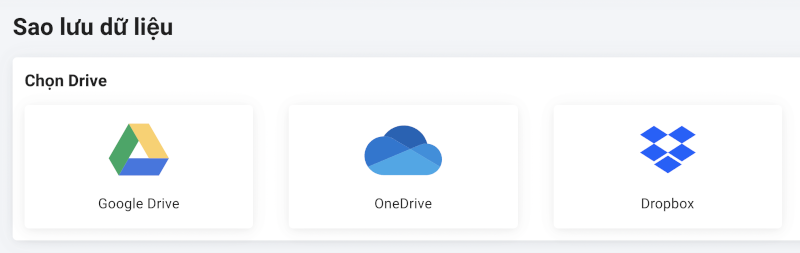
8. Ở ô memo bạn hãy nhập mô tả gì đó để ghi chú, ở ô thứ 2 là "Backup Google Drive Code" bạn hãy nhập mã đã sao chép được ở bước số 5
   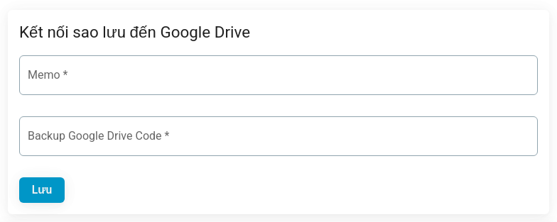
9. Ấn lưu để hoàn tất.

## Sao lưu đến OneDrive

Để quá trình cấu hình diễn ra suôn sẻ bạn cần chuẩn bị những thứ sau đây:

1. Một tài khoản Microsoft OneDrive chuyên dùng để sao lưu dữ liệu
2. Cài Rclone và lấy OneDrive Token

    1. **Trên Windows**

        Tải phần mềm Rclone 64bit hoặc 32bit về máy tại địa chỉ https://rclone.org/downloads/
        
        Sau đó giải nén file zip tải được ở trên ta có file rclone.exe, giả sử nằm ở thư mục `D:\Rclone\rclone.exe`
        Mở ứng dụng CMD của Windows (Run- CMD) rồi chạy lệnh sau:

        ```powershell
        D:\Rclone\rclone.exe authorize "onedrive"
        ```

        Đừng quên thay `D:\Rclone\rclone.exe` thành đường dẫn tương ứng trên máy bạn nhé!
        Một trình duyệt sẽ mở ra, tới bước 3

    2. **Trên Linux/macOS/BSD**

        Mở ứng terminal rồi chạy lệnh để cài đặt (lưu ý nhập sudo password):

        ```bash
        curl https://rclone.org/install.sh -o rclone.sh
        sudo bash rclone.sh
        rm rclone.sh

        rclone authorize "onedrive"
        ```

        Một trình duyệt sẽ mở ra, tới bước 3

3. Đăng nhập vào tài khoản Microsoft (bỏ qua nếu bạn đã đăng nhập)
4. Cho phép kết nối vào tài khoản của bạn bằng cách ấn Có hoặc Yes:
   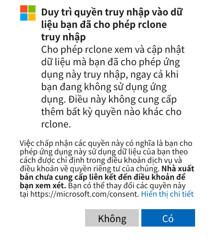
5. Quay lại terminal/cmd ở bước 2, bạn sẽ thấy một đoạn mã như hình bên dưới, vui lòng sao chép mã này lại:

    Đoạn mã ở giữa `Paste the following into your remote machine --->` và `<---End paste` nhé!
    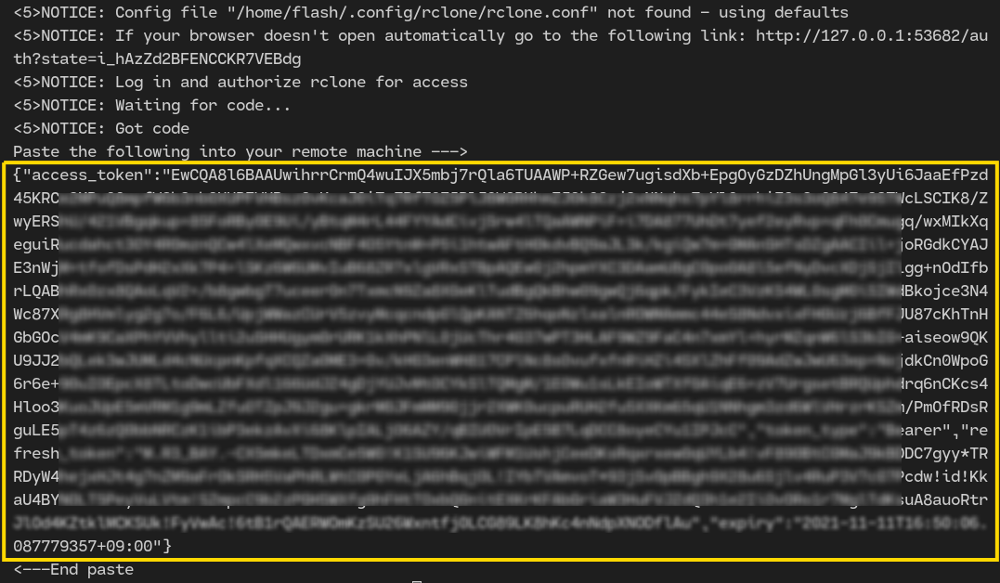

6. Truy vào <a :href="data.url + '/servers/'" target="_blank">trang quản lý máy chủ</a> và chọn máy chủ cần sao lưu, sau đó ấn vào tab "Sao lưu"
7. Chọn OneDrive
   
8. Ở ô memo bạn hãy nhập mô tả gì đó để ghi chú, ở ô thứ 2 là "Backup OneDrive Code" bạn hãy nhập mã đã sao chép được ở bước số 5
   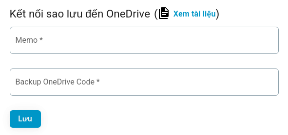
9. Ấn lưu để hoàn tất.

## Sao lưu đến DropBox

Để quá trình cấu hình diễn ra suôn sẻ bạn cần chuẩn bị những thứ sau đây:

1. Một tài khoản Dropbox chuyên dùng để sao lưu dữ liệu
2. Cài Rclone và lấy Dropbox Token

    1. **Trên Windows**

        Tải phần mềm Rclone 64bit hoặc 32bit về máy tại địa chỉ https://rclone.org/downloads/
        
        Sau đó giải nén file zip tải được ở trên ta có file rclone.exe, giả sử nằm ở thư mục `D:\Rclone\rclone.exe`
        Mở ứng dụng CMD của Windows (Run- CMD) rồi chạy lệnh sau:

        ```powershell
        D:\Rclone\rclone.exe authorize "dropbox"
        ```

        Đừng quên thay `D:\Rclone\rclone.exe` thành đường dẫn tương ứng trên máy bạn nhé!
        Một trình duyệt sẽ mở ra, tới bước 3

    2. **Trên Linux/macOS/BSD**

        Mở ứng terminal rồi chạy lệnh để cài đặt (lưu ý nhập sudo password):

        ```bash
        curl https://rclone.org/install.sh -o rclone.sh
        sudo bash rclone.sh
        rm rclone.sh
        rclone authorize "dropbox"
        ```

        Một trình duyệt sẽ mở ra, tới bước 3

3. Đăng nhập vào tài khoản Dropbox (bỏ qua nếu bạn đã đăng nhập)
4. Cho phép kết nối vào tài khoản của bạn bằng cách ấn "Đồng ý" hoặc "Allow":
   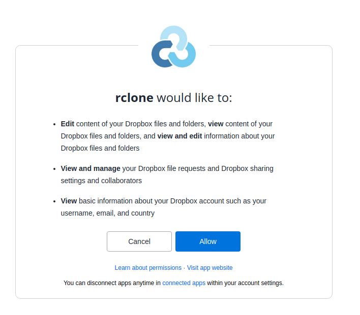
5. Quay lại terminal/cmd ở bước 2, bạn sẽ thấy một đoạn mã như hình bên dưới, vui lòng sao chép mã này lại:

    Đoạn mã ở giữa `Paste the following into your remote machine --->` và `<---End paste` nhé!
    

6. Truy vào <a :href="data.url + '/servers/'" target="_blank">trang quản lý máy chủ</a> và chọn máy chủ cần sao lưu, sau đó ấn vào tab `Sao lưu`
7. Chọn Dropbox
   
8. Ở ô memo bạn hãy nhập mô tả gì đó để ghi chú, ở ô thứ 2 là "Backup Dropbox Code" bạn hãy nhập mã đã sao chép được ở bước số 5
   
9. Ấn lưu để hoàn tất.

## Sao lưu đến SFTP

1. Truy vào <a :href="data.url + '/servers/'" target="_blank">trang quản lý máy chủ</a> và chọn máy chủ cần sao lưu, sau đó ấn vào tab `Sao lưu`
2. Chọn SFTP
   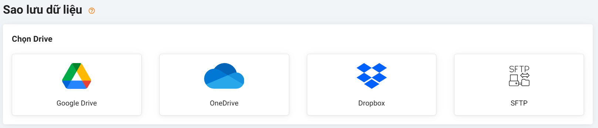
3. Tại cửa sổ cấu hình kết nối SFTP, Nhập các thông tin kết nối SFTP.

    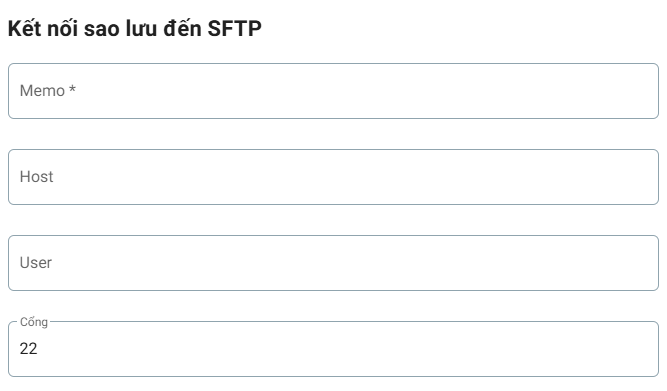

-   Memo: Ở ô memo bạn hãy nhập mô tả gì đó để ghi chú
-   Host: Nhập địa chỉ IPv4 hoặc Tên miền của máy chủ SFTP
-   User: Nhập người dùng kết nối đến SFTP. Mặc định (root)
-   Port: Nhập cổng kết nối đến SFTP. Mặc định (22)

    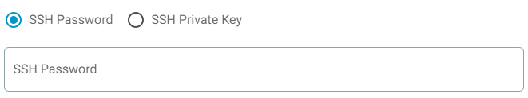

-   SSH Password: Nhập mật khẩu cho user kết nối SFTP

    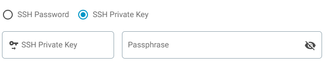

-   SSH Private Key & Passphrase: Kết nối đến SFTP sử dụng khoá private và mật khẩu khoá (nếu có)

## Cấu hình sao lưu

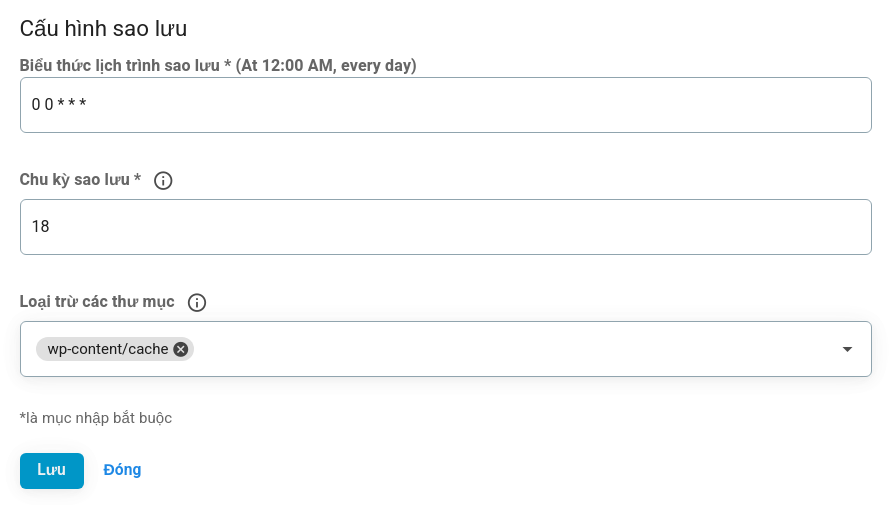

-   Biểu thức lịch trình sao lưu: tham khảo [tại đây](../knowledge/cron-job.md)
-   Chu kì sao lưu: số ngày gần nhất giữ lại các bản sao lưu, ví dụ thiết lập là 18 thì các bản sao lưu 19 ngày trước đó không còn khả dụng, bạn nên cân nhắc tải chúng về trước khi bị xóa đi.
-   Loại trừ các thư mục: là đường dẫn chỉ đến thư mục bạn không nằm trong bản sao lưu dữ liệu
