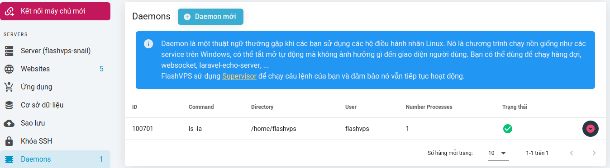
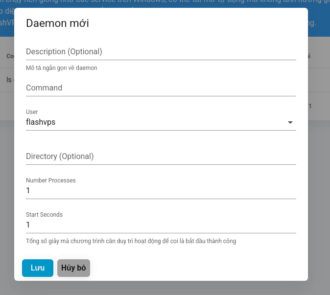

# Daemons

## Tổng quát

Daemon là một thuật ngữ thường gặp khi các bạn sử dụng các hệ điều hành nhân Linux. Nó là chương trình chạy nền giống như các service trên Windows, có thể tắt mở tự động mà không ảnh hưởng gì đến giao diện người dùng. Bạn có thể dùng để chạy hàng đợi, websocket, laravel-echo-server, ...
`{{ data.name }}` sử dụng Supervisor để chạy câu lệnh của bạn và đảm bảo nó vẫn tiếp tục hoạt động

## Cấu hình Daemon

Bạn có thể thiết lập 1 script daemon thông qua tab `Daemon` của máy chủ. Các bước để cấu hình 1 tập lệnh (script) daemon:

1. Tại tab `Daemon` > Chọn `Daemon mới`
   
2. Điền thông tin script muốn thiết lập:

    - **Command**: Câu lệnh cần chạy. VD: `php artisan queue:work`
    - **User**: Người dùng hệ thống được sử dụng để gọi lệnh, mặc định `flashvps` sẽ được sử dụng
    - **Directory**: Thư mục để chạy lệnh của bạn từ đó. Trường này có thể để trống.
    - **Number Processes**: Tùy chọn này xác định số instances của quy trình (process) sẽ được tiếp tục chạy
      

3. Chọn `Lưu`

Sau khi daemon script được tạo thành công bạn sẽ có thể dễ dàng thực hiện 1 số thao tác trên script như sau:

## Log files

`{{ data.name }}` tự động cấu hình daemon của bạn để ghi vào tệp nhật ký. Nhật ký có thể được tìm thấy trong thư mục `/home/flashvps/.flashvps/`. Các tệp nhật ký được đặt tên là `daemon-*.log`. Nếu daemon script được chạy với người dùng hệ thống là `root` thì tệp nhật ký sẽ được lưu tại `/root/.flashvps/`.

::: warning
Nếu bạn đang sử dụng tính năng cách ly người dùng của `{{ data.name }}`, bạn nên điều hướng đến thư mục `.flashvps` trong thư mục `/home/{username}` dựa trên người dùng mà daemon thuộc về để định vị tệp nhật ký.
:::
