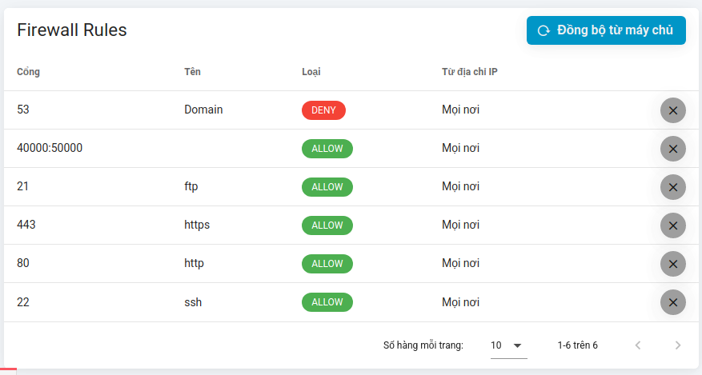

# Firewall Rule

## Tổng quát

{{ data.name }} cho phép bạn quản lý tường lửa của máy chủ cũng như cấu hình máy chủ nào có thể kết nối với các máy chủ khác thông qua Bảng quản lý mạng trong tab **Network** tại máy chủ của bạn.

:::warning **! Manually Add Rules.**

Nếu bạn tạo thủ công một `ufw` rule trên máy chủ của bạn, {{ data.name }} sẽ cho phép bạn dễ dàng [Đồng bộ từ máy chủ](#đong-bo-tu-may-chu) các rules đã thêm.

:::

## Firewalls

Bạn có thể thiết lập cấu hình và quản lý tường lửa của mình từ bên trong bảng điều khiển {{ data.name }} thông qua tab **Network** trên bảng điều khiển quản lý của máy chủ. Tường lửa được sử dụng để mở các cổng trên máy chủ của bạn với Internet. Ví dụ: khi sử dụng FTP, bạn có thể cần mở cổng `21`.
Để tăng cường bảo mật, bạn có thể hạn chế các cổng đã mở đối với các địa chỉ IP cụ thể. Các bước để cấu hình một tường lửa:

1. Tại tab `Network` > bấm nút `Add Firewall Rule`:
   

2. Điền theo hướng dẫn

    - **Cổng**: Bạn có thể chỉ định 1 cổng chẳng hạn `3306`, `5432` hoặc cũng có thể mở 1 dải cổng: ví dụ muốn mở dải cổng từ `8000` đến `8010` thì nhập vào là `(8000:8010)`
    - **Loại quy tắc cho phép (Allow)/ từ chối (Deny)**: Bạn có thể chọn cho phép hoặc từ chối traffic cho một rule nhất định. Bằng cách tạo `từ chối` rule, bạn sẽ ngăn traffic truy cập đến dịch vụ.
      ::: warning **! Deny Rule Run First.**
      Để làm cho các `deny` rules hoạt động chính xác, chúng được thêm vào ở mức độ ưu tiên cao hơn các `allow` rule. Mỗi `deny` rule mới sẽ được thêm vào bên trên mọi `deny` rule hiện có.
      :::

3. Chọn `Thêm mới`

## Các quy tắc tường lửa mặc định

Khi cài đặt máy chủ. {{ data.name }} sẽ tự động cấu hình 3 quy tắc:

-   **SSH**: Cho phép truy cập cổng `22` từ bất kỳ địa chỉ IP
-   **HTTP**: Cho phép truy cập cổng `80` từ bất kỳ địa chỉ IP
-   **HTTPS**: Cho phép truy cập cổng `443` từ bất kỳ địa chỉ IP

Bạn nên lưu ý rằng mặc dù truy cập đến được phép trên cổng `22` đối với các kết nối SSH, các kết nối SSH không sử dụng [Khóa SSH](../knowledge/ssh-keys.md) sẽ không được chấp nhận. Do đó, không thể bắt buộc kết nối SSH với máy chủ của bạn. **Bạn không bao giờ được xóa quy tắc cho phép truy cập SSH đến máy chủ của mình; nếu không, {{ data.name }} sẽ không thể kết nối hoặc quản lý máy chủ của bạn**.

## Xóa SSH Firewall Rule

Nếu bạn đã xóa quy tắc tường lửa (thường là cổng 22) khỏi giao diện người dùng {{ data.name }} hoặc trực tiếp trên máy chủ, {{ data.name }} sẽ không thể kết nối với máy chủ và sẽ không thể tạo lại quy tắc này cho bạn.

Để khắc phục điều này, bạn sẽ cần truy cập trực tiếp vào máy chủ thông qua nhà cung cấp của mình và thêm lại cổng SSH theo cách thủ công. DigitalOcean cho phép bạn kết nối từ xa thông qua bảng điều khiển của họ.

{{ data.name }} sử dụng `ufw` cho tường lửa, vì vậy khi bạn đã kết nối với máy chủ, bạn cần chạy phần sau với quyền root:
`ufw allow 22`

## Đồng bộ từ máy chủ

{{ data.name }} cho phép bạn đồng bộ các quy tắc đã được thêm thủ công ở máy chủ với hệ thống.
Tại tab `Network` > Chọn `Đồng bộ từ máy chủ`

