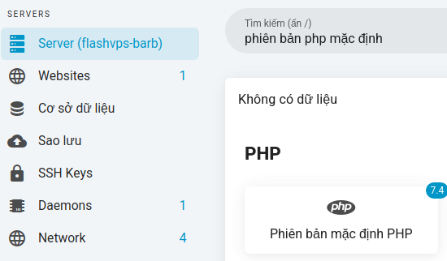
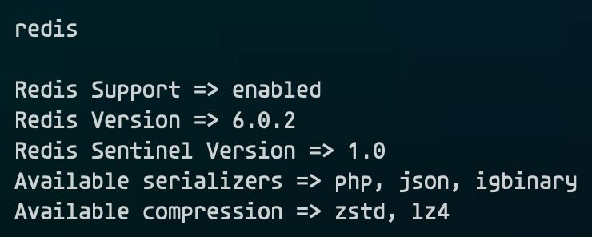
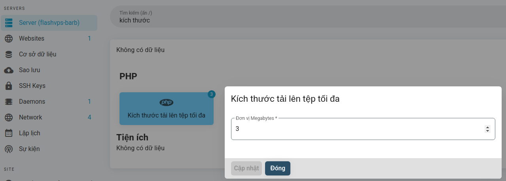

<script setup>
import { data } from '../../.vitepress/config.data.ts'
</script>

# PHP

{{ data.name }} giúp bạn dễ dàng chuyển đổi phiên bản mặc định cho máy chủ, thiết lập kích thước tải lên tệp tối đa, thời gian thực thi tối đa và bất/tắt OPCache.

::: warning ! Cài đặt PHP thủ công

Nếu bạn chọn cài đặt thủ công các phiên bản PHP trên máy chủ của mình, {{ data.name }} sẽ không biết về các cài đặt PHP đó. {{ data.name }} chỉ biết về các cài đặt PHP được quản lý thông qua bảng điều khiển {{ data.name }}.

:::

## Multiple PHP Versions

Khi tạo một máy chủ, bạn phải quyết định phiên bản PHP nào bạn muốn cài đặt làm phiên bản `default`. PHP CLI trên máy chủ của bạn sẽ trỏ đến phiên bản đã cài đặt được chọn tại thời điểm tạo.

Khi máy chủ đã được tạo, {{ data.name }} giúp bạn dễ dàng cài đặt các phiên bản bổ sung cùng với phiên bản mặc định. Trong tài liệu sau, chúng tôi sẽ thảo luận về cách quản lý các phiên bản PHP bổ sung này.

## Cài đặt

Bạn có thể cài đặt các phiên bản PHP bổ sung thông qua tab [**Ứng dụng**](./application.md) trên bảng điều khiển quản lý của máy chủ. Sau khi một phiên bản PHP bổ sung đã được cài đặt, bạn có thể chọn nó khi tạo một trang web hoặc khi chuyển đổi phiên bản PHP của một trang web.

Khi bạn cài đặt một phiên bản PHP mới vào máy chủ của mình, {{ data.name }} sẽ tạo và thiết lập cấu hình quy trình PHP-FPM cho phiên bản đó. Điều này có nghĩa là máy chủ của bạn sẽ chạy nhiều phiên bản PHP cùng một lúc.

## Gỡ cài đặt

Bạn có thể gỡ cài đặt các phiên bản PHP thông qua tab [**Ứng dụng**](./application.md) trên bảng điều khiển quản lý của máy chủ. Bạn có thể chọn gỡ cài đặt phiên bản PHP miễn là:

-   Có các phiên bản khác được cài đặt.
-   Phiên bản bạn muốn gỡ cài đặt không phải là phiên bản mặc định của máy chủ cho các trang web mới.
-   Phiên bản bạn muốn gỡ cài đặt không phải là phiên bản mặc định của máy chủ trên CLI.
-   Phiên bản bạn muốn gỡ cài đặt không được sử dụng bởi bất kỳ trang web nào.

## Chuyển đổi PHP Mặc định

Phiên bản PHP 'mặc định' là phiên bản PHP sẽ được sử dụng theo mặc định khi tạo một trang web mới trên máy chủ.
Các bước chuyển đổi:

1. Tại bảng điều khiển quản lý máy chủ > Chọn `Phiên bản mặc định PHP`
   
2. Chọn phiên bản PHP muốn chuyển
   
3. Chọn `Cập nhật`

Khi chọn một phiên bản PHP mới làm phiên bản 'mặc định' cho máy chủ của bạn, các phiên bản PHP được các trang web hiện có sử dụng sẽ không được cập nhật.

## Cài PHPRedis với igbinary và zstd + lz4

::: warning
OpenLiteSpeed không áp dụng
:::

-   Vào Application > PHP cài extension `php8.2-redis`, `php8.2-igbinary`, `php8.2-lz4`.
-   Vào Server > Termial (root user) chạy lệnh

    ```bash
    apt update && apt install liblz4-dev libzstd-dev
    pecl uninstall redis
    pecl install --configureoptions 'enable-redis-igbinary="yes" enable-redis-zstd="yes" enable-redis-lz4="yes"' redis
    ```

    Nó sẽ báo lỗi liên quan tới php_ini tuy nhiên có thể bỏ qua.

    Check kết quả bằng lệnh `php -ri redis`

    Kết quả như trong hình là ok.

    

    Bạn nào chạy nhiều site dùng chung 1 instance Redis đặc biệt là các site `Wordpress`, `Woocommerce` nên xem xét bật compression để tối ưu hơn.

    Blog so sánh redis compression từ DoorDash: https://doordash.engineering/2019/01/02/speeding-up-redis-with-compression/

## Một số cài đặt cấu hình PHP phổ biến

::: warning

Thay đổi các cài đặt sau sẽ áp dụng các thay đổi cho tất cả các phiên bản PHP được cài đặt trên máy chủ.

:::

### Kích thước tải lên tệp tối đa

Bạn có thể thiết lập cấu hình kích thước tải lên tệp tối đa tại bảng điều khiển quản lý máy chủ. Giá trị được cung cấp tính theo đơn vị megabyte. Để tham khảo, `1024MB` là `1GB`.


### Thời gian thực thi tối đa

Bạn có thể định cấu hình thời gian thực thi tối đa tại bảng điều khiển quản lý máy chủ. Giá trị được cung cấp tính theo theo đơn vị `giây`.


### OPcache

Việc tối ưu hóa OPcache PHP cho sản xuất(production) sẽ cấu hình OPcache để lưu trữ mã PHP đã biên dịch của bạn trong bộ nhớ để cải thiện đáng kể hiệu suất. Nếu bạn chọn tối ưu hóa OPcache cho sản xuất(production), bạn nên xác minh rằng tập lệnh triển khai của bạn [**khởi động lại dịch vụ PHP-FPM**](cookbook.md#khoi-đong-lai-php-fpm) vào cuối mỗi lần triển khai.

Bật PHPOpcache tại bảng điều khiển quản lý máy chủ

