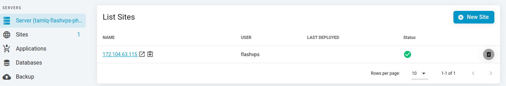
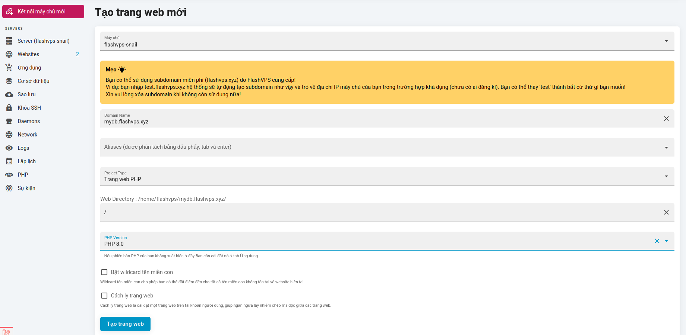
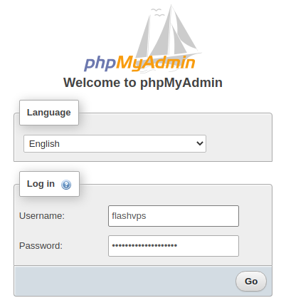
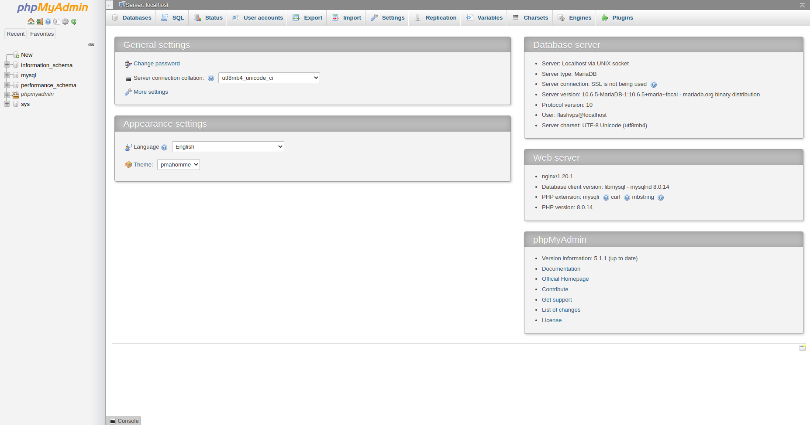

# phpMyAdmin

::: warning
Không giống như các panel hay các script bạn sử dụng trước đây, phpMyAdmin trong {{ data.name }} là một website độc lập.
:::

## phpMyAdmin là gì?

`phpMyAdmin` là một công cụ phần mềm miễn phí được viết bằng PHP, nhằm xử lý việc quản trị MySQL qua Web. phpMyAdmin hỗ trợ một loạt các hoạt động trên MySQL và MariaDB. Các hoạt động thường được sử dụng (quản lý cơ sở dữ liệu, bảng, cột, quan hệ, chỉ mục(indexes), người dùng, quyền, v.v.) có thể được thực hiện thông qua giao diện người dùng, trong khi bạn vẫn có khả năng thực thi trực tiếp bất kỳ câu lệnh SQL nào.

{{ data.name }} cũng hỗ trợ cài đặt phpMyAdmin, vì vậy bạn có thể quản lý cơ sở dữ liệu từ bất cứ đâu.

Nếu bạn chưa từng làm như vậy, bạn nên tạo một cơ sở dữ liệu và người dùng cơ sở dữ liệu mới. Điều này được phpMyAdmin sử dụng để lưu trữ cấu hình của cơ sở dữ liệu và người dùng của bạn.

Một khi {{ data.name }} đã cài đặt phpMyAdmin, sau đó bạn có thể đăng nhập vào cài đặt của mình bằng bất kỳ tổ hợp tên người dùng và mật khẩu cơ sở dữ liệu nào của bạn.

## Các tính năng nổi bật của phpMyAdmin

-   Giao diện web trực quan
-   Hỗ trợ hầu hết các tính năng của MySQL:
    -   browse và xóa cơ sở dữ liệu, bảng, views, trường và indexes
    -   tạo, sao chép, xóa, đổi tên và thay đổi cơ sở dữ liệu, bảng, trường và indexes
    -   maintenance server, cơ sở dữ liệu và bảng, với các đề xuất về cấu hình máy chủ
    -   thực thi, chỉnh sửa và bookmark bất kỳ câu lệnh SQL nào, thậm chí cả các truy vấn hàng loạt
    -   quản lý MySQL user accounts and privileges
    -   quản lý stored procedures and triggers
-   Nhập dữ liệu từ CSV và SQL
-   Xuất dữ liệu sang các định dạng khác nhau: CSV, SQL, XML, PDF, ISO / IEC 26300 - OpenDocument Text and Spreadsheet, Word, LATEX và các định dạng khác
-   Administering multiple servers
-   Tạo đồ họa của bố cục cơ sở dữ liệu của bạn ở các định dạng khác nhau
-   Tạo các truy vấn phức tạp bằng cách sử dụng Query-by-example (QBE)
-   Tìm kiếm toàn cầu trong một cơ sở dữ liệu hoặc một tập hợp con của nó
-   Chuyển đổi dữ liệu được lưu trữ sang bất kỳ định dạng nào bằng cách sử dụng một tập hợp các predefined functions, như hiển thị dữ liệu BLOB dưới dạng hình ảnh hoặc download-link
-   ...

## Hướng dẫn cài đặt phpMyAdmin

::: warning
Phiên bản phpMyAdmin có thể hoạt động trên PHP lớn hơn 8.0 nhưng có thể gặp một số vấn đề tương thích do thay đổi một số tính năng và cú pháp so với các phiên bản PHP trước đó.
:::

1. **Tạo trang web**: Tại giao diện thông tin máy chủ, bạn chọn `Tạo trang web mới`
   

2. Điền thông tin trang web và chọn `Tạo trang web`
   

3. **Cài đặt phpMyAdmin**: Bạn đi tới bảng quản lý trang web.
   Sau đó chọn tùy chọn cài đặt mã nguồn phpMyAdmin
   

4. Chọn `Cài đặt phpMyAdmin`

    {{ data.name }} sẽ tiến hành cài đặt giúp bạn, Quá trình cài đặt sẽ mất 1-2 phút. Sau đó bạn chỉ việc truy cập vào trang web và nếu bạn thấy giao diện như hình dưới là đã thành công.
    Bạn nhập username và password mà {{ data.name }} đã gửi cho bạn qua mail khi bạn tạo máy chủ. Hoặc bạn cũng có thể đi đến tab `Cơ sở dữ liệu` > và tạo `username`, `password` mới.
    

    Sau khi đăng nhập thành công có giao diện như sau:
    

## Một số vấn đề cần lưu ý

### Khi import file với dung lượng lớn

-   Khi import file với dung lượng lớn sẽ mất nhiều thời gian xử lý
-   Bạn quay lại <a :href="data.url + '/servers'" target="_blank">{{ data.name }}</a> và thiết lập thêm 1 vài thông số tại bảng quản lý máy chủ để việc import file thực hiện thành công:
    -   Thiết lập [`Kích thước file tải lên tối đa`](php.md#kích-thước-tải-lên-tệp-tối-đa) (MB)
    -   Thiết lập [`thời gian thực thi`](php.md#thời-gian-thưc-thi-tối-đa)
