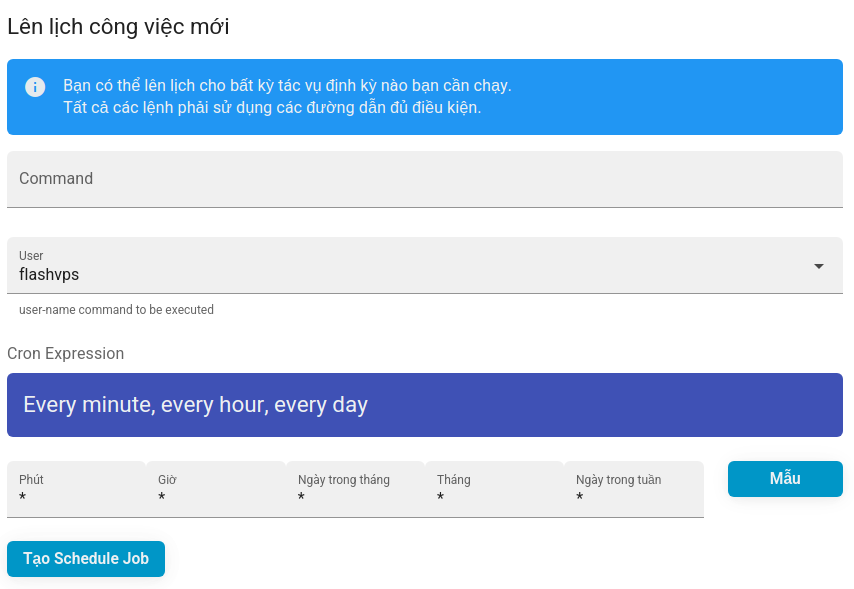

# Lập lịch (Schedule)

## Scheduled Jobs

Các công việc đã lên lịch có thể được cấu hình để chạy các lệnh trong một khoảng thời gian xác định. `{{ data.name }}` cung cấp một số giá trị mặc định phổ biến hoặc bạn có thể nhập lịch trình Cron tùy chỉnh cho một lệnh.

Bạn có thể tạo công việc đã lên lịch thông qua bảng điều khiển `{{ data.name }}` thông qua tab **Lập lịch** cho bảng điều khiển quản lý của máy chủ. Khi tạo một công việc mới đã lên lịch, bạn cần cung cấp:

-   **Command**: Lệnh để chạy, ví dụ: `php /home/flashvps/default/ artian schedule:run`
-   **User**: Người dùng hệ thống chạy lệnh. ví dụ: `flashvps`
-   **Cron Expression**: Tần suất chạy lệnh tại.
    

::: warning **! Scheduled Job Not Running?.**  
Nếu công việc đã lên lịch của bạn không chạy, bạn nên đảm bảo rằng đường dẫn đến lệnh là chính xác.
:::

### Laravel Scheduled Jobs

Nếu bạn đã triển khai một ứng dụng Laravel và đang sử dụng tính năng [lập lịch của Laravel](https://laravel.com/docs/master/scheduling), bạn sẽ cần tạo một công việc đã lên lịch để chạy lệnh Laravel Artisan `schdule:run`. Công việc này nên được cấu hình để thực hiện mỗi phút.
