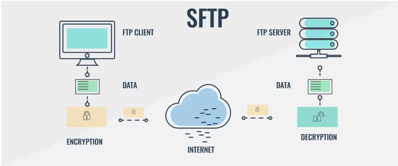
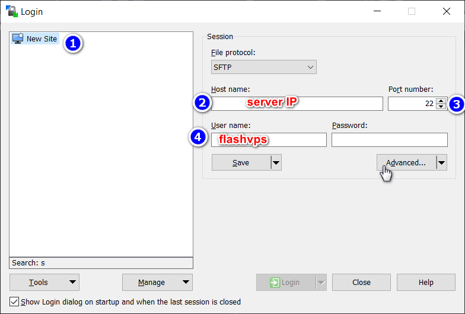
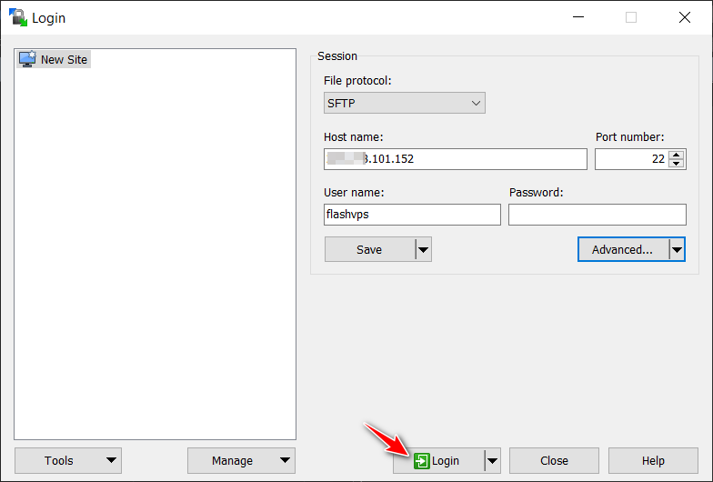
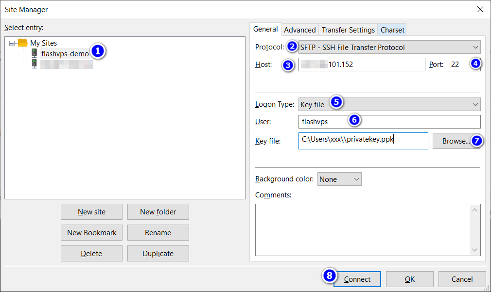

# SFTP

::: info

SFTP hay còn được biết đến với cái tên gốc là: SSH File Transfer Protocol.
Đó là giao thức SSH - Secure Shell, một giao thức dùng để di chuyển các tệp tin.
SFTP được phát triển vào những năm 1990. Và nó cho phép di chuyển các tệp tin 1 cách an toàn.
:::

## SFTP Client là gì?

SFTP Client là một phần mềm sử dụng giao thức SFTP để truyền tệp một cách an toàn đến các máy tính từ xa.

## Hướng dẫn sử dụng WinSCP

1. Tải về và cài đặt tại địa chỉ: https://winscp.net/eng/download.php
2. Bấm nút "New Session" để khởi tạo kết nối mới
   
3. Cấu hình như hình, sau đó bấm vào nút "Advanced..."
   
4. Ở bên trái chọn SSH > Authentication, sau đó bấm vào nút ... trong khung màu đỏ và chọn private PuttyKey,
   nếu chưa có Private PuTTY Key, bạn hãy xem [hướng dẫn tại đây](../knowledge/ssh-keys.md)
   
   Sau đó bấm OK.
5. Bấm "Login" để đăng nhập
   
6. Xong, bạn có thể upload file lên máy chủ của mình.
   

## Hướng dẫn sử dụng FileZilla

1. Tải về và cài đặt tại địa chỉ: https://filezilla-project.org/download.php?type=client
2. Từ menu chọn "File > Site Manager"
   
3. Bấm "New Site" để tạo site mới
   
4. Cấu hình như hình dưới, lưu ý:

    ② protocol: chọn SFTP

    ⑤ Logon Type: chọn key file

    ⑦ nếu chưa có Private PuTTY Key, bạn hãy xem [hướng dẫn tại đây](../knowledge/ssh-keys.md)
    
    Sau đó bấm Connect.

5. Xong, bạn có thể upload file lên máy chủ của mình.
