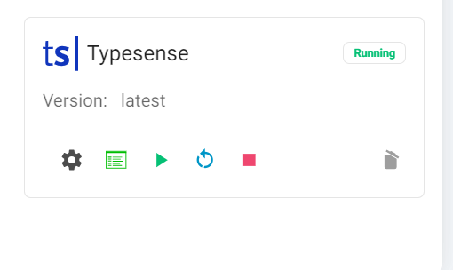
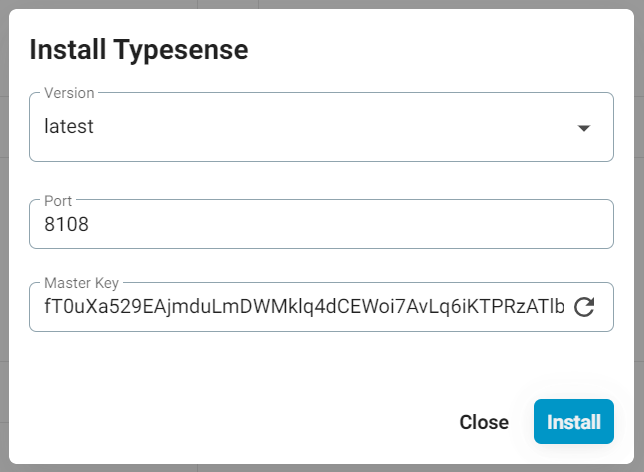

# Typesense Server

Cách cài đặt Typesense Server Search trên FlashPanel

## Cài đặt

Trước tiên bạn cần 1 server mới tinh kết nối với FlashPanel (chỉ cần cài Nginx, mấy cái khác không cần)
 - Thực ra bạn có thể dùng chung server hiện tại với website Wordpress, tuy nhiên mình nghĩ các bạn nên tách ra riêng, để dễ quản lý và có lỗi gì thì cũng không bị lỗi cả 2

## WordPress

Vào Wordpress, cài đặt plugin Search with Typesense (miễn phí hoàn toàn nhé), nếu dùng Woocommerce thì add-on mới cần mua

Sau khi cài đặt và kích hoạt plugin, bạn vào plugin và vào tab General:


Bạn sẽ thấy một số thông tin mình cần có để cài đặt Typesense.

Okay, dưới đây là cách mình lấy các thông tin đó mà không cần phải gõ bất kỳ 1 dòng code nào:

## Cài đặt Typesense Search trên server

Bạn vào server đã kết nối FlashPannel, vào mục ứng dụng (app), tìm và cài đặt ứng dụng Typesense



Bạn nhớ copy và lưu lại Master API key, đó là key API tổng của Typesense Server.




tạo admin key

```bash
# day la api key khi cai dat ung dung
TYPESENSE_API_KEY=abcxyz

# tao admin key
curl 'http://localhost:8108/keys' \
    -X POST \
    -H "X-TYPESENSE-API-KEY: ${TYPESENSE_API_KEY}" \
    -H 'Content-Type: application/json' \
    -d '{"description":"Admin key.","actions": ["*"], "collections": ["*"]}'

# tao search only api key
curl 'http://localhost:8108/keys' \
    -X POST \
    -H "X-TYPESENSE-API-KEY: ${TYPESENSE_API_KEY}" \
    -H 'Content-Type: application/json' \
    -d '{"description":"Search-only companies key.","actions": ["documents:search"], "collections": ["companies"]}'

```

## Truy cập typesense vơi domain

Bước 1: tạo website


Bước 2: Cài ssl nếu cần
