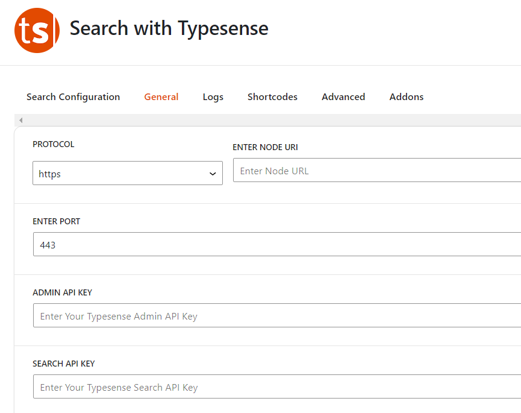
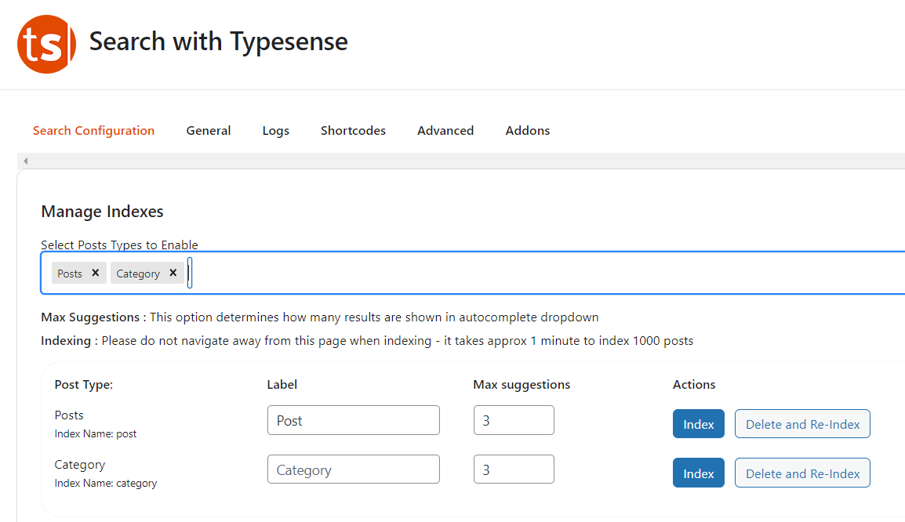

---
head:
    - - meta
      - name: description
        content: Typesense Server là một công cụ tìm kiếm mã nguồn mở, được thiết kế để cung cấp các tính năng tìm kiếm toàn văn nhanh chóng và chính xác
---

<script setup>
import { data } from '../../.vitepress/config.data.ts'
</script>

# Typesense Server


Cách cài đặt Typesense Server Search trên {{ data.name }}

## Typesense Server là gì?

Typesense Server là một công cụ tìm kiếm mã nguồn mở, được thiết kế để cung cấp các tính năng tìm kiếm toàn văn nhanh chóng và chính xác. Nó được xây dựng để phục vụ các ứng dụng có yêu cầu tìm kiếm phức tạp, nhưng lại dễ dàng triển khai và quản lý.

### Các tính năng chính của Typesense Server:

1. **Tìm kiếm toàn văn nhanh chóng**: Typesense sử dụng các thuật toán tìm kiếm tiên tiến để cung cấp kết quả tìm kiếm gần như tức thì.

2. **Dễ dàng cài đặt và quản lý**: Nó có giao diện quản lý đơn giản, giúp dễ dàng cài đặt, cấu hình và duy trì.

3. **Tự động hoàn thành và gợi ý từ khoá**: Typesense hỗ trợ tự động hoàn thành và gợi ý từ khóa trong khi người dùng nhập liệu, giúp cải thiện trải nghiệm người dùng.

4. **Cải thiện chất lượng kết quả tìm kiếm**: Sử dụng các tính năng như đánh trọng số (weighting), phân tích ngôn ngữ tự nhiên, và điều chỉnh độ phù hợp (relevance tuning) để đảm bảo kết quả tìm kiếm chính xác và phù hợp nhất với truy vấn của người dùng.

5. **API RESTful**: Cung cấp API RESTful giúp dễ dàng tích hợp với các ứng dụng web hoặc di động.

6. **Hỗ trợ tìm kiếm gần đúng (fuzzy search)**: Giúp tìm kiếm chính xác ngay cả khi người dùng nhập sai chính tả hoặc có lỗi gõ phím.

7. **Mở rộng dễ dàng**: Có khả năng mở rộng để xử lý khối lượng dữ liệu lớn và nhiều người dùng đồng thời.

### Lợi ích khi sử dụng Typesense:

-   **Tốc độ và hiệu suất cao**: Giúp cải thiện trải nghiệm người dùng với các kết quả tìm kiếm nhanh và chính xác.
-   **Đơn giản và dễ sử dụng**: Giao diện quản lý và API thân thiện với người dùng, giúp việc tích hợp và quản lý trở nên dễ dàng hơn.
-   **Mã nguồn mở**: Người dùng có thể tùy chỉnh và mở rộng tính năng theo nhu cầu của mình mà không bị giới hạn bởi một nhà cung cấp cụ thể.

### Một số ứng dụng của Typesense:

-   **E-commerce**: Tìm kiếm sản phẩm trong các cửa hàng trực tuyến.
-   **Ứng dụng web và di động**: Cung cấp tính năng tìm kiếm cho các ứng dụng cần tìm kiếm nội dung hoặc dữ liệu lớn.
-   **Cổng thông tin và trang web nội dung**: Giúp người dùng tìm kiếm thông tin một cách nhanh chóng và hiệu quả.

Typesense Server là một lựa chọn lý tưởng cho các nhà phát triển và doanh nghiệp muốn cải thiện tính năng tìm kiếm trong các ứng dụng của mình mà không cần tốn quá nhiều công sức và tài nguyên.

## Cài đặt Typesense Server trên {{ data.name }}

::: info
Trước tiên bạn cần 1 server mới tinh kết nối với FlashPanel (chỉ cần cài `Nginx`, mấy cái khác không cần). Thực ra bạn có thể dùng chung server hiện tại với website, tuy nhiên mình nghĩ các bạn nên tách ra riêng, để dễ quản lý và có lỗi gì thì cũng không bị lỗi cả 2
:::

Vào tab `Ứng dụng` của máy chủ, tìm đến ứng dụng `Typesense Server` và bấm cài đặt


Các thông tin như `Port` và `Master Key` các bạn hãy lưu lại nhé.

## Kết nối Typesense Server

Có 2 cách để bạn kết nối đến Typesense Server:

1. kết nối thông qua ip, port
2. kết nối thông qua domain

### Kết nối thông qua ip, port

1. Nếu website và Typesense Server trên cùng 1 máy chủ, bạn không phải làm gì hết.
2. Nếu website và Typesense Server khác máy chủ, bạn phải mở cổng `8108` ở [quản lý Firewall](firewall-rule.md) cho bên ngoài kết nối tới

### Kết nối thông qua domain

Bạn vào server đã kết nối {{ data.name }}, vào mục ứng dụng (app), tìm và cài đặt ứng dụng Typesense

Tạo 1 website mới cho Typesense Server

Nhớ điền các thông tin cần thiết: Domain (hoặc subdomain đều được, và nhớ trỏ DNS về IP server), chọn loại `Proxy Port`, và nhập port Proxy là `8108`, như hình dưới. Và nhấp vào tạo site.


Sau đó bạn [cài chứng chỉ SSL](../site/ssl.md) cho domain nhé.

## Tạo Api Key

Khi kết nối đến Typesense Server, bạn cần cung cấp `API Key` bạn có thể dùng `Master Api Key` khi cài đặt Typesense nhưng không khuyến khích vì không an toàn. `Master Api Key` là key API tổng, nó có toàn quyền.

Do đó, để bảo mật hơn, bạn nên tạo các key con `Admin Api Key`, và `Search Only Api Key`

Bạn vào Command và nhập các lệnh dưới đây để tạo các API key

```bash
# Đây là Master API Key
TYPESENSE_API_KEY=abcxyz

# Tạo Admin Api Key
curl 'http://localhost:8108/keys' \
    -X POST \
    -H "X-TYPESENSE-API-KEY: ${TYPESENSE_API_KEY}" \
    -H 'Content-Type: application/json' \
    -d '{"description":"Admin Key","actions": ["*"], "collections": ["*"]}'

# Tạo Search Only Api Key
curl 'http://localhost:8108/keys' \
    -X POST \
    -H "X-TYPESENSE-API-KEY: ${TYPESENSE_API_KEY}" \
    -H 'Content-Type: application/json' \
    -d '{"description":"Search-only key","actions": ["documents:search"], "collections": ["nhập_vào_collection"]}'

```

## Sử dụng Typesense Server trong WordPress

Vào Wordpress, cài đặt plugin `Search with Typesense` (miễn phí hoàn toàn nhé), nếu dùng `Woocommerce` thì add-on mới cần mua

Sau khi cài đặt và kích hoạt plugin, bạn vào plugin và vào tab General:



Bạn điền thông tin như sau:

1. Trường hợp Typesense Server và WordPress cùng 1 máy chủ
    - PROTOCOL: chọn `http`
    - ENTER NODE URI: nhập `127.0.0.1`
    - ENTER PORT: nhập `80`
    - ADMIN API KEY và SEARCH API KEY: nhập `MASTER API Key` hoặc [tạo `Admin Api Key` và `Search Only Api Key`](#123)
2. Trường hợp Typesense Server và WordPress khác máy chủ và dùng `ip:port`
    - PROTOCOL: chọn `http`
    - ENTER NODE URI: nhập `ip_máy_chủ`
    - ENTER PORT: nhập `8108`
    - ADMIN API KEY và SEARCH API KEY: nhập `MASTER API Key` hoặc [tạo `Admin Api Key` và `Search Only Api Key`](#123)
3. Trường hợp Typesense Server và WordPress khác máy chủ và dùng `domain`
    - PROTOCOL: chọn `https`
    - ENTER NODE URI: nhập `domain` khi tạo website ở trên
    - ENTER PORT: nhập `443`
    - ADMIN API KEY và SEARCH API KEY: nhập `MASTER API Key` hoặc [tạo `Admin Api Key` và `Search Only Api Key`](#123)
      nhập MASTER API Key vào (cái này mình sẽ nói thêm ở phần sau)

Xong bạn nhấp vào "Save"

Nó sẽ thông báo ở dưới góc trái như vậy là thành công:


### Index dữ liệu lên Typesense server:

Bạn vào mục Search Config:



Index post và categories bằng cách nhấp vào nút index và đợi (tốc độ index khá nhanh đấy)

Nếu bạn muốn index dữ liệu lên Typesense server ổn định hơn thì tham khảo WP-CLI của plugin theo đường dẫn này: https://docs.wptypesense.com/wp-cli/

### Tùy chỉnh hiển thị

Bạn có thể tùy chỉnh một số mục dưới đây:


Mình thì thích dùng `Instant Search` hơn là `Autocomplete`. Nhưng tùy vào nhu cầu của mỗi người, bạn có thể tùy chỉnh theo ý muốn của mình.

### Hiển thị trang Typesense Search:

Bạn có thể dùng shortcode để hiển thị trang search. Chỉ cần tạo 1 trang trắng, xong add shortcode vào là được.

Tài liệu về shortcode của plugin tại đây: https://docs.wptypesense.com/shortcode/

## Tổng kết:

Ở trên là các bước cơ bản và khá là dễ dàng để cài đặt 1 máy chủ `Typesense search` cực kỳ mạnh mẽ cho website Wordpress của bạn.

Đặc biệt đối với các website có số lượng bài viết cực nhiều (tính bằng chục ngàn đến vài trăm ngàn)

Giảm tải máy chủ.

Hơn nữa, trải nghiệm người dùng sẽ được cải thiện cực kỳ so với việc dùng search mặc định của Wordpress.
