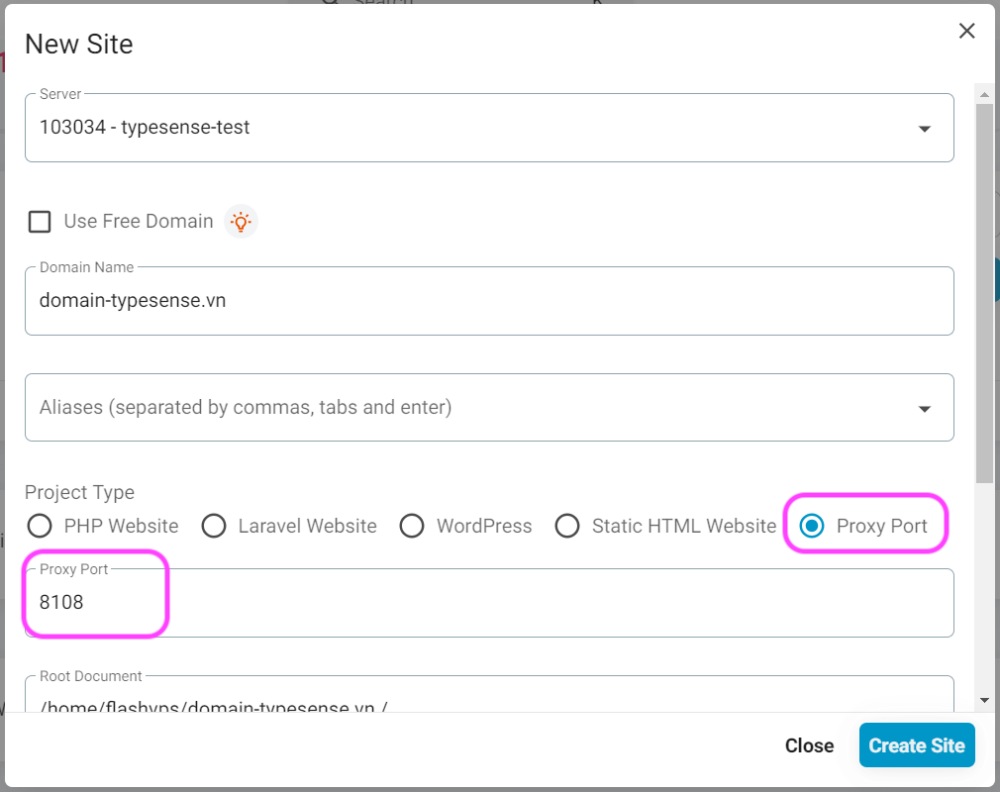
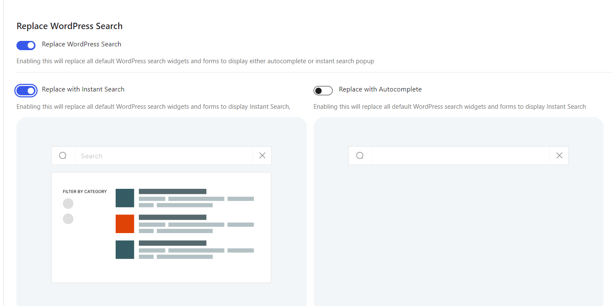

# Typesense Server

Cách cài đặt Typesense Server Search trên FlashPanel

## Cài đặt

Trước tiên bạn cần 1 server mới tinh kết nối với FlashPanel (chỉ cần cài Nginx, mấy cái khác không cần)
 - Thực ra bạn có thể dùng chung server hiện tại với website Wordpress, tuy nhiên mình nghĩ các bạn nên tách ra riêng, để dễ quản lý và có lỗi gì thì cũng không bị lỗi cả 2

## WordPress

Vào Wordpress, cài đặt plugin Search with Typesense (miễn phí hoàn toàn nhé), nếu dùng Woocommerce thì add-on mới cần mua

Sau khi cài đặt và kích hoạt plugin, bạn vào plugin và vào tab General:


Bạn sẽ thấy một số thông tin mình cần có để cài đặt Typesense.

Okay, dưới đây là cách mình lấy các thông tin đó mà không cần phải gõ bất kỳ 1 dòng code nào:

## Cài đặt Typesense Search trên server

Bạn vào server đã kết nối FlashPannel, vào mục ứng dụng (app), tìm và cài đặt ứng dụng Typesense


Bạn nhớ copy và lưu lại Master API key, đó là key API tổng của Typesense Server.


Bước tiếp theo: Tạo domain cho server Typesense.

Bạn chọn Tạo mới website trong server Typesense nhé:

Nhớ điền các thông tin cần thiết: Domain (hoặc subdomain đều được, và nhớ trỏ DNS về IP server), chọn loại Proxy, và nhập port Proxy là 8108, như hình dưới. Và nhấp vào tạo site.



Sau đó bạn cài chứng chỉ SSL cho domain nhé. Cái này thì dễ rồi, mình không nói qua nữa.

Như vậy là xong.

## Điền thông tin vào Typesense Plugin:

Quay lại plugin Typesense trong Wordpress:

Bạn điền thông tin như sau:

- PROTOCOL: chọn https

- ENTER NODE URI: nhập domain (hoặc subdomain của server Tyepsense)

- ENTER PORT: nhập 443

- ADMIN API KEY và SEARCH API KEY: nhập MASTER API Key vào (cái này mình sẽ nói thêm ở phần sau)


Xong bạn nhấp vào "Save"

Nó sẽ thông báo ở dưới góc trái như vậy là thành công:


## Bắt đầu sử dụng Typesense trên website:

### Index dữ liệu lên Typesense server:

Bạn vào mục Search Config:


Index post và categories bằng cách nhấp vào nút index và đợi (tốc độ index khá nhanh đấy)

Nếu bạn muốn index dữ liệu lên Typesense server ổn định hơn thì tham khảo WP-CLI của plugin theo đường dẫn này: https://docs.wptypesense.com/wp-cli/

### Tùy chỉnh hiển thị:

Bạn có thể tùy chỉnh một số mục dưới đây:



Mình thì thích dùng Instant Search hơn là Autocomplete. Nhưng tùy vào nhu cầu của mỗi người, bạn có thể tùy chỉnh theo ý muốn của mình.

### Hiển thị trang Typesense Search:

Bạn có thể dùng shortcode để hiển thị trang search. Chỉ cần tạo 1 trang trắng, xong add shortcode vào là được.

Tài liệu về shortcode của plugin tại đây: https://docs.wptypesense.com/shortcode/


## Tổng kết:

Ở trên là các bước cơ bản và khá là dễ dàng để cài đặt 1 máy chủ Typesense search cực kỳ mạnh mẽ cho website Wordpress của bạn.
Đặc biệt đối với các website có số lượng bài viết cực nhiều (tính bằng chục ngàn đến vài trăm ngàn)

Giảm tải máy chủ.
Hơn nữa, trải nghiệm người dùng sẽ được cải thiện cực kỳ so với việc dùng search mặc định của Wordpress.

## Note

Ở phần cài đặt Typesense, bạn được cấp 1 Master API key. Đó là key API tổng, nó có toàn quyền đối với các API key còn lại.
Do đó, để bảo mật hơn, bạn nên tạo các key con (admin API key, và search only key)

Bạn vào Command và nhập các lệnh dưới đây để lấy các API key
```bash
# day la api key khi cai dat ung dung
TYPESENSE_API_KEY=abcxyz

# tao admin key
curl 'http://localhost:8108/keys' \
    -X POST \
    -H "X-TYPESENSE-API-KEY: ${TYPESENSE_API_KEY}" \
    -H 'Content-Type: application/json' \
    -d '{"description":"Admin key.","actions": ["*"], "collections": ["*"]}'

# tao search only api key
curl 'http://localhost:8108/keys' \
    -X POST \
    -H "X-TYPESENSE-API-KEY: ${TYPESENSE_API_KEY}" \
    -H 'Content-Type: application/json' \
    -d '{"description":"Search-only companies key.","actions": ["documents:search"], "collections": ["companies"]}'

```