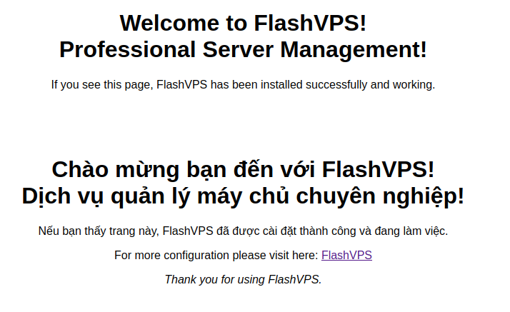

<script setup>
import { data } from '../../.vitepress/config.data.ts'
</script>

# Cơ bản

## Tạo trang web

1. Tại trang quản lý máy chủ, bấm nút `New Site`

    

    Khi tạo một trang web mới trên máy chủ `{{ data.name }}` của bạn, nhiều tùy chọn cấu hình có sẵn cho bạn:

    - **Máy chủ**: Máy chủ mà trang web sẽ được tạo trong đó.
    - **Domain Name**: Tên miền cho trang web.
    - **Aliases**: Bí danh cho trang web (tùy chọn)
    - **Project Type**: Tùy chọn này cho biết liệu dự án được cài đặt cho trang web của bạn sẽ là một dự án PHP / Laravel hay một trang HTML tĩnh. Cài đặt này được sử dụng để xác định cấu trúc của tệp cấu hình Nginx được tạo cho trang web của bạfn.
    - **Web Directory**: Thư mục có thể truy cập công khai qua Internet. Đối với các ứng dụng Laravel, đây thường là thư mục `/public`.
    - **PHP Version**: Nếu bạn đã cài đặt nhiều phiên bản PHP trên máy chủ của mình, bạn có thể chọn phiên bản nào sẽ được sử dụng để phục vụ trang web.
    - **Bật wildcard tên miền con**: Wildcard tên miền con cho phép bạn có thể đặt điểm đến cho tất cả tên miền con không tồn tại về website hiện tại.
    - **Cách ly trang web**: Cài đặt cấu hình này cho biết liệu quá trình PHP-FPM có nên chạy trên tài khoản người dùng chỉ định hay là sử dụng người dùng mặc định.
      <!-- Bạn có thể tìm hiểu thêm về cách ly trang web bằng cách tham khảo [tài liệu đầy đủ về tính năng này](#). -->
    - **Tạo cơ sở dữ liệu**: Cài đặt này cho biết liệu bạn có muốn tạo một cơ sở dữ liệu mới cho trang web của mình hay không.

2. Nhập thông tin > Chọn `Tạo trang web`

## Cài đặt mã nguồn

Khi trang web đã được tạo trong `{{ data.name }}`, bạn có thể cài đặt một ứng dụng hoặc dự án. Các dự án chứa mã nguồn thực của ứng dụng của bạn.

Cài đặt mã nguồn tại bảng điều khiển quản lý của trang web


### Self Upload

Mục đích là ẩn đi mục `Cài đặt mã nguồn` trên giao diện và cho `{{ data.name }}` biết rằng mã nguồn được bạn tải lên thủ công

### Git Repository

::: warning **! Nhà cung cấp kiểm soát nguồn**  
Trước khi bạn có thể cài đặt kho lưu trữ Git, trước tiên bạn phải đảm bảo rằng bạn đã [kết nối git](../connect/connect-git.md) với tài khoản `{{ data.name }}` của mình.
:::

Khi bạn đã kết nối các tài khoản nhà cung cấp kiểm soát nguồn của mình, bạn có thể chọn nhà cung cấp từ một trong các tùy chọn có sẵn. Các bước cài đặt mã nguồn cho trang web:

1. Chọn `Git` | `Github` | `Gitlab` | `Bitbucket`

2. Nếu bạn chọn `Git` bạn sẽ cần [thêm khóa SSH `{{ data.name }}` vào nhà cung cấp](../connect/connect-git.md) theo cách thủ công.
3. Nhập tên kho lưu trữ, bạn nên cung cấp URL SSH đầy đủ, ví dụ: `git@flashpanel.io:flashpanel/flashpanel.git`.
4. Nhập Tên nhánh
5. Chọn `Automatically add deployment key (Recommended)` nếu bạn chưa đăng ký server global key
6. Chọn `Automatically install Composer dependencies` nếu bạn muốn chạy lệnh `composer install` sau khi `Pull Code` về
7. Bấm nút `Install Git Repository`

### WordPress

Các bước cài đặt [Wordpress](https://wordpress.org/):

1. Chọn cài đặt mã nguồn `Wordpress`
2. Trường người dùng cơ sở dữ liệu và cơ sở dữ liệu có thể bỏ trống. `{{ data.name }}` sẽ tạo tự động cho bạn. Hoặc [Tạo cơ sở dữ liệu](../server/database.md) nếu chưa có.
3. Chọn `Cài đặt Wordpress`

Sau khi quá trình cài đặt hoàn tất. Bạn có thể đi đến tên miền trang web của bạn và tiếp tục cài đặt WordPress từ trình duyệt.

::: warning **! Bảo mật WordPress**  
Bạn nên tiếp tục cài đặt WordPress ngay sau khi `{{ data.name }}` đã cài đặt nó cho bạn, để nó được đảm bảo an toàn với tên người dùng và mật khẩu của bạn. Bạn cũng có thể chọn tạo [Quy tắc bảo mật](./nginx.md) mới trước khi cài đặt WordPress để cài đặt của bạn được bảo vệ bằng mật khẩu.
:::

### phpMyAdmin

Các bước cài đặt mã nguồn [phpMyAdmin](https://phpmyadmin.net/):

1. Chọn tùy chọn cài đặt mã nguồn phpMyAdmin
2. Chọn `Cài đặt phpMyAdmin`

Khi `{{ data.name }}` đã cài đặt phpMyAdmin, sau đó bạn có thể đăng nhập vào cài đặt của mình bằng bất kỳ tổ hợp tên người dùng và mật khẩu cơ sở dữ liệu nào của bạn.

## Trang web mặc định



Khi bạn đã sẵn sàng chuyển đổi ứng dụng của mình sang một tên miền chính thức, bạn có thể dễ dàng [Tạo trang web](#tao-trang-web) với tên miền của bạn.

## Mẫu Nginx Mặc định

Dưới đây là ví dụ về cấu hình trang Nginx mặc định được sử dụng bởi `{{ data.name }}`.

```nginx
server {
    listen 80;
    listen [::]:80;

    server_name www.your-domain.com;

    if ($http_x_forwarded_proto = 'https') {
        return 301 https://your-domain.com$request_uri;
    }

    return 301 $scheme://your-domain.com$request_uri;
}

server{
    listen 80;
    listen [::]:80;
    server_name your-domain.com;
    server_tokens off;
    root /home/user/your-domain.com;

    # ssl_certificate ###
    # ssl_certificate_key ###

    ssl_protocols TLSv1.2 TLSv1.3;
    ssl_ciphers XXXXXX;
    ssl_prefer_server_ciphers off;
    ssl_dhparam /etc/nginx/dhparams.pem;

    add_header X-Frame-Options "SAMEORIGIN";
    add_header X-XSS-Protection "1; mode=block";
    add_header X-Content-Type-Options "nosniff";

    index index.html index.php;

    charset utf-8;

    # USER CUSTOM CONFIG (CAN MOVE, DO NOT REMOVE!)
    location ^~ /.well-known/acme-challenge {
        auth_basic off;
        allow all;
        alias /home/user/.letsencrypt;
    }

    location / {
        try_files $uri $uri/ /index.php?$query_string;
    }

    location = /favicon.ico { access_log off; log_not_found off; }
    location = /robots.txt  { access_log off; log_not_found off; }

    access_log off;
    error_log  /var/log/nginx/your-domain.com-error.log error;

    error_page 404 /index.php;

    location ~ \.php$ {
        try_files $uri $uri/ =404;
        fastcgi_split_path_info ^(.+\.php)(/.+)$;
        fastcgi_pass unix:/var/run/php/php7.4-fpm.sock;
        fastcgi_index index.php;
        include fastcgi_params;
    }

    # Deny files starting with a . (dot) except .well-known
    location ~ /\.(?!well-known).* {
        deny all;
    }

    # WordPress: Add a slash at the end of request */wp-admin
    rewrite /wp-admin$ $scheme://$host$uri/ permanent;

    # WordPress: deny general stuff
    location ~* ^/(?:xmlrpc\.php|wp-links-opml\.php|wp-config\.php|wp-config-sample\.php|readme\.html|license\.txt)$ {
        deny all;
    }

    location ~* \.(3gp|gif|jpg|jpeg|png|ico|wmv|avi|asf|asx|mpg|mpeg|mp4|pls|mp3|mid|wav|swf|flv|exe|zip|tar|rar|gz|tgz|bz2|uha|7z|doc|docx|xls|xlsx|pdf|iso|eot|svg|ttf|woff|woff2)$ {
      gzip_static off;
      add_header Pragma public;
      add_header Cache-Control "public, must-revalidate, proxy-revalidate";
      access_log off;
      expires 30d;
      break;
    }

    location ~* \.(txt|js|css)$ {
      add_header Pragma public;
      add_header Cache-Control "public, must-revalidate, proxy-revalidate";
      access_log off;
      expires 30d;
      break;
    }

}
```

## Phiên bản PHP

Nếu máy chủ của bạn đã cài đặt nhiều phiên bản PHP, bạn có thể chuyển đổi phiên bản mà trang web dụng bất kỳ lúc nào.

1. Tại bảng điều khiển quản lý của trang web > Mục `Utilities` > Chọn ô `Update PHP Version`
2. Chọn phiên bản PHP và bấm nút `Update`

::: warning
Khi chuyển đổi phiên bản mà trang web đang sử dụng, bạn nên đảm bảo rằng:

-   Máy chủ của mình có cài đặt đầy đủ extension/mô-đun PHP bổ sung cho phiên bản đó. Việc không cài đặt các mô-đun bổ sung có thể làm cho trang web của bạn không phản hồi.

-   Bạn cũng sẽ cần cập nhật tập lệnh [triển khai](./deployment.md) của trang web của mình để tải lại phiên bản PHP-FPM chính xác và gọi phiên bản PHP chính xác khi chạy bất kỳ lệnh PHP nào.

:::
