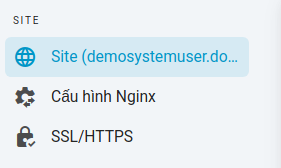

# Câu lệnh

## Giới thiệu

Bạn có thể thực hiện các lệnh Bash tùy ý từ bảng Lệnh. Các lệnh được thực thi từ trong thư mục gốc của trang web, ví dụ: `/home/flashvps/site.com`. Nếu bạn cần chạy các lệnh trong một thư mục khác, bạn có thể đặt trước lệnh đó bằng một thao tác `cd`:

`cd bin && ./run-command.sh`

## Chạy lệnh

Các bước để thực thi 1 câu lệnh:

1. Tại bảng quản lý trang web
   
2. Tìm kiếm với từ khóa `thực thi câu lệnh` >> Chọn tab `Thực thi câu lệnh`
   
3. Nhập câu lệnh muốn thực thi > Chọn `Thực thi`

> **! Command Input**
> Các lệnh không được thực thi trong tty, có nghĩa là không thể cung cấp đầu vào / mật khẩu (which means that input / passwords cannot be provided.).

## Lịch sử câu lệnh

`{{ data.name }}` hiển thị lịch sử câu lệnh dưới dạng bảng, mặc đĩnh sẽ hiển thị 10 câu lệnh mới nhất đã được thực hiện.

Từ bảng Lịch sử Lệnh, bạn cũng có thể xem kết quả đầu ra của lệnh và chạy lại lệnh.
