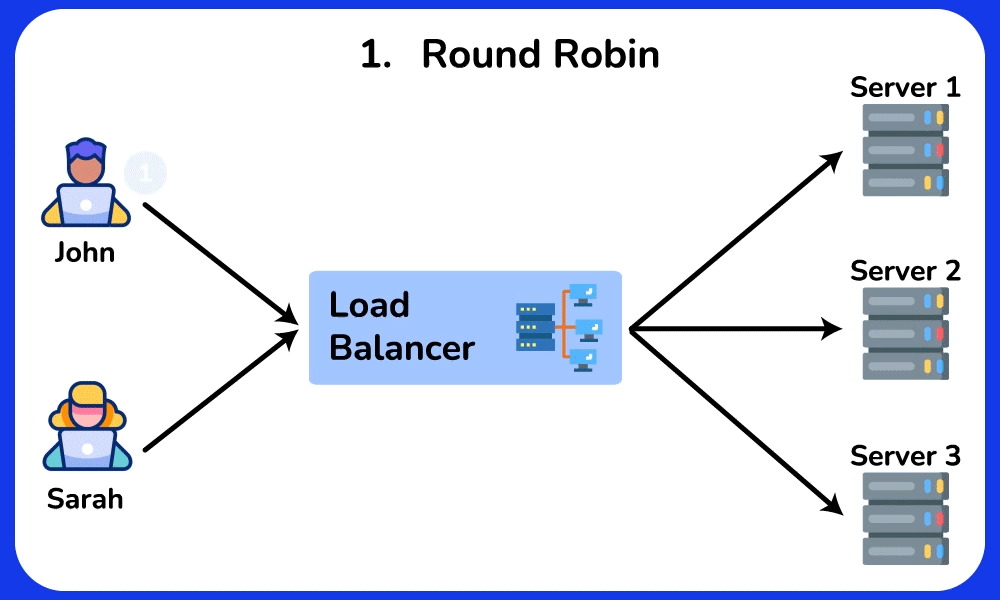
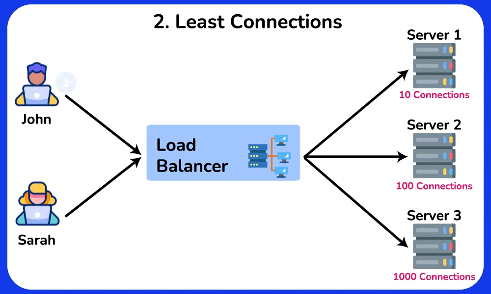

---
head:
    - - meta
      - name: description
        content: Cân bằng tải trong Nginx là một trong những tính năng mạnh mẽ và phổ biến nhất của Nginx, giúp phân phối lưu lượng mạng một cách hiệu quả giữa các máy chủ backend để cải thiện hiệu suất, tính sẵn sàng và độ tin cậy của ứng dụng
---

<script setup>
import { data } from '../../.vitepress/config.data.ts'
import OgImage from '../../.vitepress/components/OgImage.vue'
</script>

# Cân bằng tải (Load Balancing)

<OgImage name="Cân bằng tải (Load Balancing)" />

::: warning
Tài liệu này chỉ dành cho máy chủ cài đặt [ứng dụng](../server/application.md) `Nginx`
:::

Cân bằng tải trong Nginx là một trong những tính năng mạnh mẽ và phổ biến nhất của Nginx, giúp phân phối lưu lượng mạng một cách hiệu quả giữa các máy chủ backend để cải thiện hiệu suất, tính sẵn sàng và độ tin cậy của ứng dụng


## Load Balancing Methods - Phương thức cân bằng tải

Nginx hỗ trợ nhiều thuật toán cân bằng tải khác nhau:


### Round Robin (mặc định)

Thuật toán này phân phối các yêu cầu đến máy chủ theo thứ tự tuần hoàn. Nó chỉ định một yêu cầu cho máy chủ đầu tiên, sau đó chuyển sang máy chủ thứ hai, thứ ba, v.v. và sau khi đến máy chủ cuối cùng, nó sẽ bắt đầu lại ở máy chủ đầu tiên.



Ưu điểm:

-   Đảm bảo phân phối yêu cầu đồng đều giữa các máy chủ vì mỗi máy chủ sẽ lần lượt theo một thứ tự cố định.
-   Dễ dàng thực hiện và hiểu.
-   Hoạt động tốt khi máy chủ có năng lực tương tự.

Nhược điểm:

-   Có thể không hoạt động tối ưu khi máy chủ có dung lượng khác nhau hoặc khối lượng công việc khác nhau.
-   Không xem xét đến tình trạng máy chủ hoặc thời gian phản hồi.
-   Round Robin có thể dự đoán được trong mẫu phân phối yêu cầu của nó, mẫu này có khả năng bị khai thác bởi những kẻ tấn công có thể quan sát mẫu lưu lượng truy cập và có thể tìm thấy lỗ hổng trong các máy chủ cụ thể bằng cách dự đoán máy chủ nào sẽ xử lý yêu cầu của chúng.

### Least Connections

Thuật toán Kết nối ít nhất hướng các yêu cầu đến máy chủ có số lượng kết nối hoạt động thấp nhất. Cách tiếp cận này tính đến khối lượng công việc khác nhau của máy chủ.



**Ưu điểm:**

-   Thích ứng với năng lực và khối lượng công việc khác nhau của máy chủ.
-   Cân bằng tải hiệu quả hơn khi xử lý các yêu cầu mất nhiều thời gian để xử lý.

**Nhược điểm:**

-   Yêu cầu theo dõi số lượng kết nối hoạt động cho mỗi máy chủ, điều này có thể làm tăng độ phức tạp.
-   Có thể không tính đến thời gian phản hồi hoặc tình trạng của máy chủ.

### IP Hash

Thuật toán IP Hash xác định máy chủ mà yêu cầu sẽ được gửi đến dựa trên địa chỉ IP nguồn và/hoặc đích. Phương pháp này duy trì tính bền vững của phiên, đảm bảo rằng các yêu cầu từ một người dùng cụ thể sẽ được chuyển đến cùng một máy chủ.


**Ưu điểm:**

-   Duy trì tính bền vững của phiên, có thể hữu ích cho các ứng dụng yêu cầu kết nối liên tục với một máy chủ cụ thể.
-   Có thể phân phối tải đồng đều khi sử dụng hàm băm được thiết kế tốt.

**Nhược điểm:**

-   Có thể không cân bằng tải hiệu quả khi xử lý một số ít khách hàng với nhiều yêu cầu.
-   Không xem xét đến tình trạng máy chủ, thời gian phản hồi hoặc các dung lượng khác nhau.

## Thêm máy chủ cân bằng tải


Sau khi bấm vào nút `Add Server` sẽ hiện ra các mục cho bạn điền, mình sẽ giải thích các mục này

1. **123.123.123 và 80**

    - Địa chỉ và cổng của máy chủ backend mà Nginx sẽ gửi các yêu cầu đến. Trong trường hợp này, đó là máy chủ chạy trên `123.123.123` và cổng `80`.

2. **weight=1**:

    - Thiết lập trọng số cho máy chủ này trong thuật toán cân bằng tải. Trọng số xác định mức độ ưu tiên của máy chủ khi phân phối lưu lượng.
    - Một trọng số cao hơn sẽ làm cho máy chủ nhận được nhiều yêu cầu hơn so với các máy chủ có trọng số thấp hơn. Trọng số mặc định là 1 nếu không được chỉ định.

3. **backup**:

    - Chỉ định máy chủ này là máy chủ dự phòng (backup server).
    - Máy chủ dự phòng chỉ nhận lưu lượng khi tất cả các máy chủ chính (primary servers) không khả dụng hoặc không hoạt động.
    - Điều này có nghĩa là máy chủ này sẽ không nhận bất kỳ lưu lượng nào trong điều kiện bình thường và chỉ được sử dụng trong trường hợp các máy chủ chính đều bị hỏng.

    Lợi ích của việc sử dụng thuộc tính backup:

    1. **Tăng cường độ tin cậy:** Đảm bảo rằng hệ thống của bạn vẫn có thể phục vụ yêu cầu ngay cả khi tất cả các máy chủ chính đều gặp sự cố.
    2. **Tối ưu hóa tài nguyên:** Máy chủ dự phòng không bị sử dụng trong điều kiện bình thường, giảm thiểu tải và tối ưu hóa tài nguyên cho các máy chủ chính.

4. **down**:

    - Đánh dấu máy chủ này là không khả dụng (down).
    - Máy chủ được đánh dấu là `down` sẽ không nhận bất kỳ lưu lượng nào từ load balancer.
    - Điều này có thể hữu ích khi bạn muốn tạm thời loại bỏ một máy chủ khỏi nhóm backend để bảo trì, kiểm tra, hoặc vì máy chủ đang gặp sự cố.

    Lợi ích của việc sử dụng thuộc tính down:

    1. **Quản lý bảo trì:** Bạn có thể tạm thời loại bỏ một máy chủ khỏi luồng lưu lượng để thực hiện bảo trì mà không cần xóa nó khỏi cấu hình Nginx.
    2. **Khắc phục sự cố:** Nếu một máy chủ gặp sự cố, bạn có thể đánh dấu nó là `down` để Nginx không gửi lưu lượng đến máy chủ đó, đảm bảo rằng lưu lượng chỉ được gửi đến các máy chủ hoạt động tốt.
    3. **Kiểm tra và phát triển:** Trong quá trình phát triển và kiểm tra, bạn có thể sử dụng thuộc tính `down` để kiểm tra hành vi của hệ thống khi một số máy chủ không khả dụng.

## Lưu ý 1: Đồng bộ session

Để đảm bảo session đồng bộ khi sử dụng Nginx làm load balancer, có hai phương pháp chính:

1. **Sticky Sessions:** Đảm bảo rằng tất cả các yêu cầu từ một user (session) được chuyển đến cùng một máy chủ backend.
2. **Shared Session Storage:** Lưu trữ session trong một cơ sở dữ liệu hoặc kho lưu trữ dùng chung để mọi máy chủ backend có thể truy cập.

### 1. Sticky Sessions

Sticky sessions sử dụng cookies để đảm bảo rằng một user luôn được chuyển đến cùng một máy chủ backend. Đây là cách cấu hình sticky sessions trong Nginx:

```nginx
upstream backend {
    server backend1.example.com;
    server backend2.example.com;
    server backend3.example.com;

    sticky cookie srv_id expires=1h domain=.example.com path=/; # [!code focus]
}
```

Trong đoạn cấu hình này:

-   `sticky cookie srv_id`: Tạo một cookie với tên `srv_id`.
-   `expires=1h`: Cookie sẽ hết hạn sau 1 giờ.
-   `domain=.example.com`: Cookie áp dụng cho toàn bộ tên miền.
-   `path=/`: Cookie áp dụng cho toàn bộ đường dẫn.

### 2. Shared Session Storage

Phương pháp này lưu trữ session trong một cơ sở dữ liệu hoặc kho lưu trữ dùng chung như Redis, Memcached, hoặc một cơ sở dữ liệu SQL. Các bước chính bao gồm:

-   **Cấu hình ứng dụng để sử dụng kho lưu trữ session:** Thay vì lưu session cục bộ trên từng máy chủ, bạn cấu hình ứng dụng web để lưu session trong kho lưu trữ dùng chung.
-   **Đảm bảo tất cả các máy chủ backend có thể truy cập kho lưu trữ session:** Tất cả các máy chủ backend phải có quyền truy cập và có thể đọc/ghi vào kho lưu trữ session này.

### Ví dụ: Sử dụng Redis cho Shared Session Storage

2. **Cấu hình ứng dụng web:**
   Với PHP-FPM, bạn có thể cấu hình như sau trong file `php.ini`:

    ```ini
    session.save_handler = redis
    session.save_path = "tcp://127.0.0.1:6379"
    ```

Bằng cách sử dụng một trong hai phương pháp này, bạn có thể đảm bảo rằng session của user sẽ được đồng bộ và nhất quán giữa các máy chủ backend trong hệ thống của bạn.

## Lưu ý 2: Đồng bộ File Upload

Khi sử dụng Nginx để cân bằng tải, bạn nên lưu trữ các tệp người dùng tải lên ở một vị trí riêng biệt, chẳng hạn như Amazon S3 hoặc một hệ thống lưu trữ dùng chung khác. Điều này giúp đảm bảo rằng tất cả các máy chủ backend đều có thể truy cập vào các tệp đó mà không cần phải đồng bộ hóa tệp giữa các máy chủ, giúp tránh được nhiều vấn đề phức tạp. Dưới đây là một số lý do và phương pháp phổ biến:

### Lý do lưu trữ tệp ở vị trí riêng biệt

1. **Đồng bộ hóa dễ dàng:** Khi tệp được lưu trữ trên một hệ thống lưu trữ dùng chung, tất cả các máy chủ backend có thể truy cập ngay lập tức mà không cần phải đồng bộ hóa tệp giữa các máy chủ.
2. **Tính nhất quán dữ liệu:** Giúp đảm bảo tính nhất quán của dữ liệu tải lên vì không có sự trùng lặp hoặc không nhất quán giữa các máy chủ.
3. **Quản lý dễ dàng:** Quản lý và bảo trì hệ thống dễ dàng hơn khi tệp được tập trung vào một nơi.
4. **Scalability:** Dễ dàng mở rộng hệ thống khi lưu trữ tập trung, vì các máy chủ mới có thể truy cập tệp ngay lập tức mà không cần cấu hình thêm.

### Giải pháp phổ biến

1. **Amazon S3:**

    - Amazon S3 là một dịch vụ lưu trữ đối tượng phổ biến được sử dụng rộng rãi cho việc lưu trữ các tệp người dùng.
    - Bạn có thể sử dụng SDK của Amazon để tải lên và truy xuất tệp từ S3 trong ứng dụng của mình.

2. **NFS (Network File System):**

    - Sử dụng NFS để tạo một thư mục dùng chung giữa các máy chủ.
    - Điều này cho phép tất cả các máy chủ backend truy cập vào cùng một hệ thống tệp.

3. **Sử dụng CDN (Content Delivery Network):**
    - Kết hợp lưu trữ đối tượng với CDN để cải thiện hiệu suất truy cập tệp và phân phối nội dung đến người dùng nhanh chóng.

Lưu trữ tệp tải lên ở một vị trí riêng biệt như Amazon S3 hoặc một hệ thống lưu trữ dùng chung khác là một thực hành tốt khi sử dụng Nginx để cân bằng tải. Điều này giúp đảm bảo rằng tất cả các máy chủ backend có thể truy cập tệp một cách nhất quán và hiệu quả, đồng thời giảm thiểu các vấn đề phức tạp liên quan đến đồng bộ hóa tệp.

## Lưu ý 3: Đồng bộ cơ sở dữ liệu

Đồng bộ hóa cơ sở dữ liệu (database) trong môi trường cân bằng tải là một vấn đề phức tạp và đòi hỏi sự cẩn thận trong thiết kế kiến trúc hệ thống. Dưới đây là một số phương pháp và chiến lược phổ biến để đảm bảo cơ sở dữ liệu đồng bộ khi sử dụng Nginx để cân bằng tải:

### 1. **Sử dụng cơ sở dữ liệu dùng chung (Single Database Instance)**

-   **Mô tả:** Tất cả các máy chủ backend kết nối đến cùng một cơ sở dữ liệu.
-   **Ưu điểm:** Đơn giản, dễ quản lý và đảm bảo tính nhất quán dữ liệu.
-   **Nhược điểm:** Giới hạn khả năng mở rộng, vì một cơ sở dữ liệu duy nhất có thể trở thành điểm nghẽn.

### 2. **Replica Set (Master-Slave Replication)**

-   **Mô tả:** Sử dụng mô hình master-slave (hoặc primary-secondary). Một máy chủ cơ sở dữ liệu chính (master) chịu trách nhiệm ghi dữ liệu, và các máy chủ phụ (slave) nhận dữ liệu được sao chép từ máy chủ chính để đọc.
-   **Ưu điểm:** Cải thiện khả năng đọc dữ liệu, tăng khả năng chịu tải.
-   **Nhược điểm:** Độ trễ trong việc sao chép dữ liệu từ master đến slave có thể gây ra sự không nhất quán tạm thời.

### 3. **Cơ sở dữ liệu phân tán (Distributed Databases)**

-   **Mô tả:** Sử dụng các hệ thống cơ sở dữ liệu được thiết kế để hoạt động phân tán, như Cassandra, Google Spanner, hoặc CockroachDB.
-   **Ưu điểm:** Khả năng mở rộng cao, tính sẵn sàng và khả năng chịu lỗi tốt.
-   **Nhược điểm:** Phức tạp trong việc triển khai và quản lý.

### 4. **Cơ sở dữ liệu sharding**

-   **Mô tả:** Chia cơ sở dữ liệu thành nhiều phần nhỏ hơn, gọi là shards. Mỗi shard chứa một phần của dữ liệu và được lưu trữ trên các máy chủ khác nhau.
-   **Ưu điểm:** Khả năng mở rộng tốt, giảm tải trên mỗi máy chủ cơ sở dữ liệu.
-   **Nhược điểm:** Phức tạp trong việc triển khai và quản lý, cần cẩn thận trong việc phân chia dữ liệu.

### 5. **Công cụ đồng bộ hóa và clustering**

-   **Mô tả:** Sử dụng các công cụ clustering và đồng bộ hóa dữ liệu như Galera Cluster cho MySQL, Patroni cho PostgreSQL hoặc sử dụng dịch vụ của nhà cung cấp như Amazon Aurora, Google Cloud SQL.
-   **Ưu điểm:** Đảm bảo tính sẵn sàng cao và đồng bộ dữ liệu theo thời gian thực.
-   **Nhược điểm:** Cần cấu hình và quản lý phức tạp, chi phí có thể cao hơn.

### Cấu hình ví dụ với Galera Cluster cho MySQL

Galera Cluster là một giải pháp mạnh mẽ cho việc đồng bộ hóa cơ sở dữ liệu MySQL/MariaDB theo thời gian thực. Dưới đây là ví dụ cấu hình:
