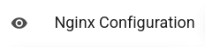

# Cấu hình Nginx

## Quy tắc Chuyển hướng (Redirect Rules)

`{{ data.name }}` cho phép bạn định cấu hình chuyển hướng có thể được định cấu hình để tự động chuyển hướng khách truy cập từ trang này sang trang khác. Các quy tắc chuyển hướng này có thể được tạo thông qua tab 'New Rewrite Rule' tại giao diện quản lý cấu hình nginx của trang web.

### Tạo quy tắc chuyển hướng

Chuyển hướng là các trình bao bọc xung quanh các [quy tắc viết lại](https://nginx.org/en/docs/http/ngx_http_rewrite_module.html#rewrite) của Nginx và có thể sử dụng cú pháp chuyển hướng đầy đủ được Nginx hỗ trợ, bao gồm cả biểu thức chính quy (regular expressions). Ví dụ: bạn có thể sử dụng `= /` để chỉ khớp với gốc của miền.

Các bước tạo Redirect Rule:

1. Tại tab `Cấu hình Nginx` > Chọn `New Rewrite Rule`
   
2. Nhập thông tin về quy tắc chuyển hướng

    - **Memo**: Tên gợi nhớ cho quy tắc
    - **Loại**: Chuyển hướng tạm thời | Chuyển hướng vĩnh viến | last
      

3. Chọn `New Rewrite Rule`

> **⚠ INFO: Cập nhật Nginx Config.**  
> Sau khi thêm, xóa, sửa Nginx Config bạn cần bấm nút "Cập nhật Nginx Configuration" để những thay đổi có hiệu lực.

### Sửa quy tắc chuyển hướng

Bạn có thể sửa Quy tắc chuyển hướng thông qua tab `Cấu hình Nginx` trên bảng điều khiển quản lý trang web của mình trong `{{ data.name }}`. Các bước sửa quy tắc chuyển hướng:

1. Tại tab `Cấu hình Nginx` > Chọn tab `Server`
   
2. Tỉm đến quy tắc chuyển hướng muốn sửa > chọn **biểu tượng chiếc bút**

**\*Lưu ý**: Chỉ chỉnh sửa **quy tắc chuyển hướng** và **Memo** (Tên gợi nhớ)
 3. Chọn `Edit Nginx Configuration`

> **⚠ INFO: Cập nhật Nginx Config.**  
> Sau khi thêm, xóa, sửa Nginx Config bạn cần bấm nút "Cập nhật Nginx Configuration" để những thay đổi có hiệu lực.

## Chuyển hướng tạm thời và Chuyển hướng vĩnh viẽn

`{{ data.name }}` hỗ trợ 2 loại chuyển hướng:

-   Chuyển hướng Vĩnh viễn (Mã trạng thái HTTP 301)
-   Chuyển hướng Tạm thời (Mã trạng thái HTTP 302)

Mặc dù cả hai loại chuyển hướng này thường ẩn đối với người dùng, nhưng trình duyệt sẽ xử lý chúng theo cách khác nhau và điều quan trọng là phải biết sự khác biệt.

### Chuyển hướng tạm thời

Khi trình duyệt gặp chuyển hướng tạm thời, nó sẽ đưa bạn đến đích và quên rằng nó đã được chuyển hướng từ trang gốc. Nếu bạn thay đổi trang đích và sau đó truy cập lại trang gốc, trình duyệt sẽ thấy vị trí chuyển hướng mới và đưa bạn đến đó.

### Chuyển hướng vĩnh viễn

Với chuyển hướng vĩnh viễn, trình duyệt sẽ nhớ rằng nó đã được chuyển hướng khỏi trang gốc. Để tiết kiệm việc thực hiện một yêu cầu mạng khác, lần tiếp theo trình duyệt truy cập trang gốc, trình duyệt sẽ thấy rằng nó đã được chuyển hướng và ngay lập tức truy cập trang đó thay thế.

Mặc dù bạn có thể thay đổi điểm đến của chuyển hướng vĩnh viễn, nhưng bạn sẽ cần phải xóa bộ nhớ cache của trình duyệt trước khi truy cập lại trang gốc. Việc thay đổi chuyển hướng vĩnh viễn được coi là một phương pháp không tốt, vì vậy hãy cẩn thận khi thực hiện.

### Chuyển hướng Last

Chuyển hướng last sẽ đảm bảo dừng tìm kiếm lệnh viết lại ở vị trí hiện tại hoặc chặn và sử dụng URI đã thay đổi (VD: URI được viết lại) và tìm kiếm vị trí mới cho bất kỳ lệnh viết lại nào phù hợp.

## Quy tắc Bảo mật (Security Rules)

::: info
`{{ data.name }}` có thể định cấu hình bảo vệ bằng mật khẩu trên các trang web của bạn bằng cách sử dụng [xác thực quyền truy cập cơ bản](https://en.wikipedia.org/wiki/Basic_access_authentication). Bạn có thể chọn bảo vệ toàn bộ trang web của mình hoặc một đường dẫn cụ thể.
:::

### Tạo quy tắc bảo mật

Bạn có thể tạo Quy tắc bảo mật mới thông qua tab `Cấu hình Nginx` trên bảng điều khiển quản lý trang web của mình trong `{{ data.name }}`. Bạn phải cung cấp tên quy tắc bảo mật mà một số trình duyệt sẽ hiển thị trong lời nhắc xác thực của chúng, cũng như ít nhất một bộ thông tin xác thực. Nếu bạn cần thêm nhiều thông tin đăng nhập, bạn có thể nhấp vào nút + để thêm tổ hợp tên người dùng và mật khẩu mới.

Các bước tạo quy tắc bảo mật:

1. Tại tab `Cấu hình Nginx` > Chọn `New Security Rule`
   
2. Nhập thông tin về quy tắc chuyển hướng

-   **Memo**: Tên gợi nhớ cho quy tắc
-   **Cặp Tên tên người và Mật khẩu**: Thông tin xác thực người dùng và mật khẩu sẽ được yêu cầu nhập khi truy cập đến đường dẫn bảo mật
    

3. Chọn `New Security Rule`

> **⚠ INFO: Cập nhật Nginx Config.**  
> Sau khi thêm, xóa, sửa Nginx Config bạn cần bấm nút "Cập nhật Nginx Configuration" để những thay đổi có hiệu lực.

### Sửa quy tắc bảo mật

Bạn có thể sửa Quy tắc bảo mật thông qua tab `Cấu hình Nginx` trên bảng điều khiển quản lý trang web của mình trong `{{ data.name }}`. Các bước sửa quy tắc bảo mật:

1. Tại tab `Cấu hình Nginx` > Chọn tab `Server`
   
2. Tỉm đến quy tắc bảo mật muốn sửa > chọn **biểu tượng chiếc bút**

**\*Lưu ý**: Chỉ chỉnh sửa **đường dẫn** cần bảo mật và **Memo** (Tên gợi nhớ)
 3. Chọn `Edit Nginx Configuration`

> **⚠ INFO: Cập nhật Nginx Config.**  
> Sau khi thêm, xóa, sửa Nginx Config bạn cần bấm nút "Cập nhật Nginx Configuration" để những thay đổi có hiệu lực.

### Thông tin xác thực (Credentials)

`{{ data.name }}` tạo một tệp .htpasswd duy nhất cho mỗi quy tắc bảo mật, nghĩa là mỗi đường dẫn được bảo mật có thể có một bộ thông tin xác thực riêng. Điều này cũng có nghĩa là bạn sẽ cần phải nhập lại cùng một thông tin đăng nhập khi bảo mật nhiều đường dẫn. Nếu cần sửa đổi thông tin xác thực, bạn có thể làm theo hướng dẫn [Sửa quy tắc bảo mật](#sửa-quy-tắc-bảo-mật).

## Quản lý Cấu hình Nginx

Tại giao diện quản lý cấu hình nginx `{{ data.name }}` hỗ trợ các chức năng cho phép bạn dễ dàng quản lý tệp cấu hình nginx.

> **⚠ INFO: Cập nhật Nginx Config.**  
> Sau khi thêm, xóa, sửa Nginx Config bạn cần bấm nút "Cập nhật Nginx Configuration" để những thay đổi có hiệu lực.

## Xem trước cấu hình Nginx

`{{ data.name }}` cho phép xem nội dung tệp cấu hình Nginx tại tab `Cấu hình Nginx` của trên bảng điều khiển quản lý trang web của mình bạn chọn vào biểu tượng `con mắt`.

## Tạo block cấu hình nginx

`{{ data.name }}` hỗ trợ bạn tạo các khổi cấu hình nginx. Các bước tạo block cấu hình nginx:

1. Tại tab `Cấu hình Nginx` > Chọn `New Nginx Configuration`
   
2. Điền thông tin block cấu hình

-   **Memo**: Tên gợi nhớ cho block, tên này sẽ chỉ hiển thị trên hệ thống của `{{ data.name }}` không lưu vào máy chủ VPS của bạn
-   **Position**: Vị trí lưu block cấu hình trong tệp cấu hình cho trang web của bạn.
    -   **Server**: Vị trí lưu sẽ nằm trong khối server chính (Block chứa toàn bộ cấu hình về trang web của bạn) trong tệp cấu hình trang web
    -   **Before**: Vị trí lưu sẽ nằm trước khối server chính
    -   **After**: Vị trí lưu sẽ nằm sau khối server chính
-   Nội dung block cấu hình

3. Chọn `New Nginx Configuration`

> **⚠ INFO: Cập nhật Nginx Config.**  
> Sau khi thêm, xóa, sửa Nginx Config bạn cần bấm nút "Cập nhật Nginx Configuration" để những thay đổi có hiệu lực.

## Sửa block cấu hình nginx

Các bước sửa block cấu hình nginx:

1. Tại tab `Cấu hình Nginx` > Chọn vị trí tab (**Before | Server | After**) mà block cấu hình được lưu trước đó
   
2. Tỉm đến block cấu hình nginx muốn sửa > chọn **biểu tượng chiếc bút**

::: warning
Nếu block cần sửa là **Block bảo mật** thì tham khảo [Sửa quy tắc bảo mật](#sua-quy-tac-bao-mat) hoặc **Block chuyển hướng** tham khảo [Sửa quy tắc chuyển hướng](#sua-quy-tac-chuyen-huong)
:::

3. Điền thông tin muốn sửa

-   **Memo**: Tên gợi nhớ cho block, tên này sẽ chỉ hiển thị trên hệ thống của `{{ data.name }}` không lưu vào máy chủ VPS của bạn
-   **Position**: Vị trí lưu block cấu hình trong tệp cấu hình cho trang web của bạn.
    -   **Server**: Vị trí lưu sẽ nằm trong khối server chính (Block chứa toàn bộ cấu hình về trang web của bạn) trong tệp cấu hình trang web
    -   **Before**: Vị trí lưu sẽ nằm trước khối server chính
    -   **After**: Vị trí lưu sẽ nằm sau khối server chính
-   Nội dung block cấu hình
    

4. Sau khi đã sửa, Chọn `Edit Nginx Configuration`

> **⚠ INFO: Cập nhật Nginx Config.**  
> Sau khi thêm, xóa, sửa Nginx Config bạn cần bấm nút "Cập nhật Nginx Configuration" để những thay đổi có hiệu lực.

## Cập nhật Nginx Configuration

Sau khi thêm, xóa, sửa Nginx Config bạn cần bấm nút "Cập nhật Nginx Configuration" để những thay đổi có hiệu lực
Tại giao diện quản lý cấu hình Nginx > Chọn `Cập nhật Nginx Configuration`

