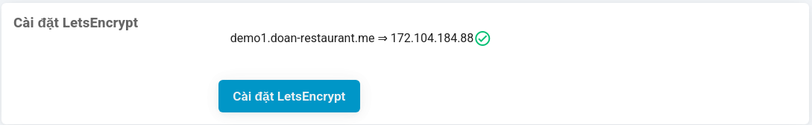
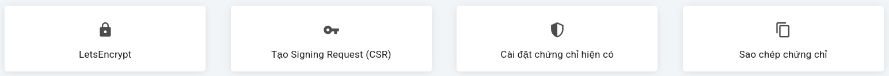
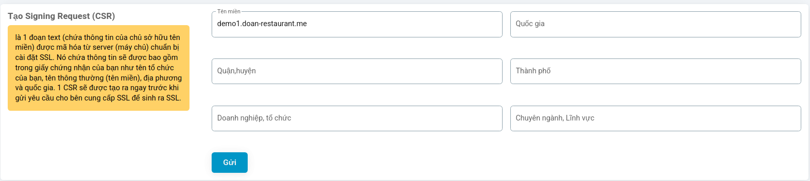
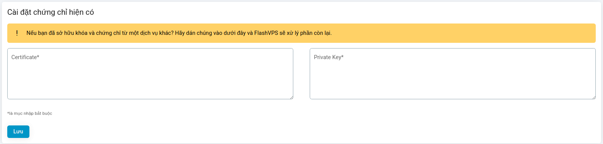
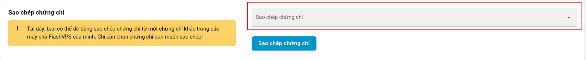
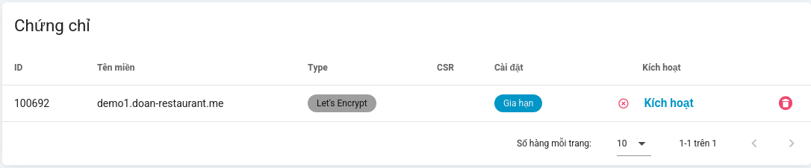

# SSL

{{ data.name }} hỗ trợ cài đặt chứng chỉ SSL tùy chỉnh và sử dụng `LetsEncrypt`, `ZeroSSL` để tạo chứng chỉ miễn phí cho các trang web của bạn.

## LetsEncrypt

[LetsEncrypt](https://letsencrypt.org/) cung cấp chứng chỉ SSL miễn phí được công nhận trên tất cả các trình duyệt chính.

{{ data.name }} sẽ tự động gia hạn chứng chỉ LetsEncrypt của bạn trong vòng 21 ngày trở xuống trước khi hết hạn. Hoặc bạn cũng có thể gia hạn thủ công tại [bảng quản lý chứng chỉ](#quan-ly-chung-chi-ssl) của trang web. Việc gia hạn sẽ diễn ra vào một ngày và giờ ngẫu nhiên để tránh làm tràn ngập các máy chủ LetsEncrypt.

Bạn có thể tạo Singing Request tại tab `SSL` trên bảng quản lý trang web của {{ data.name }}:

1. Chọn `LetsEnctypt`
2. Chọn `Cài đặt LetsEnctypt`
   

::: warning
Do quá trình gia hạn LetsEncrypt, không thể sao chép chứng chỉ LetsEncrypt sang các trang khác. Bạn chỉ cần cấp chứng chỉ LetsEncrypt mới cho trang web đó.
:::

## ZeroSSL

Sử dụng tương tự như Let's Encrypt

## **Cloudflare**

{{ data.name }} hiện hỗ trợ tự động tạo **chứng chỉ SSL Cloudflare 15 năm** với khả năng kích hoạt liền mạch.

Để thiết lập Cloudflare SSL:

1. Đi tới trang **Quản lý trang web** và chọn tab **SSL**.
2. Chọn nhà cung cấp SSL ưa thích của bạn từ danh sách (ví dụ: Let’s Encrypt, ZeroSSL, Cloudflare).
3. Chọn **Cloudflare** và nhấp vào nút **Cài đặt** để tiếp tục.

> **Lưu ý:** Bạn phải thêm **Khóa API Cloudflare** của mình vào {{ data.name }} để sử dụng tính năng này. Tham khảo tài liệu để biết hướng dẫn: [Kết nối nhà cung cấp DNS](../connect/connect-dns-provider.md).

## Create Signing Request (CSR)

Create Signing Request là 1 đoạn text (chứa thông tin của chủ sở hữu tên miền) được mã hóa từ server (máy chủ) chuẩn bị cài đặt SSL. Nó chứa thông tin sẽ được bao gồm trong giấy chứng nhận của bạn như tên tổ chức của bạn, tên thông thường (tên miền), địa phương và quốc gia. 1 CSR sẽ được tạo ra ngay trước khi gửi yêu cầu cho bên cung cấp SSL để sinh ra SSL.

1. Tại tab `SSL` > Chọn `Tạo Signing Request`
   
2. Nhập thông tin CSR
   
3. Chọn `Gửi`

## Cài đặt chứng chỉ hiện có

Nếu bạn đã sở hữu khóa và chứng chỉ từ một dịch vụ khác. {{ data.name }} hỗ trợ bạn cài đặt chứng chỉ đó cho trang web của bạn.

1. Tại tab `SSL` > Chọn `Cài đặt chứng chỉ hiện có`
   
2. Dán mã chứng chỉ và trường **Certificate** và mã khóa riêng tư vào trường **Private Key**
   
3. Chọn `Lưu`

## Sao chép chứng chỉ

Bạn có thể dễ dàng sao chép 1 chứng chỉ từ chứng chỉ khác trong các máy chủ {{ data.name }} của bạn.

1. Tại tab `SSL` > Chọn `Sao chép chứng chỉ`
2. Chọn một chứng chỉ cần sao chép
   
3. Chọn `Sao chép chứng chỉ`

## Quản lý Chứng chỉ SSL

{{ data.name }} hiển thị danh sách các chứng chỉ đã cài đặt dưới dạng bảng. Tại đây bạn có thể `Gia hạn`, `Kích hoạt` hoặc `xóa` chứng chỉ cho trang web.

## Sử dụng chứng chỉ Cloudflare 15 năm

::: info
Đây là hướng dẫn sử dụng chứng chỉ Cloudflare 15 năm `miễn phí` nếu tên miền của bạn đang sử dụng dịch vụ Cloudflare, ưu điểm là không cần gia hạn mỗi 3 tháng như các chứng chỉ `LetsEncrypt` hoặc `ZeroSSL`
:::

1. Đầu tiên vào panel `Cloudflare`, tiếp đến chọn mục `SSL/TLS`. Tại đây chọn `SSL/TLS encryption mode` sang `Full`
   
2. Tiếp theo chọn vào `Origin Server`, bấm `Create Certificate`
   
3. Bấm `Create` để tạo
   
   Lúc này ta sẽ có thông tin về chứng chỉ vừa tạo
   
4. Quay lại `{{ data.name }}` > tab `SSL` > chọn `Install Existing Certificate`
   
5. Sao chép mục ① và ② ở `bước 3` vào mục ① và ② tương ứng
   
6. Bấm `Install Existing Certificate` là xong
