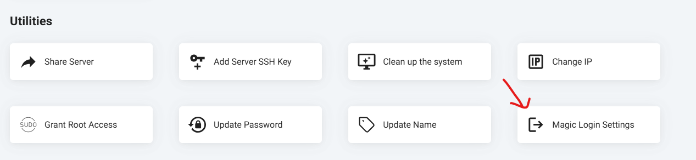
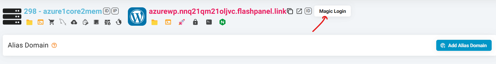
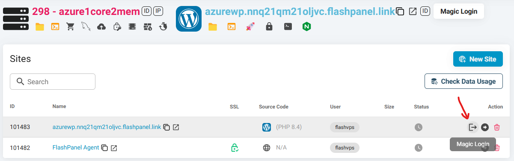

# Magic Login: Đăng nhập vào các trang WordPress của bạn với tư cách là người dùng quản trị.

**Magic Login** là một thuật ngữ dùng để mô tả một loại quy trình đăng nhập mang đến trải nghiệm xác thực liền mạch và dễ dàng cho người dùng.

Phương thức đăng nhập của chúng tôi trong {{ data.name }} tăng cường bảo mật và nâng cao trải nghiệm người dùng. Nó loại bỏ nhu cầu ghi nhớ và quản lý mật khẩu, giảm nguy cơ các sự cố bảo mật liên quan đến mật khẩu. Bên cạnh đó, nó còn đơn giản hóa quy trình đăng nhập, mang lại sự tiện lợi và thân thiện hơn cho người dùng.

## Bật/Tắt Magic Login

Với {{ data.name }}, bạn có thể tùy chọn tắt tính năng Magic Login trực tiếp từ bảng điều khiển của mình. Tùy chọn này có sẵn trong mục Máy chủ > Tiện ích. Khi tắt, tính năng Magic Login sẽ bị xóa khỏi tất cả các trang web thuộc máy chủ này.

## Cách Magic Login hoạt động trong {{ data.name }}?

Tính năng đăng nhập kỳ diệu của **{{ data.name }}** đơn giản hóa việc truy cập trang quản trị WordPress của bạn với một quy trình dễ dàng. Hãy tạm biệt những lo lắng liên quan đến mật khẩu và tận hưởng một cách đăng nhập tiện lợi hơn. Để bắt đầu, hãy nhấn nút “Magic Login”. Hành động này sẽ kích hoạt quy trình đăng nhập kỳ diệu, và bạn sẽ được đăng nhập an toàn vào trang quản trị WordPress chỉ với một cú nhấp chuột.

