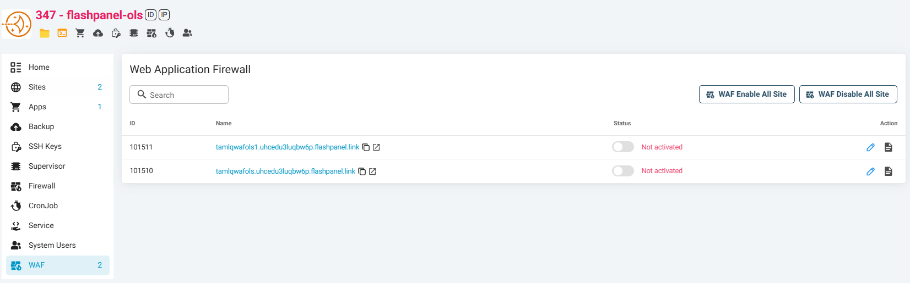
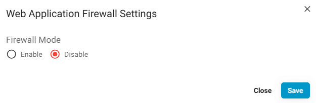
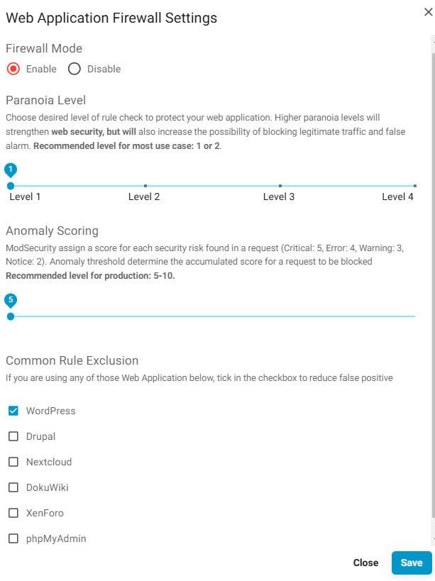

---
head:
    - - meta
      - name: description
        content: Cách Sử Dụng ModSecurity và OWASP CRS Cho Tường Lửa Ứng Dụng Web (WAF) Để Bảo Vệ Trang Web Của Bạn
---

# Cách Sử Dụng ModSecurity và OWASP CRS Cho Tường Lửa Ứng Dụng Web (WAF) Để Bảo Vệ Trang Web Của Bạn

Với việc bảo mật là trọng tâm chính trong năm nay, chúng tôi hân hạnh giới thiệu ModSecurity và OWASP CRS cho Tường Lửa Ứng Dụng Web (WAF) của bạn trong {{ data.name }}.

## ModSecurity là gì

<a href="https://modsecurity.org/" target="_blank">ModSecurity</a> là một công cụ tường lửa ứng dụng web (WAF) mã nguồn mở, đa nền tảng cho Apache, IIS và Nginx, được phát triển bởi SpiderLabs của Trustwave.

WAF có thể được kích hoạt trên trang web của bạn để cung cấp lớp bảo mật bên ngoài giúp tăng cường bảo vệ, phát hiện và ngăn chặn các cuộc tấn công trước khi tiếp cận ứng dụng web, vì hơn 70% các cuộc tấn công hiện nay được thực hiện ở mức ứng dụng web.

Nó giúp phát hiện và ngăn chặn nhiều cuộc tấn công nhắm vào ứng dụng web bằng cách kiểm tra tất cả yêu cầu HTTP(s) (ví dụ: phương thức yêu cầu, tiêu đề yêu cầu, loại nội dung, v.v.) dựa trên bộ quy tắc.

Nếu kiểm tra không thành công, khách truy cập sẽ không thấy nội dung trang web của bạn, và các hành động được xác định trước sẽ được thực hiện, thường là màn hình 403 Forbidden.

## OWASP CRS là gì

Chỉ riêng ModSecurity thì chưa đủ để bảo vệ trang web. Bạn cần cấu hình thêm một bộ quy tắc để kích hoạt khả năng bảo vệ web.

<a href="https://coreruleset.org/" target="_blank">Bộ Quy Tắc Cốt Lõi OWASP ModSecurity (CRS)</a> là một tập quy tắc phát hiện tấn công tổng quát, được thiết kế cho ModSecurity hoặc tường lửa ứng dụng web tương thích.

CRS nhằm mục đích bảo vệ ứng dụng web trước nhiều dạng tấn công, với mức cảnh báo sai thấp, bao gồm:

-   SQL Injection (SQLi)
-   Cross Site Scripting (XSS)
-   Local File Inclusion (LFI)
-   Remote File Inclusion (RFI)
-   PHP Code Injection
-   Java Code Injection
-   HTTPoxy
-   Shellshock
-   Unix/Windows Shell Injection
-   Session Fixation
-   Scripting/Scanner/Bot Detection
-   Metadata/Error Leakages

## Cách Cài Đặt ModSecurity và OWASP CRS

Trong {{ $data.name }}, chúng tôi muốn việc kích hoạt hoặc vô hiệu hóa ModSecurity và OWASP CRS cho từng trang web của bạn trên máy chủ trở nên dễ dàng với mọi người, từ người mới bắt đầu đến chuyên gia, thay vì phải đăng nhập vào terminal Linux để thực hiện.

Hãy đăng nhập vào Bảng Điều Khiển {{ $data.name }}, chọn máy chủ của bạn, trong nhóm **Tiện ích** bấm **Cài đặt tường lửa ứng dụng (WAF)** và nhấn nút gửi.  
Tùy theo webserver, thời gian cài đặt WAF có thể khác nhau.

Sau khi cài đặt WAF thành công, **vào menu WAF** và **bấm biểu tượng bút** trên trang web bạn muốn, sẽ xuất hiện hộp thoại Cấu hình tưởng lửa ứng dụng để cấu hình.  

Bấm “Kích hoạt” để bật Tường Lửa Ứng Dụng Web (WAF) vào ứng dụng web hiện tại, rồi bấm “Lưu”.

**Vậy là xong. Rất đơn giản!**

Bạn có thể tùy chỉnh Cài Đặt WAF bằng cách thiết lập paranoia level, anomaly threshold và common rule exclusion.

## Paranoia Level

Bằng cách sử dụng paranoia level, bạn có thể chọn mức độ quy tắc mong muốn để bảo vệ ứng dụng web của mình.

Mức paranoia cao hơn sẽ tăng cường bảo mật, nhưng cũng sẽ tăng khả năng chặn một số truy cập hợp lệ do cảnh báo sai (false positives hoặc FPs).

Theo <a href="https://coreruleset.org/faq/" target="_blank">trang web OWASP CRS</a>, có giải thích chi tiết về sự khác nhau giữa các mức paranoia.

**Paranoia level 1 (PL1)** là mặc định. Ở mức này, hầu hết các quy tắc cốt lõi đều được kích hoạt. PL1 được khuyến nghị cho người mới, cài đặt bao gồm nhiều trang web và ứng dụng khác nhau, và cho các hệ thống yêu cầu bảo mật tiêu chuẩn.

**Paranoia level 2 (PL2)** bao gồm nhiều quy tắc bổ sung, ví dụ như bật nhiều chức năng bảo vệ SQL, XSS dựa trên biểu thức chính quy, và thêm danh sách từ khóa kiểm tra các đoạn mã độc.

PL2 thích hợp cho **những người có kinh nghiệm vừa phải** muốn bảo vệ toàn diện hơn, và cho hệ thống yêu cầu bảo mật cao hơn.

**Paranoia level 3 (PL3)** kích hoạt nhiều quy tắc và danh sách từ khóa cho các cuộc tấn công ít phổ biến hơn. PL3 cũng giới hạn toàn bộ ký tự đặc biệt, giúp ngăn chặn tốt các cuộc tấn công chưa được biết, tấn công ẩn và kỹ thuật né tránh WAF.

PL3 dành cho **những người dùng có kinh nghiệm xử lý FPs** và các hệ thống có yêu cầu bảo mật cao.

**Paranoia level 4 (PL4)** tiếp tục hạn chế các ký tự đặc biệt.

PL4 được khuyến nghị cho **người dùng có kinh nghiệm** bảo vệ hệ thống có yêu cầu bảo mật cực cao.

Mức khuyến nghị cho hầu hết trường hợp là **1 (mặc định) hoặc 2**.

## Anomaly Threshold

ModSecurity gán điểm cho mỗi rủi ro bảo mật được phát hiện trong một yêu cầu (Critical: 5, Error: 4, Warning: 3, Notice: 2).

Anomaly threshold xác định điểm tổng cộng mà tại đó một yêu cầu sẽ bị chặn.

**Mức khuyến nghị cho trang web chạy thực tế là 5-10.**

## Common Rule Exclusion

OWASP CRS cung cấp một số quy tắc loại trừ phổ biến cho một số hệ thống CMS như WordPress, Drupal, NextCloud, DocuWiki, phpMyAdmin và Xenforo.

Nếu trang web của bạn đang sử dụng một trong các CMS này, hãy đánh dấu tùy chọn đó để giảm thiểu cảnh báo sai và nó sẽ được tự động áp dụng cho tường lửa của bạn.
