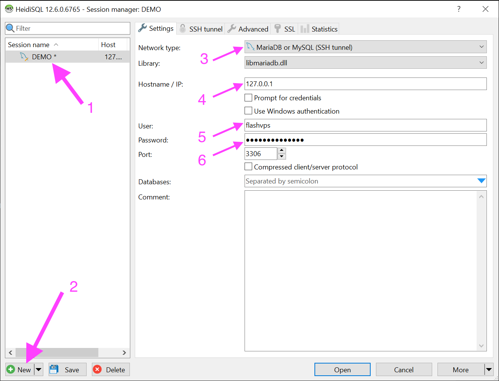

# Truy cập MySQL từ xa

Trong thực tế, bạn muốn truy cập `MySQL` | `MariaDB` từ máy tính của mình lên máy chủ, hoặc máy chủ đó là `Remote Database` để mọi người dùng chung,...

## Cách 1: Mở port 3306 (không an toàn 👀)

Mở port cơ sở dữ liệu 3306 là cách nhanh nhất để thực hiện kết nối đến remote database, tuy nhiên đây là cách kém an toàn nhất, vì lúc này cổng 3306 được công khai, ai cũng có thể truy cập vào cổng này để thử dò password, nếu bạn đặt 1 mật khẩu yếu sẽ dễ dàng bị tấn công.

Để mở port 3306 bạn xem [hướng dẫn sử dụng Firewall Rule](../server/firewall-rule.md)

## Cách 2: Thông qua SSH Tunnel (an toàn 👉 khuyến khích dùng)

Đầu tiên bạn cần thực hiện [tạo SSH Key](../knowledge/ssh-keys.md#tao-ssh-key) và [thêm SSH Key vào máy chủ](../knowledge/ssh-keys.md#them-ssh-key-vao-may-chu)

### Hướng dẫn dùng HeidiSQL

1. Cấu hình cơ sở dữ liệu

    

    1. Bấm `New` để tạo Session mới
    2. Nhập ghi chú cho Session này
    3. Network type chọn: `MariaDB or MySQL (SSH Tunnel)`
    4. IP: tuyệt đối phải là `127.0.0.1` nhé
    5. User: là tên người dùng [cơ sở dữ liệu](../server/database.md)
    6. Password: là mật khẩu người dùng cơ sở dữ liệu

2. Cấu hình SSH Tunnel

    

    1. Chọn tab `SSH Tunnel`
    2. Check vào box `Use SSH Tunnel`
    3. Chọn `ssh.exe`
    4. SSH Host + Port: nhập IP máy chủ và cổng SSH
    5. Username: là tên người dùng hệ thống Linux mà ta chọn lúc thêm SSH Key vào
       
    6. Private key file: là key đã thêm ở bước [thêm SSH Key vào máy chủ](../knowledge/ssh-keys.md#them-ssh-key-vao-may-chu) **lưu ý: chọn private key là dạng PuTTY (.ppk)**

### Hướng dẫn dùng TablePlus

Sau khi `New Connection` ta cấu hình như sau

1. host: tuyệt đối phải là `127.0.0.1`
2. tag: đặt production (tùy ý)
3. user: đây là tên người dùng cơ sở dữ liệu
4. password: đây là mật khẩu của người dùng cơ sở dữ liệu
5. Chọn kết nối thông qua SSH
6. Server: ip máy chủ của bạn
7. Port: là cổng SSH
8. Username: là tên người dùng hệ thống Linux mà ta chọn lúc thêm SSH Key
9. Tích vào `Use SSH Key`
10. Chọn đến Private Key
